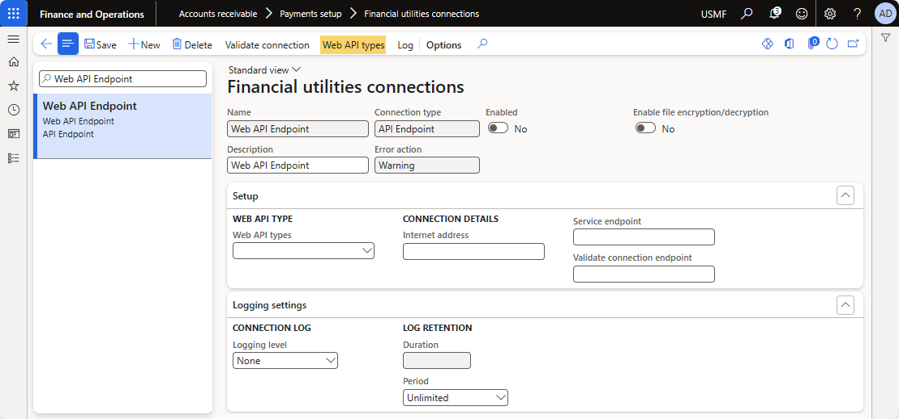
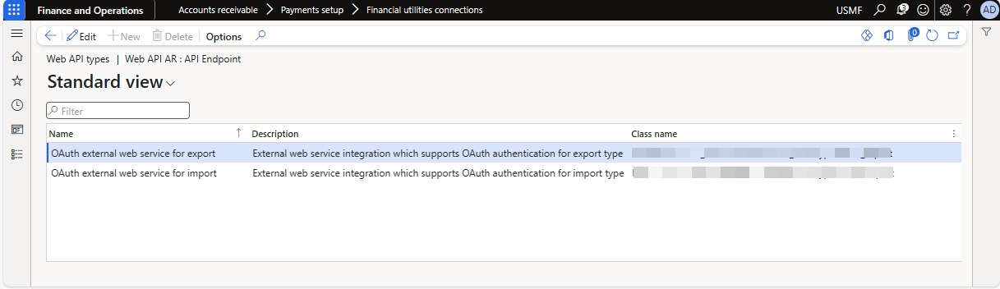
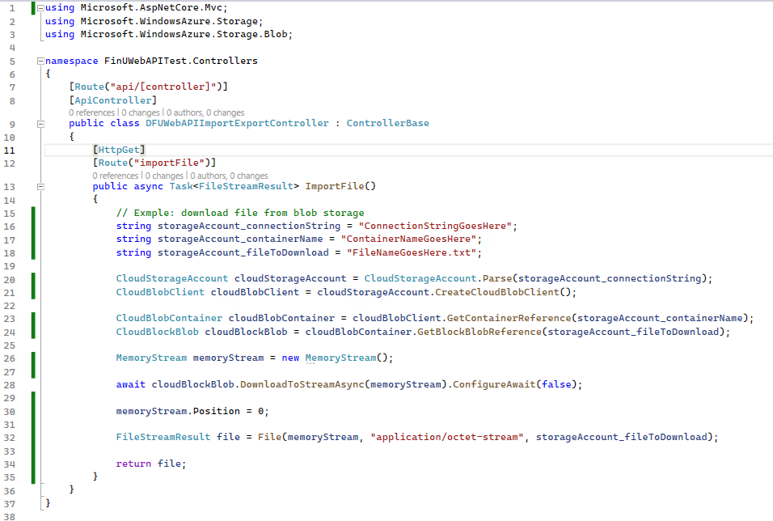
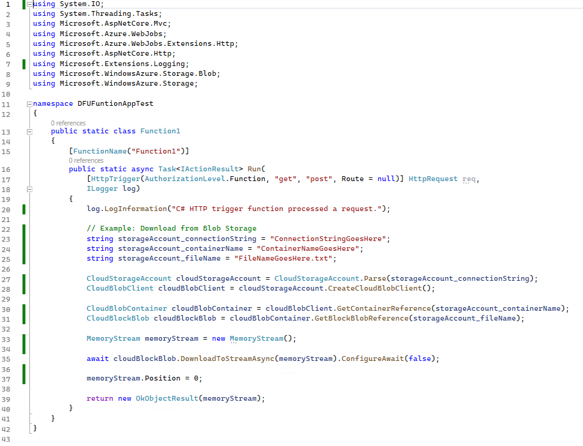
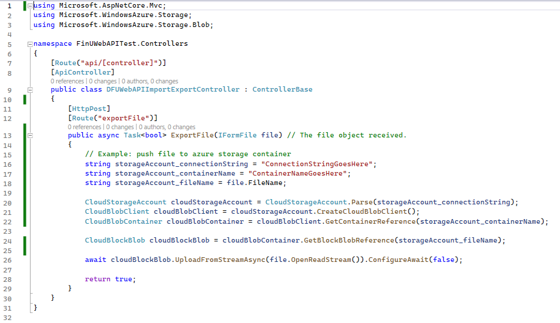
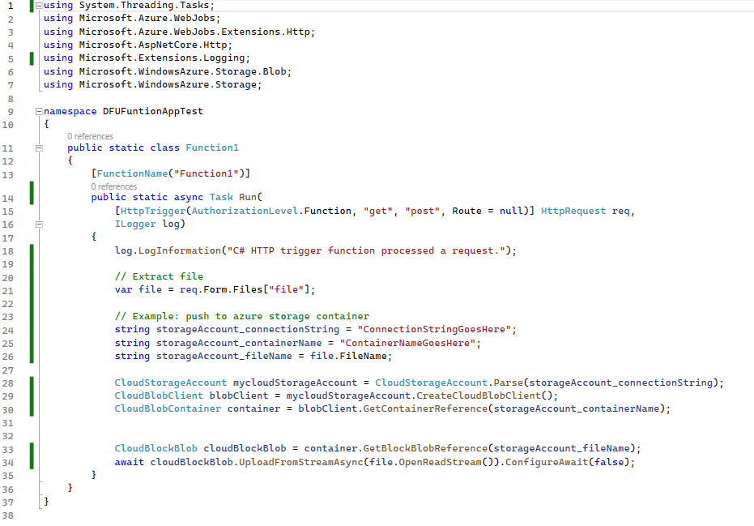

---
# required metadata

title: EDI
description: Technical guide - Web API Endpoint
author: adutt2
manager: Kym Parker
ms.date: 2023-07-06
ms.topic: article
ms.prod:
ms.service: dynamics-ax-applications
ms.technology:

# optional metadata

ms.search.form:
audience: Application User
# ms.devlang:
ms.reviewer: adutt2

# ms.tgt_pltfrm:
ms.custom: ["21901", "intro-internal"]
ms.search.region: FinanceUtilFeature
# ms.search.industry: [leave blank for most, retail, public sector]
ms.author: adutt2
ms.search.validFrom: 2016-05-31
ms.dyn365.ops.version: AX 7.0.1
---

# Technical guide - Web API Endpoint

The Web API endpoint connection allows files to processed against an external web service. This section provides details of how this can be consumed with two example, Web App and Function app. 

# Connection setup

The connection setup for Web API endpoint need to be specified here:

- **Cash and bank management > Setup > Advanced bank reconciliation setup > Financial utilities connections**  
  See [guide](https://dxcanzproduct.github.io/DXC-Products-for-Microsoft-Business-Applications/FINU/Setup/CASH-AND-BANK-MANAGEMENT/Finance-utilities-connections.html) for more details.
- **Accounts receivable > Setup > Finance utilities connections**  
  See [guide](https://dxcanzproduct.github.io/DXC-Products-for-Microsoft-Business-Applications/FINU/Setup/CASH-AND-BANK-MANAGEMENT/Finance-utilities-connections.html) for more details.
- **Organisation administration > Electronic reporting > Electronic reporting export connections**  
  See [guide](https://dxcanzproduct.github.io/DXC-Products-for-Microsoft-Business-Applications/FINU/Setup/ACCOUNTS-PAYABLE/Save-electronic-reporting-file-to-secure-location.html) for more details.

# Web API Types

Finance utilities can be configured to support different Web API types. The implementations available will be visible within a list accessible via the connections view.

The list consists of the details of the Web API types implemented for processing data.

Currently, the solution contains implementation for importing and exporting file. This has been configured to work for the following

- Bank statement import. See [guide](https://dxcanzproduct.github.io/DXC-Products-for-Microsoft-Business-Applications/FINU/Setup/CASH-AND-BANK-MANAGEMENT/Bank-statement-import.html)
- Customer remittance import. See [guide](https://dxcanzproduct.github.io/DXC-Products-for-Microsoft-Business-Applications/FINU/Setup/ACCOUNTS-RECEIVABLE/Customer-remittance.html)
- Accounts receivable save electronic report file to secure location. See [guide](https://dxcanzproduct.github.io/DXC-Products-for-Microsoft-Business-Applications/FINU/Setup/ACCOUNTS-PAYABLE/Save-electronic-reporting-file-to-secure-location.html).

# File import/export processing

This section describes how to consume the web API connection types within an external web service using two examples, Function App and Web App.

## Import file using Finance Utilities connections

The image describes an example implementation of an API endpoint to retrieve file for import which can be consumed via the Finance utitlities connection in FinOps.

The image describes an example implementation of a function app.

## Export file using Finance Utilities connections

The image describes an example implementation of an API endpoint to retrieve the exported file received via the Finance utilities connections in FinOps.

The image describes an example implementation of a function app.

**Note:** The file passed a parameter called, file within FinOps when the ER file is exported. Please ensure that the external service extracts the file using the same parameter name as shown in the examples above.
