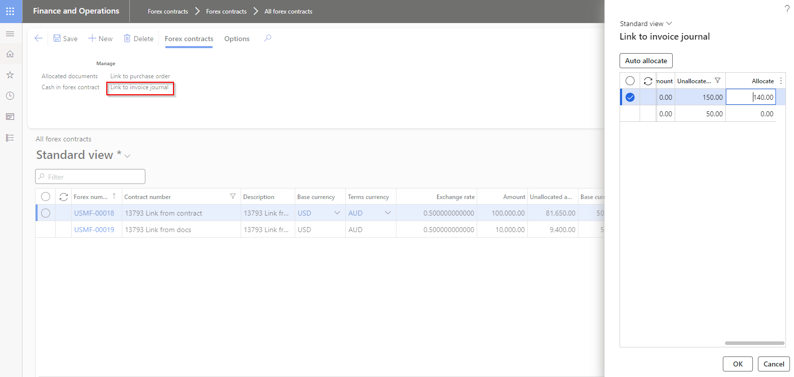
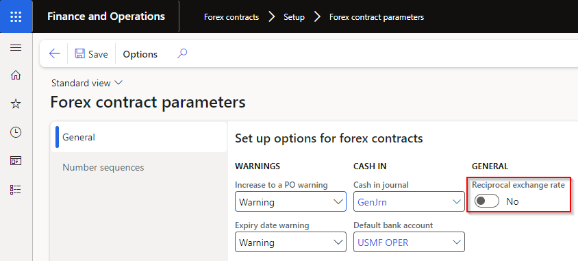
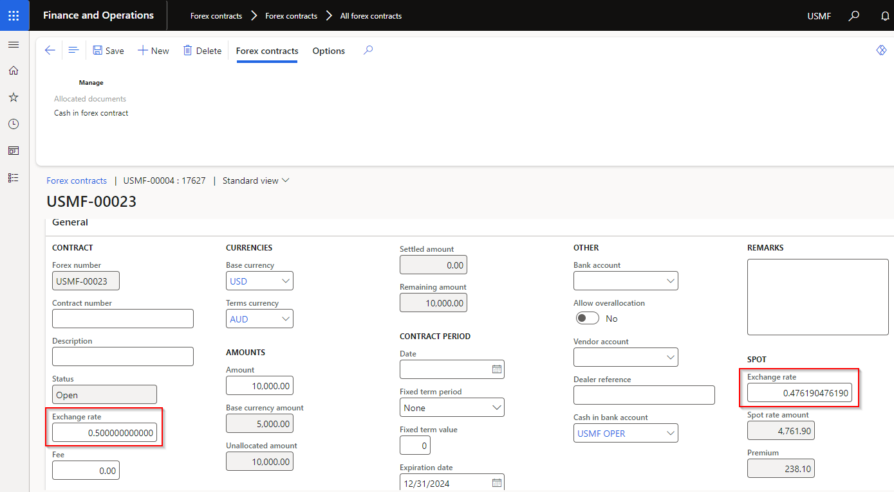
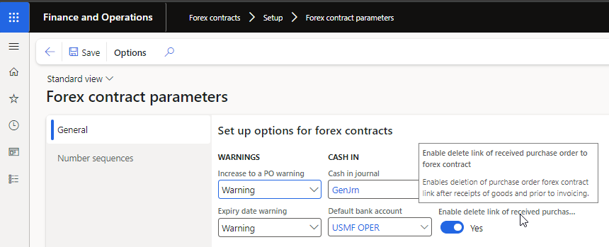
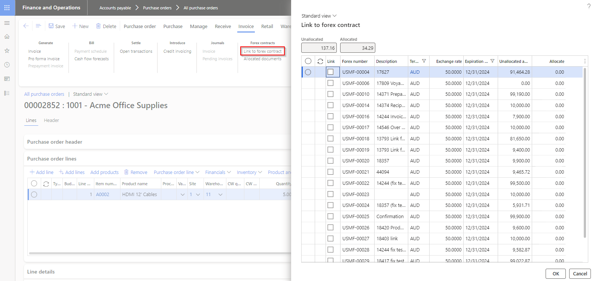

---
# required metadata

title: Forex contract
description: Forex contract - Release notes
author: Monica du Toit
manager: Pontus Ek
ms.date: 2026-01-30
ms.topic: article
ms.prod: 
ms.service: dynamics-ax-applications
ms.technology: 

# optional metadata

ms.search.form: 
audience: Application User
# ms.devlang: 
ms.reviewer: Monica du Toit
# ms.tgt_pltfrm: 
# ms.custom: 
ms.search.region: ICONForex
# ms.search.industry: [leave blank for most, retail, public sector]
ms.author: Monica du Toit
ms.search.validFrom: 2016-05-31
ms.dyn365.ops.version: AX 7.0.1
---

# Release notes
This document describes the features that are either new or changed in the release version mentioned.

# Version compatibility
The matrix shows the minimum DXC build versions compatible per Microsoft versions and builds.  
If blank: investigations are ongoing.  

D365 Version	  | Any issues found in testing?	  | Product version tested
:--       	  |:--           			  |:--
Product version: 10.0.45   App build: 10.0.2345.13	  | No	          | 10.0.40.202409121

Release notes for other models included in product:
- [DXC License Manager](../LMG/Release-notes.md#dxc-license-manager)
- [DXC License](../LMG/Release-notes.md#dxc-license)

# Current version

### Release 10.0.45.20260130

DXC Forex contract 10.0.45 runs on the following Microsoft releases

Base	  | Version	  | Release
:--       |:--            |:--
Microsoft Dynamics 365 application	| 10.0.45 	  | [What’s new or changed in Dynamics 365 application version 10.0.45](https://docs.microsoft.com/en-us/dynamics365/finance/get-started/whats-new-changed-10-0-45)

#### Build 10.0.45.202601301
Release date: 30 January 2026

Final deprecated release without **Feature management** and **Licensing**

# Previous version(s)

### Release 10.0.40.20240912

#### Build 10.0.40.202409121
Release date: 12 September 2024

<ins>Bug fixes</ins>

Number	| Functionality	  	| Description
:--	|:--		  	|:--	
19123	| Purchase order Change management	| Couldn't post Purchase order Product receipt when Change management activated. Error with: "Changes to the document are only allowed in state Draft, because change management is activated."

### Release 10.0.39.20240902

#### Build 10.0.39.202409021
Release date: 2 September 2024

<ins>Bug fixes</ins>

Number	| Functionality	  	| Description
:--	|:--		  	|:--	
18951	| Pending purchase invoice	| Error when posting a pending purchase invoice that isn't linked to a purchase order.   Error: "Cannot edit a record in Purchase orders (PurchTable). The record has never been selected."

### Release 10.0.38.20240813

#### Build 10.0.38.202408131
Release date: 14 August 2024

<ins>Bug fixes</ins>

Number	| Functionality	  	| Description
:--	|:--		  	|:--	
18668	| Invoice journal	| Changes to invoice journal removed linked to Forex contract
18746	| Invoice journal	| Changes to linked invoice journal's amount didn't update the allocated amounts accordingly
18786	| Vendor payment journal	| Payment journal exchange rate wasn't utilizing the forex exchange rate
18805	| Invoice journal & Payment journal	| Incorrect exchange rate when multiple forex contracts linked to an invoice journal line
18671	| Purchase order	| Splitting the physical and financial voucher correctly to purchase line/product level
18759	| Customer and Vendor payment journal	| Receive error 'Object reference not set to an instance of an object' when trying to change Payment status

### Release 10.0.37.20240718

#### Build 10.0.37.202407181
Release date: 18 July 2024

<ins>New features</ins>

Number	| Functionality	  	| Description
:--	|:--		  	|:--	
13793	| Forex contract link to document | New button **Link to invoice journal** added to **Forex contract**. Adds the ability to link open invoice journals for the same currency as the contract.   Existing button **Link to document** button updated to **Link to purchase order**.   
14371	| Purchase order Prepayment invoice | Ability to link Forex contract to a Purchase order's Prepayment invoice
14374	| Reciprocal exchange rate	| New option **Reciprocal exchange rate** in **Forex contract parameters**, allows users to enter the rates in the contract as reciprocal rate        For example set **Reciprocal exchange rate** to _Yes_ and enter 2 in field **Exchange rate** will automatically convert to 0.5:   
18420	| Deleting allocated documents | New Forex contract parameter option called **Enable delete link of received purchase order to forex contract** to manage ability to delete a linked purchase order/line in **Allocated documents** after it has been received. When set to:   • **Yes** - Linked purchase order/line can be deleted in Allocated documents after Purchase order/line has been received   • **No** - Linked purchase order/line can not be deleted in Allocated documents after Purchase order/line has been received   
18480	| Link to forex contract	| Increase of dialog box size to large   

<ins>Bug fixes</ins>

Number	| Functionality	  	| Description
:--	|:--		  	|:--	
18357	| Link to Forex contract	| Link to Forex contract removed after adding Purchase order to Voyage if feature **Performance Improvements for Post Receipt Function in Landed Cost** is disabled.
18403	| Forex contracts	| Link to documents (purchase order and invoice journal) added to SAB_ForexContractTable. Previously only available from list page.
14244	| Allocated documents  	| After posting the invoice, the line was displayed twice in Forex contract's Allocated documents.
18428	| Vendor transactions	| Error 'Cannot create a record in Forex contract lines (SAB_ForexContractTrans). Forex number: %, 1874. The record already exists'. Occurred when clicking on a Vendor transaction for a purchase order with multiple lines and allocated to a Forex contract. 
18417	| Changes to purchase order	| Link to Forex contract removed after changing a linked Purchase order, for example: increasing/decreasing purchase quantity, changing requested receipt date or updating financial dimensions.
18464	| Changes to purchase order	| Changes to linked purchase order's amount didn't update the allocated amounts accordingly.

### Release 10.0.37.20240530

#### Build 10.0.37.202405301
Release date: 30 May 2024

<ins>New features</ins>

Number	| Functionality	  	| Description
:--	|:--		  	|:--	
18003	| Label			| Remove DXC from Forex contract name in About > Version and Feature management
N/A	| DXC License		| New DXC License model 10.0.37.202405231. See [Release notes](../LMG/Release-notes.md) for more details.

<ins>Bug fixes</ins>

Number	| Functionality	  	| Description
:--	|:--		  	|:--	
17982	| Pending invoice	| 10.0.40 build error caused by missing reference for the ProcessAutomation Model which is now used by the VendInvoiceInfoTable.   Used to determine whether the Pending invoices button is enabled/disabled in the Vendor Purchase Invoice form.
17803	| Link to Forex contract	| Link to Forex contract removed after adding Purchase order to Voyage

### Release 10.0.37.20240426

#### Build 10.0.37.202404261
Release date: 26 April 2024

<ins>New features</ins>

Number	| Functionality	  	| Description
:--	|:--		  	|:--	
17423 	| N/A			| Update to **Table groups** to support "transaction" types being truncated in copy environment feature via Power platform admin center.
17674	| Link to forex contract | Improved error message to include reason 'Invoice is not populated' when unable to link forex contract to invoice journal line where an invoice wasn't populated.
16365	| Security		| Set Maintain and View User License to None
17724	| Licensing		| Improvements to licensing - see [Licensing release notes](../LMG/Release-notes.md#release-10037202404262) for detailed information.

<ins>Bug fixes</ins>

Number	| Functionality	  	| Description
:--	|:--		  	|:--	
17624	| Workflow automated posting	| Instead of using linked Forex contract rate, the system spot rate was used when purchase invoice is submitted to workflow that automatically posts the invoice

### Release 10.0.34.20230615

#### Build 10.0.34.202306151
Release date: 15 June 2023

<ins>New features</ins>

Number	| Functionality	  	| Description
:--	|:--		  	|:--	
N/A	| DXC License		| DXC License version 10.0.34.202306151

### Release 10.0.29.20230510

#### Build 10.0.29.202305101
Release date: 10 May 2023

<ins>New features</ins>

Number	| Functionality	  	| Reason
:--	|:--		  	|:--	
N/A		| License manager	| License manager version 10.8.32.10171   Enhanced Licensing capabilities to assist with licensing support and scaling.   **Note:** Required to upgrade all installed DXC products to at least the following versions:   • EDI 10.0.29.202305053   • Finance utilities 10.0.29.202305051   • SmartSend 10.0.29.202304142   • Core extensions 10.0.29.202304142   • DocuSign 10.0.29.202304211   • Item creation 10.0.29.202304211   •  PLM 10.0.29.202304211   • Forex 10.0.29.202305101   

### Release 10.0.29.20230503

#### Build 10.0.29.202305032
Release date: 3 May 2023

<ins>New features</ins>

Number	| Functionality	  	| Reason
:--	|:--		  	|:--	
10456	| Allocate from Forex contract	| Ability to allocate purchase order(s) from Forex contract form.   Includes button **Auto allocate** which will allocate the open forex contract top-down to purchase orders with contract's currency that haven't been fully allocated to a contract.   [User guide](PROCESSING/Link-forex-contract.html#forex-contracts)     
N/A	| License manager	| License manager version 10.8.32.10162

### Release 10.0.22.20220407

#### Build 10.0.22.202204071
Release date: 7 April 2022

Functionality	  		| Reason
:--               		|:--
Forex contract			| Ability to create Forex contracts
Link to Purchase order		| Ability to link Forex contract(s) to a Purchase order header
Link to Purchase order line 	| Ability to link Forex contract(s) to a Purchase order line
Link to Invoice journal line 	| Ability to link Forex contract(s) to a Invoice journal line
Cash in				| Ability to cash in Forex contract(s)

# Installation process
To align with MS best practice and to protect our IP the following applies to the release process.
- The license models DXCLicense and Sable37License will only be released as binaries as part of a deployable package. 
- We will not provide test models for the products, neither as binary or source code. 
- We will only publish the release as a deployable package. 
- Model source code can be provided at our discretion. It can be requested for debugging upgrade errors, or if required for extensions.
	- If you have been given the source code to our model for extension or debugging purpose, never make modifications directly to our models! 
	- If you need an extension point, please send an email to ECLANZProductSupport@dxc.com and request it to be implemented. 

Depending on the installation history follow one of these guides to install the new release. 
## Installation without existing installed product
1. Apply the deployable package to your environment. 
2. If you have requested any model for extension or debugging purposes. Install the model source code. 
a.	Note, once the model source code is compiled it will overwrite the binaries installed when the deployable package was applied. 

## Installation with existing installed product
If you’re installing the new release in an installation that already has a previous version of the product installed and you’re not using it for debugging or extension. We recommend that you;  
1. Remove the release product model source code from your source control, if source control is used. 
2. Apply the deployable package, installing the latest version of the product models as binaries.  
3. Check in the binaries for the models to source control, if source control is used. 

If you’re using our model source code for extension or debugging and would like to continue using it, please do the following to apply the new release with the source code. 

1. Remove product license model from your source control that is applicable to the release. You’ll find the license model in the deployable package. It will either be called DXCLicense and Sable37License. 
2. Apply the deployable package to your environment to install the latest binaries. Check in the binaries for the license model that was removed in step 1 to source control. Note, this step will also install the binaries for all the models in the new release. 
3. Install the product release model source code and check into source control. 

If you don’t follow these instructions and continue building your installation deployable package using the license model source code, the installation will continue using the same license model as before applying the release. 

## Feature management
Enable **DXC Forex contract** via D365 Feature management.  
If above feature is not visible, press **Check for updates** to refresh the feature management list.

