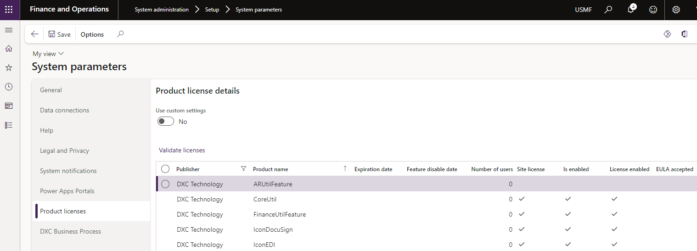
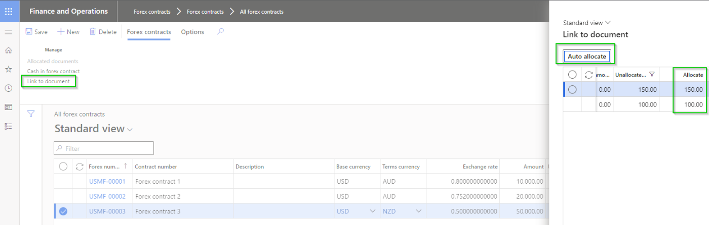

---
# required metadata

title: Forex contract
description: Forex contract - Release notes
author: jdutoit2
manager: Kym Parker
ms.date: 2024-05-13
ms.topic: article
ms.prod: 
ms.service: dynamics-ax-applications
ms.technology: 

# optional metadata

ms.search.form: 
audience: Application User
# ms.devlang: 
ms.reviewer: jdutoit2
# ms.tgt_pltfrm: 
# ms.custom: 
ms.search.region: ICONForex
# ms.search.industry: [leave blank for most, retail, public sector]
ms.author: jdutoit2
ms.search.validFrom: 2016-05-31
ms.dyn365.ops.version: AX 7.0.1
---

# Release notes
This document describes the features that are either new or changed in the release version mentioned.

# Current version

### Release 10.0.37.20240426

DXC Forex contract 10.0.37 runs on the following Microsoft releases

Base	  | Version	  | Release
:--       |:--            |:--
Microsoft Dynamics 365 application	| 10.0.37	  | [What’s new or changed in Dynamics 365 application version 10.0.37](https://docs.microsoft.com/en-us/dynamics365/finance/get-started/whats-new-changed-10-0-37)
Microsoft Dynamics 365 application	| 10.0.38	  | [What’s new or changed in Dynamics 365 application version 10.0.38](https://docs.microsoft.com/en-us/dynamics365/finance/get-started/whats-new-changed-10-0-38)
Microsoft Dynamics 365 application	| 10.0.39	  | [What’s new or changed in Dynamics 365 application version 10.0.39](https://docs.microsoft.com/en-us/dynamics365/finance/get-started/whats-new-changed-10-0-39)
Microsoft Dynamics 365 application	| 10.0.40	  | [What’s new or changed in Dynamics 365 application version 10.0.40](https://docs.microsoft.com/en-us/dynamics365/finance/get-started/whats-new-changed-10-0-40)

#### Build 10.0.37.202404261
Release date: 26 April 2024

<ins>New features</ins>

Number	| Functionality	  	| Description
:--	|:--		  	|:--	
17423 	| N/A			| Update to **Table groups** to support "transaction" types being truncated in copy environment feature via Power platform admin center.
17674	| Link to forex contract | Improved error message to include reason 'Invoice is not populated' when unable to link forex contract to invoice journal line where an invoice wasn't populated.
16365	| Security		| Set Maintain and View User License to None
17724	| Licensing		| Improvements to licensing - see [Licensing release notes](../LMG/Release-notes.md#release-10037202404262) for detailed information.

<ins>Bug fixes</ins>

Number	| Functionality	  	| Description
:--	|:--		  	|:--	
17624	| Workflow automated posting	| Instead of using linked Forex contract rate, the system spot rate was used when purchase invoice is submitted to workflow that automatically posts the invoice

# Previous version(s)

### Release 10.0.34.20230615

#### Build 10.0.34.202306151
Release date: 15 June 2023

<ins>New features</ins>

Number	| Functionality	  	| Description
:--	|:--		  	|:--	
N/A	| DXC License		| DXC License version 10.0.34.202306151

### Release 10.0.29.20230510

#### Build 10.0.29.202305101
Release date: 10 May 2023

<ins>New features</ins>

Number	| Functionality	  	| Reason
:--	|:--		  	|:--	
N/A		| License manager	| License manager version 10.8.32.10171   Enhanced Licensing capabilities to assist with licensing support and scaling.   **Note:** Required to upgrade all installed DXC products to at least the following versions:   • EDI 10.0.29.202305053   • Finance utilities 10.0.29.202305051   • SmartSend 10.0.29.202304142   • Core extensions 10.0.29.202304142   • DocuSign 10.0.29.202304211   • Item creation 10.0.29.202304211   •  PLM 10.0.29.202304211   • Forex 10.0.29.202305101   

### Release 10.0.29.20230503

#### Build 10.0.29.202305032
Release date: 3 May 2023

<ins>New features</ins>

Number	| Functionality	  	| Reason
:--	|:--		  	|:--	
10456	| Allocate from Forex contract	| Ability to allocate purchase order(s) from Forex contract form.   Includes button **Auto allocate** which will allocate the open forex contract top-down to purchase orders with contract's currency that haven't been fully allocated to a contract.   [User guide](PROCESSING/Link-forex-contract.html#forex-contracts)     
N/A	| License manager	| License manager version 10.8.32.10162

### Release 10.0.22.20220407

#### Build 10.0.22.202204071
Release date: 7 April 2022

Functionality	  		| Reason
:--               		|:--
Forex contract			| Ability to create Forex contracts
Link to Purchase order		| Ability to link Forex contract(s) to a Purchase order header
Link to Purchase order line 	| Ability to link Forex contract(s) to a Purchase order line
Link to Invoice journal line 	| Ability to link Forex contract(s) to a Invoice journal line
Cash in				| Ability to cash in Forex contract(s)

# Installation process
To align with MS best practice and to protect our IP the following applies to the release process.
- The license models DXCLicense and Sable37License will only be released as binaries as part of a deployable package. 
- We will not provide test models for the products, neither as binary or source code. 
- We will only publish the release as a deployable package. 
- Model source code can be provided at our discretion. It can be requested for debugging upgrade errors, or if required for extensions.
	- If you have been given the source code to our model for extension or debugging purpose, never make modifications directly to our models! 
	- If you need an extension point, please send an email to ECLANZProductSupport@dxc.com and request it to be implemented. 

Depending on the installation history follow one of these guides to install the new release. 
## Installation without existing installed product
1. Apply the deployable package to your environment. 
2. If you have requested any model for extension or debugging purposes. Install the model source code. 
a.	Note, once the model source code is compiled it will overwrite the binaries installed when the deployable package was applied. 

## Installation with existing installed product
If you’re installing the new release in an installation that already has a previous version of the product installed and you’re not using it for debugging or extension. We recommend that you;  
1. Remove the release product model source code from your source control, if source control is used. 
2. Apply the deployable package, installing the latest version of the product models as binaries.  
3. Check in the binaries for the models to source control, if source control is used. 

If you’re using our model source code for extension or debugging and would like to continue using it, please do the following to apply the new release with the source code. 

1. Remove product license model from your source control that is applicable to the release. You’ll find the license model in the deployable package. It will either be called DXCLicense and Sable37License. 
2. Apply the deployable package to your environment to install the latest binaries. Check in the binaries for the license model that was removed in step 1 to source control. Note, this step will also install the binaries for all the models in the new release. 
3. Install the product release model source code and check into source control. 

If you don’t follow these instructions and continue building your installation deployable package using the license model source code, the installation will continue using the same license model as before applying the release. 

## Feature management
Enable **DXC Forex contract** via D365 Feature management.  
If above feature is not visible, press **Check for updates** to refresh the feature management list.

