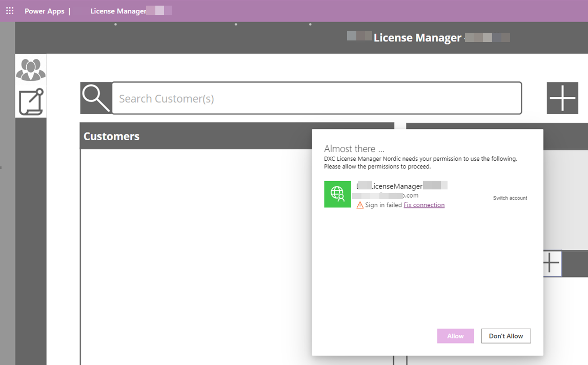

---
# required metadata

title: License manager
description: License manager - FAQ
author: hho34
manager: Kym Parker
ms.date: 2023-06-07
ms.topic: article
ms.prod:
ms.service: dynamics-ax-applications
ms.technology:

# optional metadata

# ms.search.form:
audience: Application User
# ms.devlang:
ms.reviewer: jdutoit2

# ms.tgt_pltfrm:
# ms.custom: ["21901", "intro-internal"]
ms.search.region: Global
# ms.search.industry: [leave blank for most, retail, public sector]
ms.author: helenho
ms.search.validFrom: 2016-05-31
ms.dyn365.ops.version: AX 7.0.1
---

# Frequently Asked Questions

<!-- TOC -->

FAQs

- [Version and Support Information](#version-and-support-information)
- [Dependency and Security Information](#dependency-and-security-information)
- [Troubleshooting](#troubleshooting)

<!-- /TOC -->

## Version and Support Information

Where can I find contact information for support?
Email: ECLANZProductSupport@dxc.com

## Dependency and Security Information

- The License Manager customization for ISV product license validation is implemented within the existing Dynamics 365 Finance and Operations framework.
- Does not include reference to any other third party assembly files.
- All classes for license control has been written in x++ and is bundled using the standard Dynamics 365 Finance and Operations packaging procedures.
- All classes within the module are marked as internal and cannot be invoked by third party applications or D365 customizations.
- License validation process for ISV installed products trigger a backend call to a Microsoft Azure hosted license service managed by DXC ANZ Product Team.
- License validation requests made to license server are done using HTTP Web Request framework.
- All http web request to the license server is authorized by a bearer token generated using Microsoft Entra ID service pricipal credentials.
- All credentials are privately accessed and can only be used internally.
- The bearer token is not exposed externally and cannot be accessed via code extensions.

_License server_

- Hosted within Microsoft Azure
- Protected and secured with Microsoft [security guidelines](https://learn.microsoft.com/en-us/azure/app-service/overview-security#client-authentication-and-authorization) for Microsoft Azure Web App
- Blocked for unauthorized access with [App Service authentication and authorization suppport](https://learn.microsoft.com/en-us/azure/app-service/overview-security#client-authentication-and-authorization) using Microsoft Entra ID and service principal.

_Customer telemetry retrieved by the license manager_  
The following telemetry is collected by the license manager and logged within application insights upon license validation.

- Serial number - this is being used to uniquely identify the customer environment. Serial number returned in response from license server for license validation calls initiated by FinOps is secured with RSA encryption key. License Manager module for FinOps verifies the response before extracting results from the payload response.

_Other telemetry retrieved relating to the ISV product installed_

- Product name - this is the name of ISV product instlled
- Model name - this is the name of the model for the ISV product installed
- Model version - this is the version of the model for the ISV product installed
- Host url - this is the URL of the host environment on which the model has been installed.
- Is enabled - this is the current status of the license validation result for the installed ISV product
- Is installed - this is a flag indicating if the ISV product is installed
- Is production environment - this is a flag indiciating if the current environment is a production environment

Note: License Manager does not collect any other information other than the those specified above. It does not reference or collect any telemetry against any other installed ISV modules.

## Troubleshooting

1. Prompt with fix connection when accessing the Power App.  
   
   The Power App platform requires consent to authenticate and provide access to the license manager service. This prompt appears everytime a new session is started to an existing session expires due to no user input. The standard expiration time for the access token is 60 minutes. While the app is in use, it will be able to auto-refresh the access token.
1. Connection error when accessing Power App after a new release is applied
   
   Please refer to the instalaltion instructions located at the end of this documentation [here](./PowerApp.md). For detailed technical documentation, please email the support team, ECLANZProductSupport@dxc.com
1. I can’t save ‘Customer Products’.
   Reason: Field ‘Site (Module) License’ is set to Off OR ‘No. of users’ field is blank

Beore:

After:

