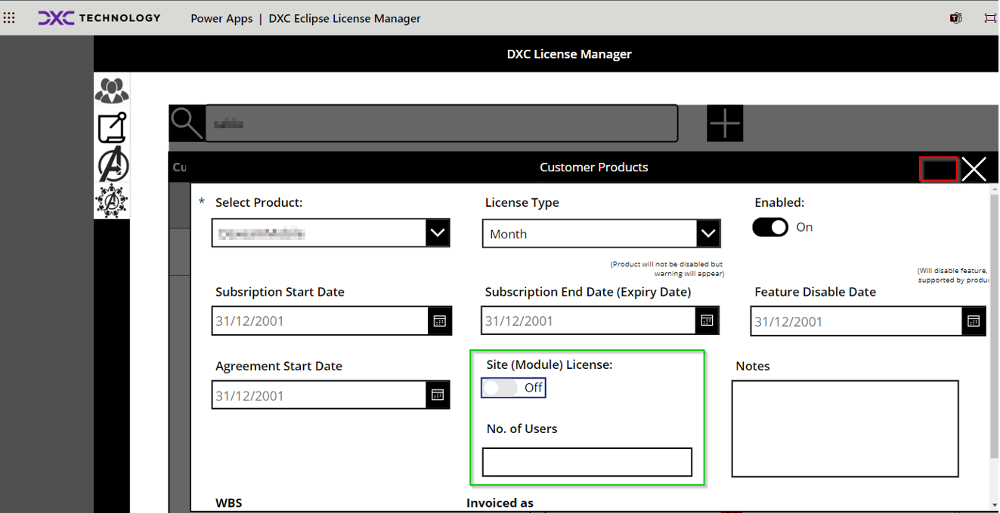
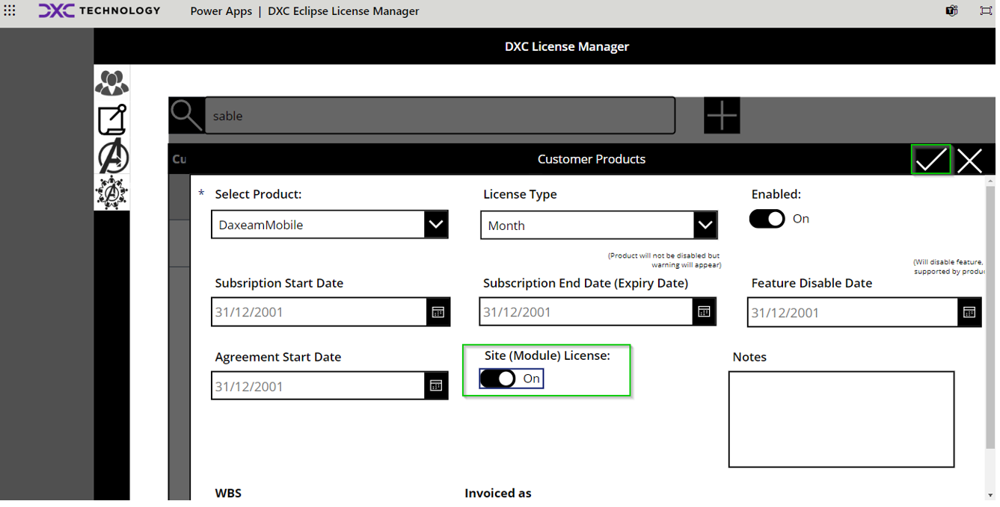
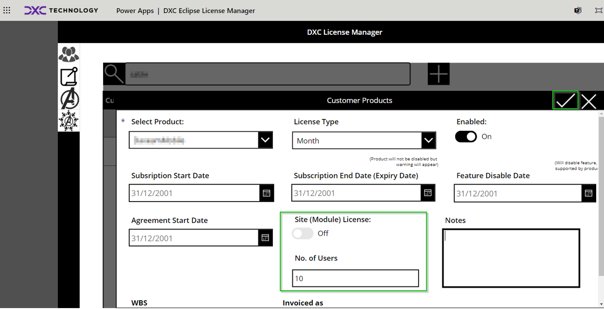

---
# required metadata

title: License manager 
description: License manager - FAQ 
author: hho34
manager: Kym Parker
ms.date: 2023-06-07
ms.topic: article
ms.prod: 
ms.service: dynamics-ax-applications
ms.technology: 

# optional metadata

# ms.search.form:  
audience: Application User
# ms.devlang: 
ms.reviewer: jdutoit2

# ms.tgt_pltfrm: 
# ms.custom: ["21901", "intro-internal"]
ms.search.region: Global
# ms.search.industry: [leave blank for most, retail, public sector]
ms.author: helenho
ms.search.validFrom: 2016-05-31
ms.dyn365.ops.version: AX 7.0.1
---

# 	Frequently Asked Questions

## Version and Support Information
Where can I find contact information for support?
Email: ECLANZProductSupport@dxc.com

## 	Troubleshooting
1.	I can’t save ‘Customer Products’.
Reason: Field ‘Site (Module) License’ is set to Off OR ‘No. of users’ field is blank

Beore:

After:

