---
# required metadata

title: License manager 
description: License manager - D365 FO 
author: hho34
manager: Kym Parker
ms.date: 2023-06-07
ms.topic: article
ms.prod: 
ms.service: dynamics-ax-applications
ms.technology: 

# optional metadata

ms.search.form:  
audience: Application User
# ms.devlang: 
ms.reviewer: jdutoit2

# ms.tgt_pltfrm: 
# ms.custom: ["21901", "intro-internal"]
ms.search.region: FinanceUtilFeature
# ms.search.industry: [leave blank for most, retail, public sector]
ms.author: jdutoit2
ms.search.validFrom: 2016-05-31
ms.dyn365.ops.version: AX 7.0.1
---

# FinOps – User guide 
# DXC License manager in FinOps 

The license manager licensed products can be found under the system parameters tab called Product licenses.  

The validate button can be used to manually trigger validation against the license server.  

The same validation will be done automatically once a day when a user loads the default start page for a finance and operations environment, https://<environment base url>/?cmp=<any company>&mi=DefaultDashboard 

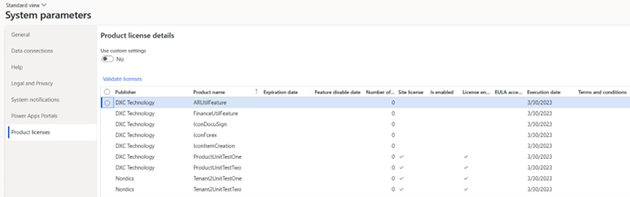

# Enabling license control of model against tenant in FinOps – Technical Guide
## Getting Started

To get started you would require a tenant GUID, this is something that is uniquely recognized for your organization.  
For this example, the following tenant ID will be used.  
Tenant ID: **446d5d80-d20d-43c6-a96c-370628f5bd9f**

# Configuration key
This section is for enabling license validation for products using configuration key.  
  
- **DXCLicenseProduct enum extension**  
Ensure that you have an extension added to the DXCLicenseProduct enum. The name of the element represents the name of the product.

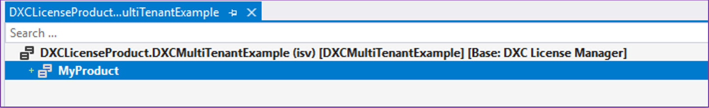  

Ensure that you have specified the config key for the enum element
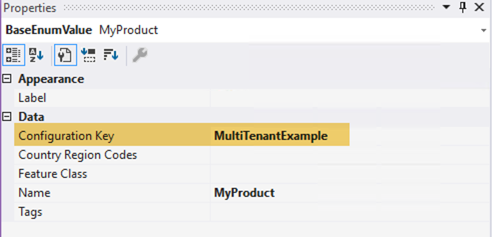  
  
- **DXCLicenseAttribute implementation**  
Implement the license class for each product as follows. Ensure to specify the tenant GUID and return the value in the getLicenseTenantIdentifier method implementation.

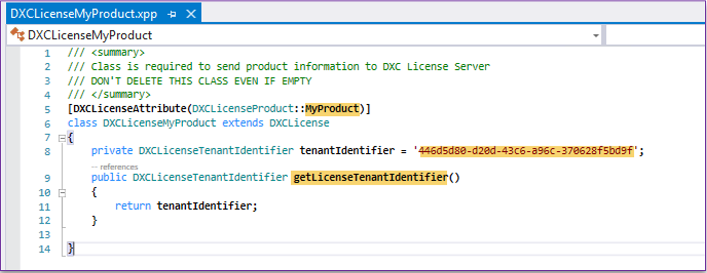    
  
- **Publisher name implementation**  
In the overview of products that are license controlled in System parameters display a publisher name. The publisher name is by default set to the publisher specified in the model descriptor file in which the license class reside. 
 
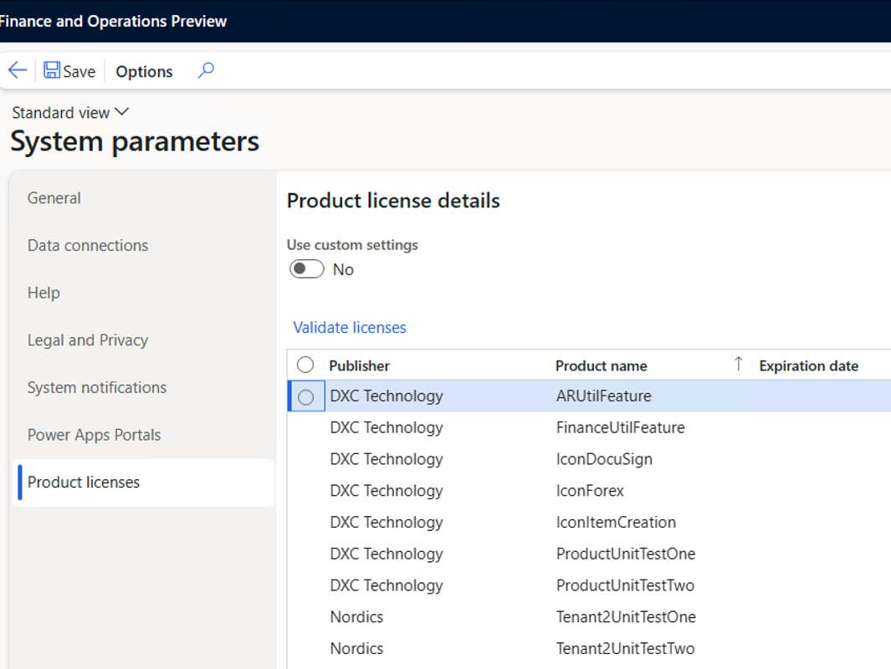  

The publisher name can be overridden by implementing the method public str getPublisherName() and returning a string with the name instead of taking it from the model descriptor file.

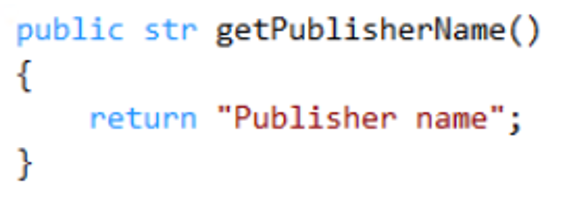  

# Feature management

This section is for enabling license validation for products using feature management.  
•	**DXCLicenseProductIdentifier enum extension**  
Ensure that you have an extension added to the DXCLicenseProductIdentifier enum. The name of the element represents the name of the product.

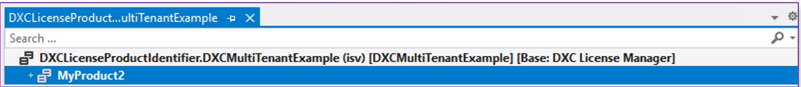 

•	**Feature class implementation**  
Create your feature class as follows, ensure you have reference to your product identifier enum and the tenant id for your organization.
  
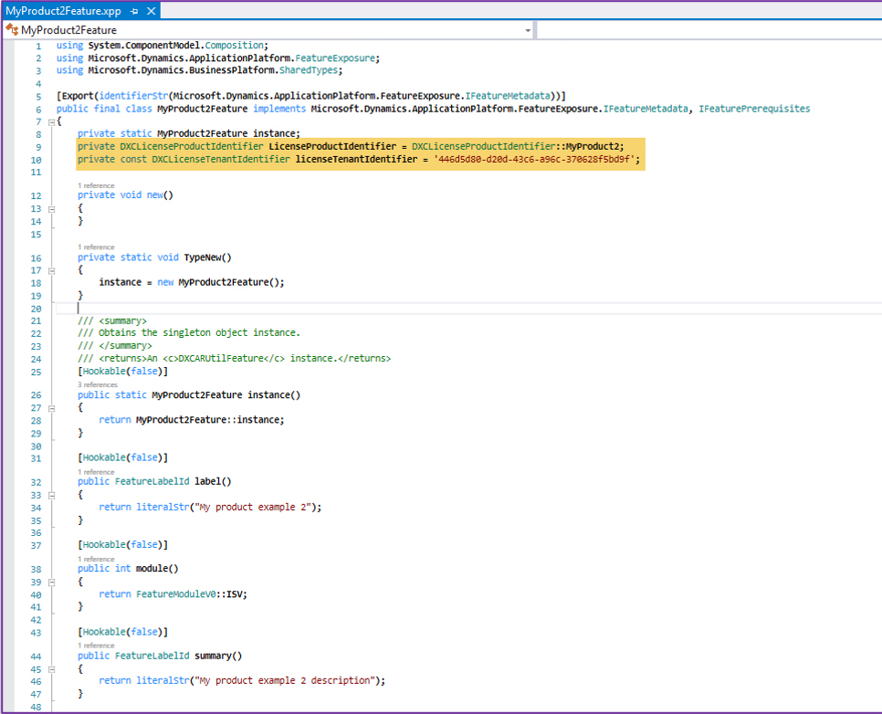 

Update the isEnabled and canEnable methods of the feature class  

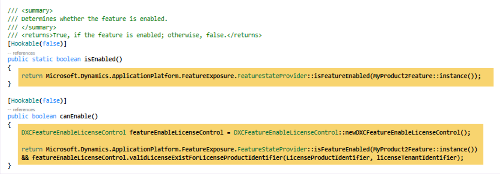 

•	**Feature control class implementation**  
Ensure that the tenant guid and product enum element is referenced.

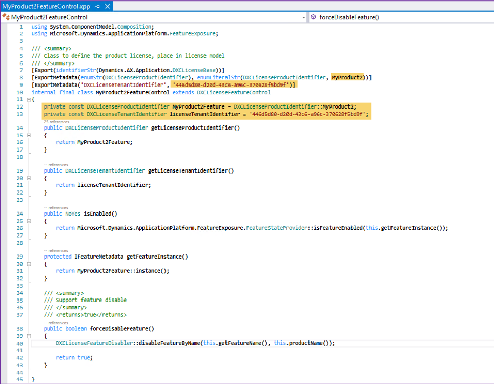 
  
•	**Feature installation class implementation**  
Ensure that the tenant guid and product enum element is referenced.

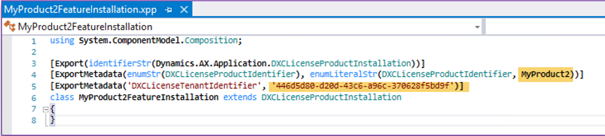
  
