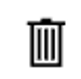
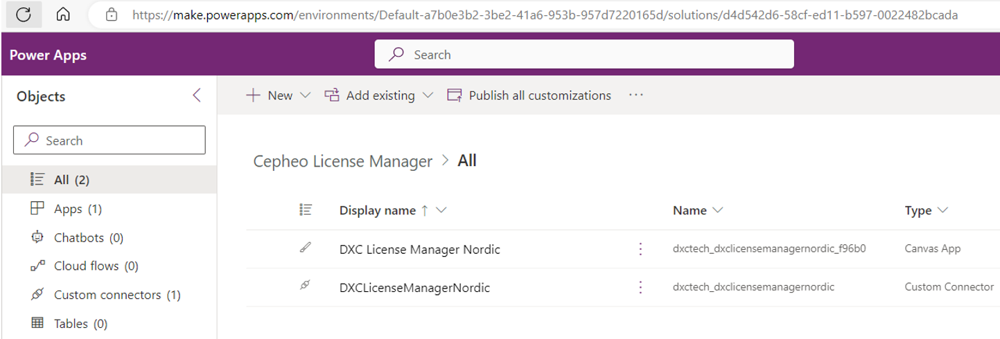
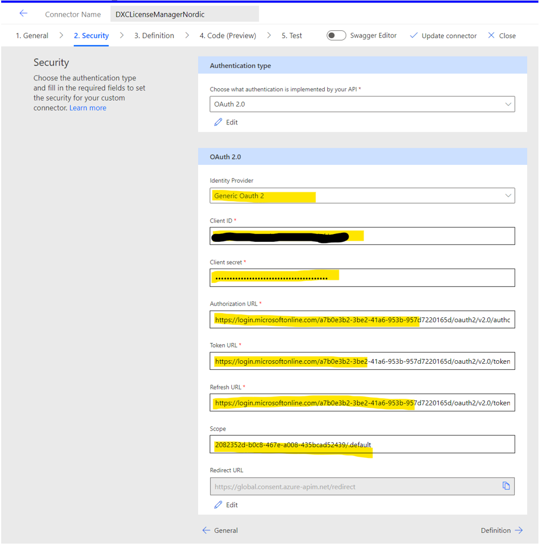

---
# required metadata

title: License manager 
description: License manager - PowerApp 
author: hho34
manager: Kym Parker
ms.date: 2023-06-07
ms.topic: article
ms.prod: 
ms.service: dynamics-ax-applications
ms.technology: 

# optional metadata

ms.search.form:  
audience: Application User
# ms.devlang: 
ms.reviewer: jdutoit2

# ms.tgt_pltfrm: 
# ms.custom: ["21901", "intro-internal"]
ms.search.region: FinanceUtilFeature
# ms.search.industry: [leave blank for most, retail, public sector]
ms.author: jdutoit2
ms.search.validFrom: 2016-05-31
ms.dyn365.ops.version: AX 7.0.1
---

# License Manager PowerApp 
## License Manager Views

**Logo** | **View**
:--       |:--
 | **Customers -** View, edit or add new Product Customer details and view, edit or add new Customer products  
Box in circle (hidden at the bottom left) | **Products -** View, edit or add new Products
 | **Expiry(s) report -** View expired and due to expire licenses based on filter criteria

## Customer Details
Customer Information shows all information relating to the Customer who has licensed Products by the organization  
•	Customer Name – Official Name of the customer  
•	Customer Description – Description or a.k.a name for the customer  
•	Customer Region - Used to identify the region of the customer head office  
•	Customer Number – Used to identify the customer in sales/finance systems  

## Customer Products
Customer Products shows a list of all Products that have been licensed for the selected customer.  
The following will either display a green tick (active) or red cross (inactive/expired):  
**•	Active** – Where the customer product  _Subscription End Date (Expiry Date)_ has not been reached  
**•	Enabled** – Customer products  _Enabled_  is set to YES  
**•	Site License** – Customer product’s  _Site (Module) License_ is set to YES. Where this is inactive, _No. of Users MUST be completed_  
The other options available on this form include:  

- Edit

  -	**Product** - Select Product from the list of available Products  
  -	**License Type** - Options Include:  
             -	Perpetual - Product purchased with perpetual license, but maintenance should still be invoiced in order to receive ‘latest’ code   
             -	Month - Subscription License billed monthly  
             -	Quarter - Subscription License billed quarterly  
             -	Annual - Subscription License billed annually  
             -	Subscription - Licensed based on subscription model  
             -	Temp - A temp license has been provided to enable customer to evaluate the product  

-	Enabled
-	Subscription Start Date - The original date of purchase. This can show how long a customer has been using the product
- Subscription End Date (Expiry Date) - Based on invoicing. This must be checked annually to ensure customer is being invoiced and making payments.
-	Feature Disable Date - If all efforts have not resulted in payment from the customer, the feature will be disabled and can no longer be used.
Note: License Manager must be linked to a Feature Key for this option 
-	Agreement Start Date - Date of current pricing agreement/SOW. This date can be used to identify customer to be included/excluded from price increases
-	Site (Module) License:
-	WBS – Identifier that can be used to identify invoiced line item
-	Invoice as - Used to help identify how the product is displayed in an invoice. This is due to sales calling products many different things within a SOW. 
-	Notes - Additional information
-  - Add Tenant and Serial number for all the customer's environments.
-  Delete - Delete the Product record for the selected customer. The product can only be deleted if all the environments for the Product has been deleted.

# Product Details
Product Information shows all information relating to the Products that need to be license controlled
-	**Product Name** – Name of the product, this should be same as the name of the enum added under DXCLicenseProductIdentifier as explained above. 
-	**Product Description** – Description for the product
-	**Product Region** - Used to identify the region of the product head office
-	**Disable License Control** – When set to yes, a perpetual license is automatically created for customers when requested.
-	**Terms Conditions URL** – Terms and conditions URI for the organization
-	**User Guide URL** – URL redirecting to the user guide for the product
-	**Support Email ID** – Email contact for product help support

# Installation of PowerApp
Enquire ECLANZProductSupport@dxc.com for the latest version of the PowerApp. 
The app comes bundled in a solution with a custom connector. 

Once the solution has been imported, edit the custom connector security tab to allow authentication with the license manager API. Choose OAuth 2.0 and Generic Oauth 2. Update the connector and create a connection from it. Open the DXC License Manager Nordic app. You will get prompted to sign in. For that to work the user needs to be registered with us, please send an email to our support ECLANZProductSupport@dxc.com if you would like a user to get access. 

**Client ID** | \<provided separate\>
:--       |:--
**Client Secret** | \<provided separate\>  
Authorization URL | https://login.microsoftonline.com/a7b0e3b2-3be2-41a6-953b-957d7220165d/oauth2/v2.0/authorize 
Token URL | https://login.microsoftonline.com/a7b0e3b2-3be2-41a6-953b-957d7220165d/oauth2/v2.0/token
Refresh URL | https://login.microsoftonline.com/a7b0e3b2-3be2-41a6-953b-957d7220165d/oauth2/v2.0/token
Scope | 2082352d-b0c8-467e-a008-435bcad52439/.default
   
  

# Reports
**Expiry(s)** report displays the customer product licenses that are due to expire.
Filter options include:  
-	This week
-	This month
-	Next three months
-	Next six months
- Within this year  

An additional filter option **Include over due expiry(s)** will display licenses that have already expired.  

Azure Application Insights can be used to run analytics to show various error calls or run SQL statements for reporting purposes.

