---
# required metadata

title: License Manager Web App
description: License Manager Web App
author: adutt2
manager: Kym Parker
ms.date: 2023-11-20
ms.topic: article
ms.prod:
ms.service: dynamics-ax-applications
ms.technology:

# optional metadata
ms.search.form:
audience: Application User
ms.reviewer: adutt2

ms.search.region: DXCLicenseManager
ms.author: adutt2
ms.search.validFrom: 2023-11-20
ms.dyn365.ops.version: AX 7.0.1
---

# License Manager Web App (**Upcoming Release - 2024**)

## Overview

The license manager web app has been designed using React JS to enable customer license information management and accessibility across different user groups within an organization.

This includes the following capabilities

- Manage ISV product information
- Manage customer information
- Manage license information of ISV products for each customer
- Manage environments enabled for each customer for ISV product accessibility
- Manage users and their access privileges for all information within this web app

## How to gain access for your organization?

The web app service access details will be provided upon initial configuration. The nominated organization adminstrators will be registered by the DXC ANZ licensing team and will have full access to grant permission to other users within their organization.

An identity provider will be configured and granted access to the web app to enable users to sign up and sign in to the app using their organization email accounts. Currently only single domain (organization email) per ISV partner is supported.

Sign up and sign in process will fail for non-registered organisation admin, user or domain.

For queries regarding access, please send an email to ECLANZProductSupport@dxc.

## Granting access to organization users

This functionality is limited to the organisation administrators.

This includes the following features

- Add or remove users (Only user accounts within your org domain can be added)
- Assign roles to users
- Assign view access to roles
- Assign access privilege for each view to roles (Create, Read, Update, Delete)

A guide detailing instructions for managing users and their access will be provided to the organization admins by the DXC ANZ licensing team

For queries regarding user management, please send an email to ECLANZProductSupport@dxc.

## Signing up or signing in

1. A sign in button is available on the top right hand corner once the web app is accessed via a web browser.
   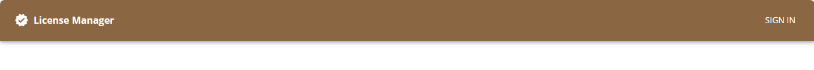
2. Once clicked, a popup dialog will be displayed requesting for the email address.
   
3. Next, specify the email address and select submit.
4. Validates user account, if new then redirects to sign up view.
5. Verify user account.
6. Redirects to the organization sign in view.
7. Upon completion of the organization sign in flow, the user account will be validated

At 3, for first-time sign in only, all web app users will be prompted to sign up.

At 4, the user account is validated against a backend service.
This will verify the following

- Is email account registered
- Is email account's domain within the allowed domain list

If successful the sign up/sign in process will be completed and user will be redirected to organization sign in view.

If unsuccessful, sign up/sign in will be blocked and an error message will be displayed detailing the reason for failure.

Note:

- Organization admins have full access to all functionality within the app made available to them and the ability to grant access to users.
- Users will have access to each view based on their assigned roles and access privileges.

### Sign up process

The following view is displayed after submit for the sign up process.

A verification code is required to authorize the email address.

Follow these steps to complete sign up

1. Select the send verification code. A verification wll be sent to the specified email address
1. Enter the code in the Verification Code input field
1. Select Verify Code. All other fields will be enabled for edit after this action.
1. Provide any other necessesary information and click continue.
1. Once complete, account will be validated and redirected to organisation sign in

## Data table properties

Throughout the application all data is displayed within data tables. This section describes the features available within the data table that is same across all views.

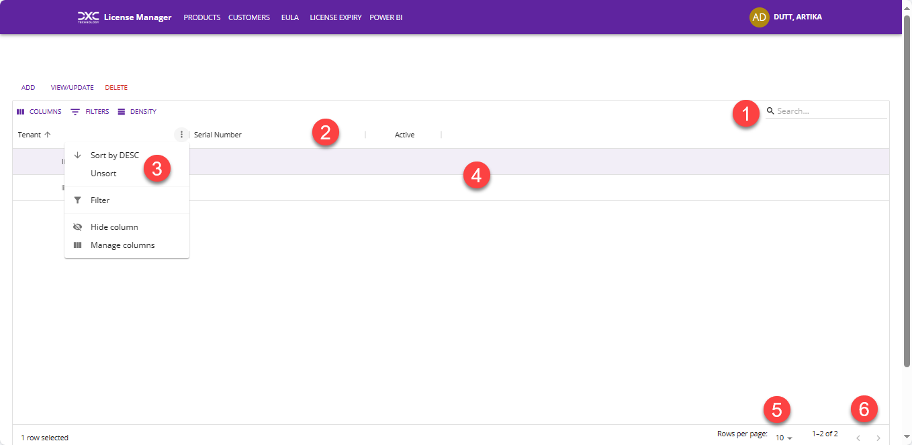

1. The search bar on the top right hand corner of the grid can be used as a wild card search across all records.
1. On click of all header column cells, the data within the column can be toggled to sort ascending or descending
1. For all header column cells, clicking on the ellipsis will display more functionality that can be applied to the selected column.
1. All data is displayed within this grid. For views that support line edit, double click on any row will enable all cells for edit (except for the one's configured to not allow edit)
1. The number of rows displayed within the page can be toggled within this option
1. The arrow keys can be used to traverse between all data within the grid list.

1. Enables users to enable and disable display of columns within the grid
   
1. Allows users to specify filter property for any column.  
   All column fields are accessible.
   
   The following options are available to apply on the filter value
   
1. Density allows users to toggle the data display view of the grid
   

## Products

This section describes the product information management capabilities available within the Power App.

App Bar Menu Item Name - **_Products_**

On load displays the list of all products.

For details on how to the data table functions see [Data table properties](#data-table-properties)

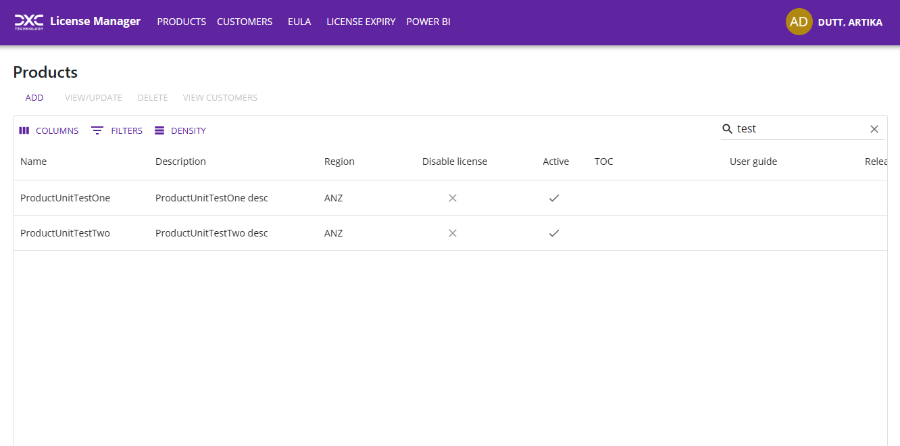
**Details:**

- **Name** – Name of the product, this should be same as the name of the enum added under DXCLicenseProductIdentifier registered within the extension for DXC License Manager in FinOps.
- **Description** – Description for the product
- **Region** - Used to identify the region of the product head office. Available options (None, ANZ, Global, Nordic)
- **Disable License** – When set to yes, a perpetual license is automatically created for customers when requested. Available options (Yes, No)
- **TOC** – Terms and conditions URI for the organization
- **User Guide** – URL redirecting to the user guide for the product
- **Support Email** – Email contact for product help support
- **Active** - Determine if the product is enabled. Available options (Yes, No)

**Functions available:**

- **Add** - Displays a popup view to allow new product to be added.
  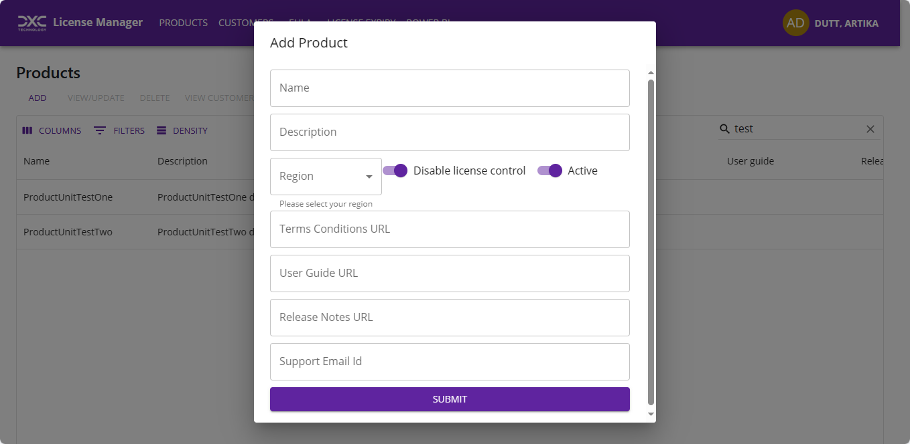
- **Update** - Double click on the grid row to enabled edit mode. Once all necessary data is modified, click outside the grid and then click update to complete the update process.
  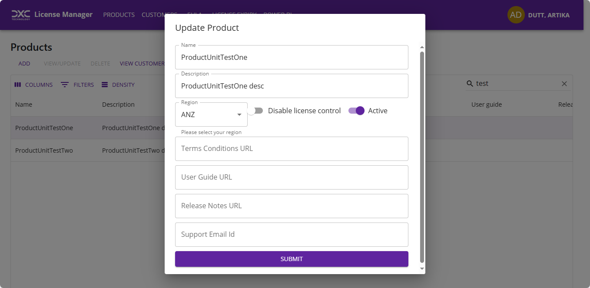
- **Delete** - Delete the product record. Note: A customer record cannot be deleted that has customer associated to it
  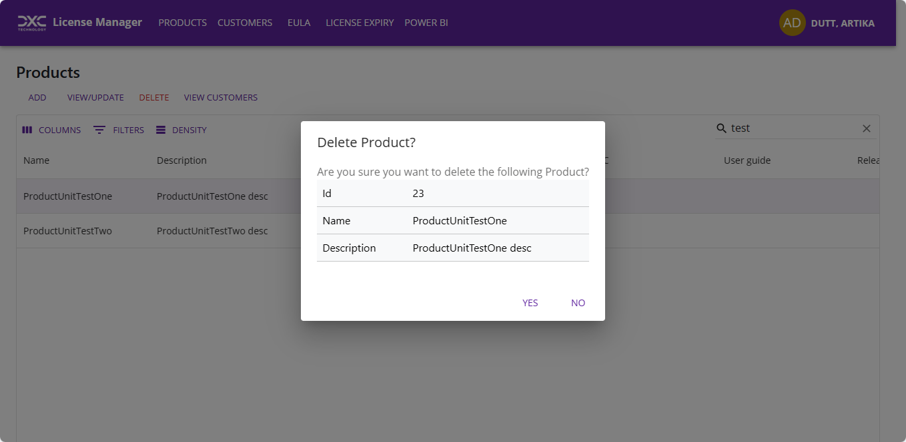
- **View Customers** - Displays the list of all customers for the selected product.
  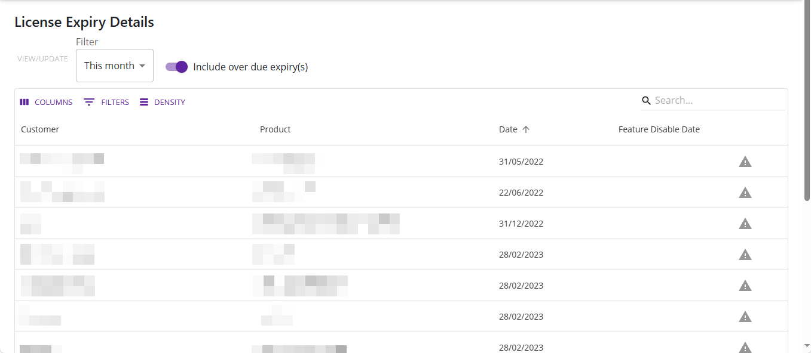

## Customers

This section describes the customer information management capabilities available within the Power App.

App Bar Menu Item Name - **_Customers_**

On load displays the list of all customers.

For details on how to the data table functions see [Data table properties](#data-table-properties)

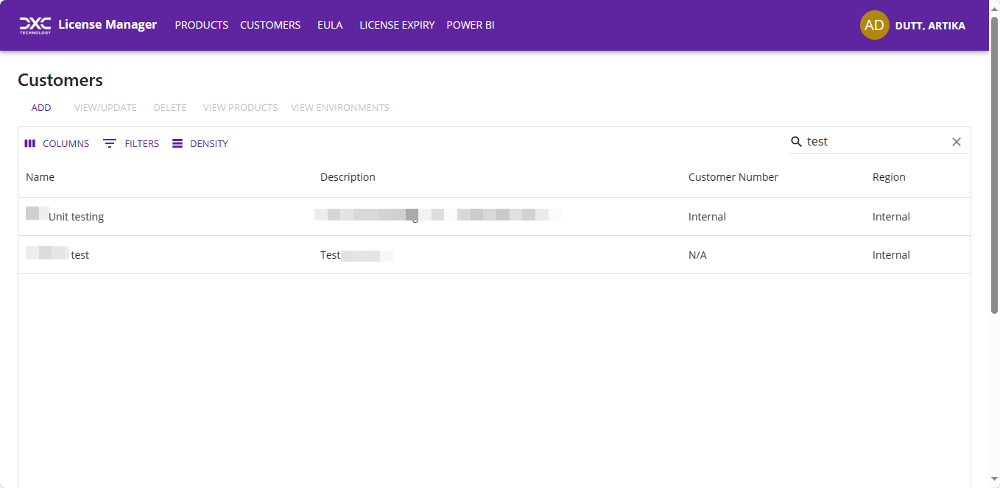

**Details:**
• **Customer Name** – Official Name of the customer  
• **Customer Description** – Description or a.k.a name for the customer  
• **Customer Region** - Used to identify the region of the customer head office  
• **Customer Number** – Used to identify the customer in sales/finance systems  

**Functions available:**

- **Add** - Displays a popup view to allow new customer to be added.
  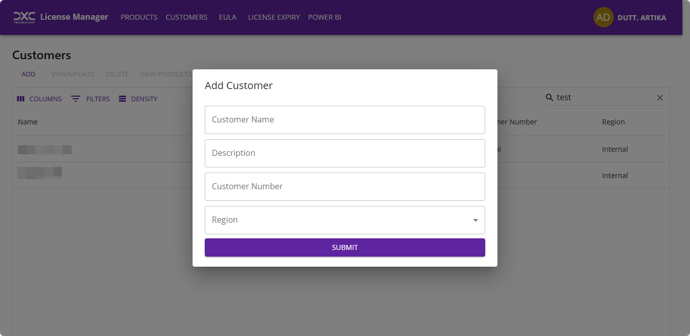
- **Update** - Double click on the grid row to enabled edit mode. Once all necessary data is modified, click outside the grid and then click update to complete the update process.
  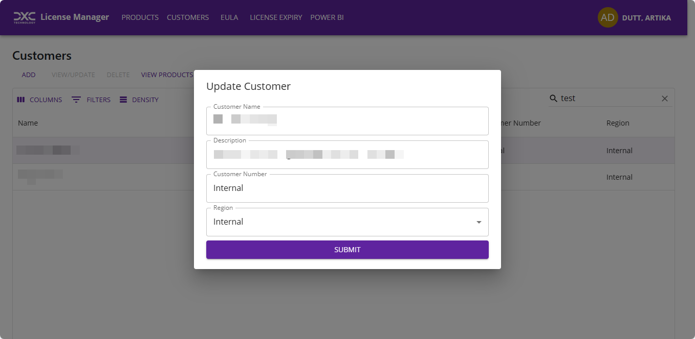
- **Delete** - Delete the customer record. Note: A customer record cannot be deleted that has products or environments associated to it
  
- **View Products** - Navigates to a view that allows products to be licensed to the selected customer
- **View Environments** - Navigates to new view that allows environments to be licensed to the selected customer.

### Customer Products

This section describes the customer product information management capabilities available within the Power App.

Navigate from Customers View

On load displays the list of all products licensed to the customer.

For details on how to the data table functions see [Data table properties](#data-table-properties)

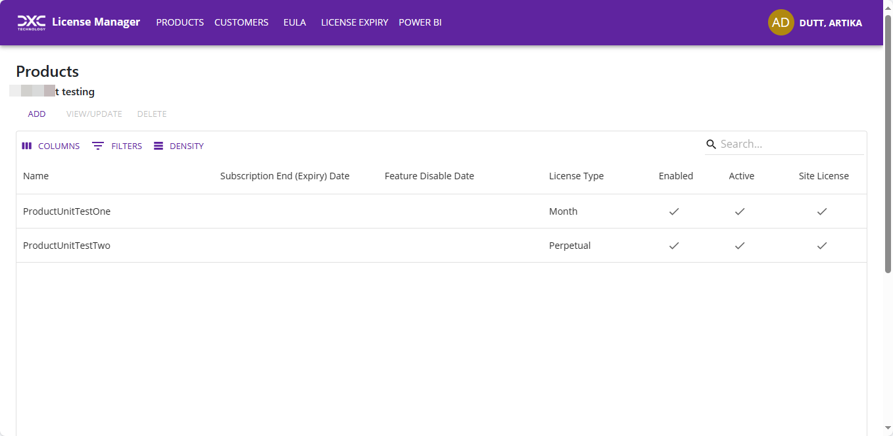

**Details:**

- **Name** - Name of the product
- **Subscription End(Expiry) Date** - Based on invoicing. This must be checked annually to ensure customer is being invoiced and making payments.
- **Feature Disable Date** - If all efforts have not resulted in payment from the customer, the feature will be disabled and can no longer be used.  
  Note: License Manager must be linked to a Feature Key for this option
- **License Type** - Options Include:
  - Perpetual - Product purchased with perpetual license, but maintenance should still be invoiced in order to receive ‘latest’ code
  - Month - Subscription License billed monthly
  - Quarter - Subscription License billed quarterly
  - Annual - Subscription License billed annually
  - Subscription - Licensed based on subscription model
  - Temp - A temp license has been provided to enable customer to evaluate the product
- **Enabled** – Determines if the license is enabled for the product or not.
- **Active** – Where the customer product _Subscription End Date (Expiry Date)_ has not been reached.
- **Site License** – Customer product’s _Site (Module) License_ is set to YES. Where this is inactive, _No. of Users MUST be completed_
- **No. of Users** - The number of users licensed to. Not required if site license is enabled.
- **Subscription Start Date** - The original date of purchase. This can show how long a customer has been using the product
- **Agreement Start Date** - Date of current pricing agreement/SOW. This date can be used to identify customer to be included/excluded from price increases
- **WBS** – Identifier that can be used to identify invoiced line item
- **Invoiced as** - Used to help identify how the product is displayed in an invoice. This is due to sales calling products many different things within a SOW.
- **Notes** - Additional information

**Functions available:**

- **Add** - Displays a popup view to allow new product to be licensed/added to the customer.
  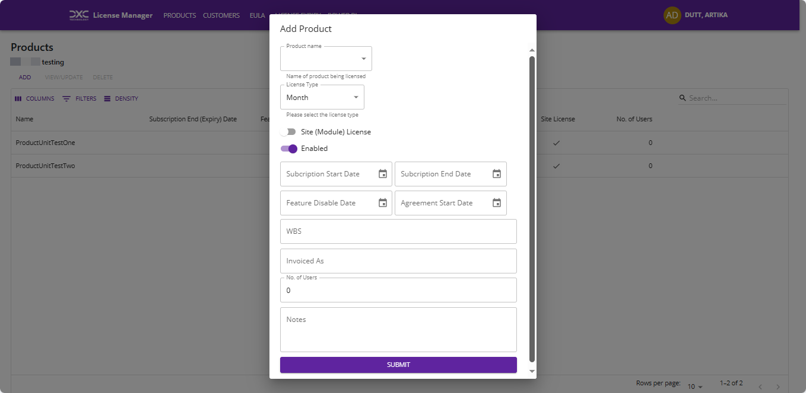
- **View/Update** - Displays a popup view to allow customer product association data to be updated or to view all details of the record.
  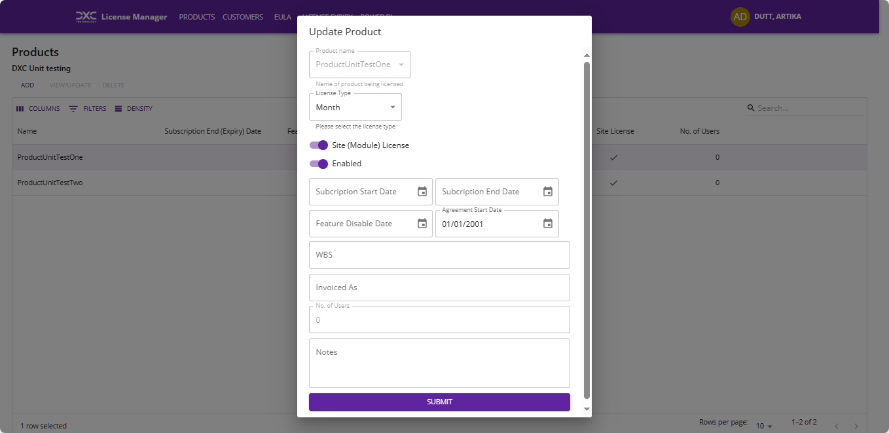
- **Delete** - Delete the product record for the selected customer. The product can only be deleted if all the environments for the Customer has been deleted.
  

### Customer Environments

This section describes the customer environment information management capabilities available within the Power App.

Navigate from Customers View

On load displays the list of all environments licensed to the customer.

For details on how to the data table functions see [Data table properties](#data-table-properties)

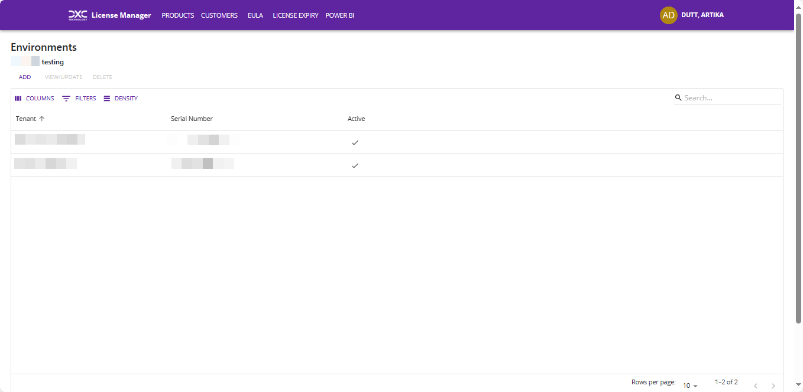

**Details:**

- **Tenant** - Domain of the environment, for example, dxc.com
- **Serial Number** - Serial of the FinOps environment that the license needs to be applied to. This can be found under About in FinOps front end environment.
- **Active** - Determines if the environment record is enabled.

**Functions available:**

- **Add** - Displays a popup view to allow new environment to be licensed/added to the customer.
  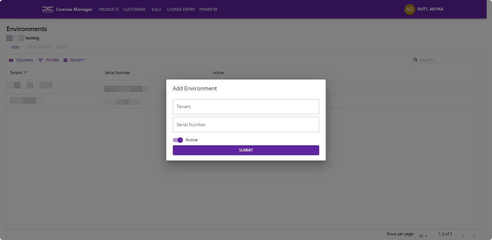
- **Update** - Double click on the grid row to enabled edit mode. Once all necessary data is modified, click outside the grid and then click update to complete the update process.
  
- **Delete** - Delete the environment record for the selected customer.
  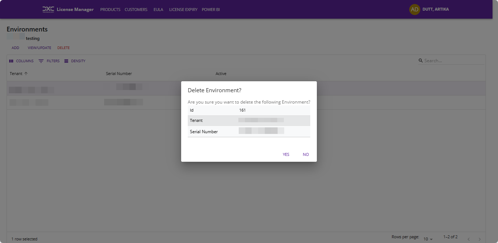

## Reports

### License Expiry

This section describes the license expiry view.

App Bar Menu Item Name - **_License Expiry_**

Navigate from License Expiry View

On load displays the list of all product license expiring or expected to expire.

For details on how to the data table functions see [Data table properties](#data-table-properties)

**Filter options:**

- This Week
- This Month
- Next three months
- Next six months
- Within this year

**Details:**

- **Customer** - Customer name
- **Product** - Product name
- **Date** - Expiry Date
- **Flag** - Flag to determine if the license has already expired

## Power BI

This section describes the reports accessible within the app

App Bar Menu Item Name - **_Power BI_**

On load, displays the list of reports accessible to the user.

Select each report in the list to view the Power BI report in embedded view.

These reports are embedded using service principal and requires Power BI Pro license. User license is not required.

Please reach out to our support team at ECLANZProductSupport@dxc.com for more details.
