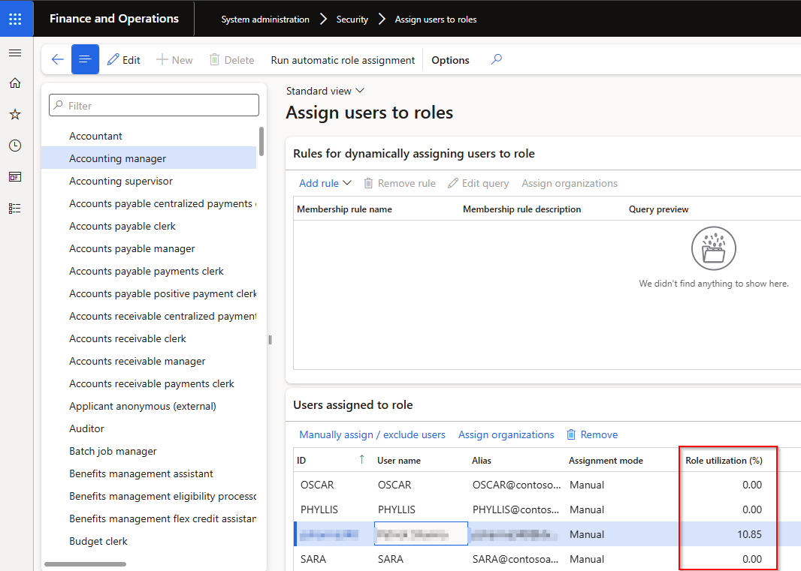

---
# required metadata

title: Security Insights for D365 FO
description: Security Insights for D365 FO - Release notes
author: Monica du Toit
manager: Pontus Ek
ms.date: 2025-10-15
ms.topic: article
ms.prod: 
ms.service: dynamics-ax-applications
ms.technology: 

# optional metadata

ms.search.form: 
audience: Application User/ Azure Administrators
# ms.devlang: 
ms.reviewer: Monica du Toit

# ms.tgt_pltfrm: 
# ms.custom: ["21901", "intro-internal"]
ms.search.region: InsightsForD365FO
# ms.search.industry: [leave blank for most, retail, public sector]
ms.author: Monica du Toit
ms.search.validFrom:  2023-03-28
ms.dyn365.ops.version: 10.0.31
---

# 	Release notes
This document describes the features that are either new or changed in the release version mentioned.

# Version compatibility
The matrix shows the minimum DXC build versions compatible per for Microsoft versions and builds.  
If blank: investigations are ongoing.  

D365 Version	  | Any issues found in testing?	  | Product version tested
:--       	  |:--           			  |:--
Product version: 10.0.43   App build: 10.0.2177.18	  | • No functional issues   • Build error fixed in 21610	          | • Functional: 10.0.40.202412061   • Build error fixed: 10.0.42.202503251
Product version: 10.0.44   App build: 10.0.2263.11	  | No	| 10.0.42.202503251
Product version: 10.0.45   App build: 10.0.2345.13	  | No	| 10.0.43.202506191

Release notes for other models included in product:
- [DXC License Manager](../LMG/Release-notes.md#dxc-license-manager)
- [DXC License](../LMG/Release-notes.md#dxc-license)

# Current version

### Release 10.0.44.20251017

Security Insights for D365 FO 10.0.44 runs on the following Microsoft releases

Base	  | Version	  | Release
:--       |:--            |:--
Microsoft Dynamics 365 application	| 10.0.44 	  | [What’s new or changed in Dynamics 365 application version 10.0.44](https://docs.microsoft.com/en-us/dynamics365/finance/get-started/whats-new-changed-10-0-44)
Microsoft Dynamics 365 application	| 10.0.45 	  | [What’s new or changed in Dynamics 365 application version 10.0.45](https://docs.microsoft.com/en-us/dynamics365/finance/get-started/whats-new-changed-10-0-45)

#### Build 10.0.44.202510171
Release date: 17 October 2025

<ins>New features</ins>

Number	| Name		 | Description
:--		|:--	     |:--
23142	| Security governance	| In 10.0.44 MS introduced new tables specifying user licensing requirements. We have now aligned our **build logic** to the newer model of D365 licensing from Security Governance. This aligns us to **License usage summary** and their new sets of licenses. Additional functionality we offer, not available in std:   • Actual usage and highlights unused license types   • Summarised / applicable values and license spread - We only show the license count applicable to the user's required license types, but also indicate what would be the minimum license for the menu item. Where a user requires multiple license types, we spread the license count to the lowest priority applicable license. For example if the user needs SCM and Finance licenses, the menu item count will only be included in the lowest priority license applicable for that menu item and user. Thus if it could be accessed by SCM and Finance, only Finance count will include this menu item for this user. This makes it simpler to see if a license type is unused based on actual user access.   • Microsoft Entra ID users       The following updates have been made to **Security insights by user** page:   • Button **Build license information** - uses new model of D365 licensing tables to build user licensing information. Also doesn't reset fetched data anymore.   • License types - the columns indicating applicable licenses matches to new sets of licenses, for example includes Finance premium.   • New fields **Minimum recommended license** and **Active user license** in FastTab 'Menu items for selected privilege'. Example: The user requires SCM and Finance license, if the menu item can be write accessed by the lower priority license 'Finance', **Active user license** would be 'Finance' for this user. **Minimum required license** will indicate the lowest priority license that can write access this menu item, for example 'Operations - Activity'. Thus if this is the only 'Finance' accessed menu item by the user, they could be moved to a different role that excludes the other Finance menu items, and only include 'Operations - Activity' menu items which could reduce their required license from 'Finance' to 'Operations - Activity'.  Blank values would be the 'Not required' records in 'License usage summary'.     The **unused license types** can still be highlighted on user, roles, duties and privileges with colors to indicate that those license types could be removed from the user, by modifying the role or replacing with lower license roles to save user licensing costs.     **Notes**:   • The data entity 'Insights for user access and security’ has been deprecated as it is no longer relevant. Previously D365 didn't have the breakdown of menu items linked to privileges, duties, roles and user, which is now available in Security governance.   •  We've removed page 'Security insights by license'. Std 'License usage summary' provides a license top-down view, we aim to include our usage data to the std form in next release.

<ins>Bug fixes</ins>

Number	| Name		 | Description
:--		|:--		 |:--
24311	| Security diagnostics	| Error 'Object reference not set to an instance of an object'. Related to telemetry capturing extensions.

# Previous Version(s)

### Release 10.0.43.20250619

#### Build 10.0.43.202506191
Release date: 19 June 2025

<ins>New features</ins>

Number	| Name		 | Description
:--	|:--		  	|:--
22736   22158	| **Interaction type**	| Ability to log Form/Page Interaction types **Viewed** (only opened the form) vs **Edited** (modified / created records) for the accessed menu items. Enable this additional telemetry field by setting **Form edits (Page edits)** to _Yes_ on **Monitoring and telemetry parameters**.  This is useful, for example if the user only viewed Finance license type menu items, they could possibly be switched to a Team member / Activity license type role for the menu items.         Where there was no interaction, or the interaction was prior enabling the new monitoring field, the Interaction type will be Blank.     Interaction type has also been added to the following two Security Insights forms. Please note the Interaction type is a display method on the license view.          

### Release 10.0.42.20250325

#### Build 10.0.42.202503251
Release date: 25 March 2025

<ins>New features</ins>

Number	| Name		 | Description
:--	|:--		  	|:--
20486	| Validation	| New parameter option **Warn when removing utilised reference in security configuration**.   When user selects **Remove reference** in **Security configuration** and fetched utilization exists for the role/duty/privilege combination, and new option is set to:   • **Yes** - Warning will notify user before the reference is removed, and only removed once they confirm.    • **No** - No warning      
19926	| Assign users to roles	| **Role utilization %** added to form **Assign users to roles** to assist in determining if other assigned users utilised the role in the fetched period. Only supported for roles assigned to users in F&O (not 'Microsoft Entra ID security groups')   
21534	| Go to batch jobs	| **Go to batch jobs** link on info log when running Security Insights steps as batch.   
21325	| Menu item name	| When running the **Synchronize user roles and access** step, **Menu item name** will be populated by custom logic to translate Menu item to it's label name.   

<ins>Bug fixes</ins>

Number	| Name		 | Description
:--	|:--		  	|:--
20930	| User access and security groups | Fix for error 'Cannot edit a record in User access and security groups (DXCSecurityInsightsGroups). The record has never been selected.' When adding users to user groups via the users tab.
21205	| Zero role utilization %	| When 1st user in group has 0 Overall user utilization %, and then clicking on user with non-zero %, the Role utilization % for that 2nd user incorrectly shows 0%
21531	| Visual highlights	| Incorrect visual highlights 
21610	| 10.0.43 build issue	| Fix 10.0.43 build issue on **Fetch interaction data from application insights**.   Microsoft.IdentityModel.Clients.ActiveDirectory has been deprecated and no longer supported by FinOps and needs to be upgraded to now use Microsoft.Identity.Client   [Microsoft notice](https://learn.microsoft.com/en-us/dynamics365/fin-ops-core/fin-ops/get-started/removed-deprecated-features-platform-updates#azure-active-directory-authentication-library-adal)

### Release 10.0.40.20241206

#### Build 10.0.40.202412061
Release date: 6 December 2024

<ins>New features</ins>

Number	| Name		 | Description
:--	|:--		  	|:--
19165	| Data entity	| New export-only data entity called 'Insights for user access and security'. This provides a flat file of all user, role, privilege, menu items and calculated utilization. This is useful for taking a "snapshot" or reviewing in Excel. It is advised to filter records before exporting as this file can be large.
19492	| Highlight unused licenses	| Ability to highlight unused licenses for a user and each role for the selected user. Unused means the applicable user didn't access any menu items with that license type in the fetch period.   Clicking on a **Role name**, will open **Assign users to roles** form, thus enabling reviewer to see which other users have been assigned to the role with unused licenses as well.     Select required highlight colour in field **Background color for unused license fields** on Visual tab in **Insights for user access and security parameters** to enable the colour highlights for unused licenses.     In below example the selected user didn't access any Operations licenses in the fetch period   
19990	| Not assigned users	| When Initiating security group using **User groups** or **Microsoft Entra ID security groups**, an extra security group **Not assigned** will be created for users that doesn't fall within any of the existing groups.
20430	| Only enabled users	| Only enabled users displayed in:   • Security insights by user   • Security insights by license
19930	| View related roles	| Button **View related roles** added to Duties and Privileges FastTabs on 'Security insights by user'. Provides a "where used" functionality.   
20488	| Fetch interaction data from application Insights	| **Record count** now included per task in Fetch's batch job infolog. Provides information on how many records were fetched, and since the job is split into tasks as per parameters, the batch job history infolog will display the number of records fetched per task.
17514	| DXC License manager	| New DXC License manager 10.0.40.202412041. See [Release notes](../LMG/Release-notes.md#d365-finance-and-operations) for more detail.

<ins>Bug fixes</ins>

Number	| Name		 | Description
:--	|:--		  	|:--
19103	| Create privilege utilization record	| Fix for error "Cannot create a record in Privilege utilization (%) (DXCSecurityInsightsPrivilegeUtilization). Security privilege: 0, 0.00. The record already exists."
19848	| Update conflict	| Fix to following error on step 'Synchronize user roles and access': "Cannot edit a record in User information (SysUserInfo). An update conflict occurred due to another user process deleting the record or changing one or more fields in the record."
20395	| Refresh unfilters	| When user filters on the following, a Refresh (Shift + F5) will now not remove the filters:   • Security insights by user - Users FastTab   • Security insights by license - Licenses and Users FastTab
20392	| Validation	| Incorrectly successfully validated Azure application insights configuration in **Insights for user access and security parameters** when the **Application Insights App Id** was incorrect.

### Release 10.0.40.20240910

#### Build 10.0.40.202409101
Release date: 10 September 2024

<ins>New features</ins>

Number	| Name		 | Description
:--	|:--		  	|:--
18830	| Initiate user security groups	| Ability to use **Microsoft Entra ID security groups** when initiating user security groups on the **Security insights by user** view.   Option controlled by the MSFT config key for AAD.
18764	| HR tables	| Ability to insert columns from HR tables. For example can insert Title for users, where person is assigned to users.
18756	| Filter by Group	| Ability to filter by **User security group** on following steps:   • Fetch interaction data from application insights   • Calculate utilization rates

### Release 10.0.37.20240731

#### Build 10.0.37.202407311
Release date: 31 July 2024

First release

# Installation process
To align with MS best practice and to protect our IP the following applies to the release process.
- The license models DXCLicense and Sable37License will only be released as binaries as part of a deployable package. 
- We will not provide test models for the products, neither as binary or source code. 
- We will only publish the release as a deployable package. 
- Model source code can be provided at our discretion. It can be requested for debugging upgrade errors, or if required for extensions.
	- If you have been given the source code to our model for extension or debugging purpose, never make modifications directly to our models! 
	- If you need an extension point, please send an email to ECLANZProductSupport@dxc.com and request it to be implemented. 

Depending on the installation history follow one of these guides to install the new release. 
## Installation without existing installed product
1. Apply the deployable package to your environment. 
2. If you have requested any model for extension or debugging purposes. Install the model source code. 
a.	Note, once the model source code is compiled it will overwrite the binaries installed when the deployable package was applied. 

## Installation with existing installed product
If you’re installing the new release in an installation that already has a previous version of the product installed and you’re not using it for debugging or extension. We recommend that you;  
1. Remove the release product model source code from your source control, if source control is used. 
2. Apply the deployable package, installing the latest version of the product models as binaries.  
3. Check in the binaries for the models to source control, if source control is used. 

If you’re using our model source code for extension or debugging and would like to continue using it, please do the following to apply the new release with the source code. 

1. Remove product license model from your source control that is applicable to the release. You’ll find the license model in the deployable package. It will either be called DXCLicense and Sable37License. 
2. Apply the deployable package to your environment to install the latest binaries. Check in the binaries for the license model that was removed in step 1 to source control. Note, this step will also install the binaries for all the models in the new release. 
3. Install the product release model source code and check into source control. 

If you don’t follow these instructions and continue building your installation deployable package using the license model source code, the installation will continue using the same license model as before applying the release. 

## Feature management

Enable the following feature in D365 Feature management:
- **Security Insights for D365FO**

If above feature is not visible, press **Check for updates** to refresh the feature management list.

