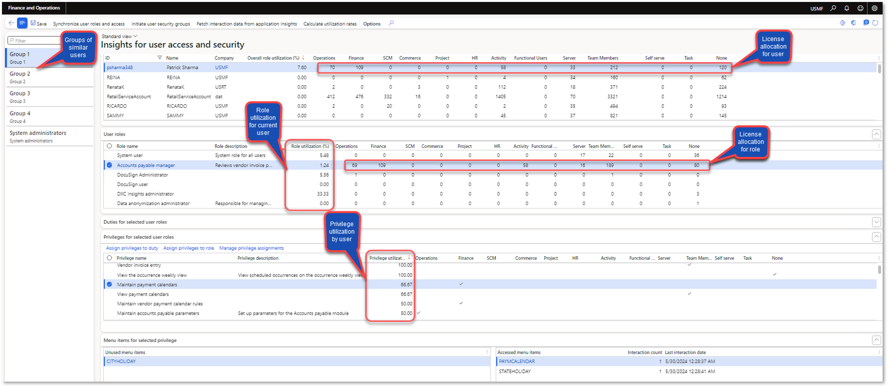
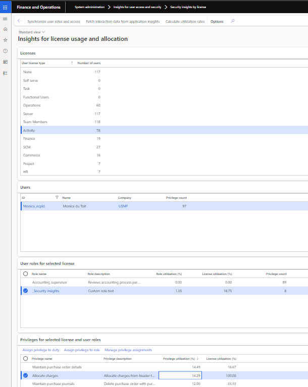

---
# required metadata

title: Security Insights for D365 FO
description: Review Security Insights for D365 FO
author: Monica du Toit
manager: Pontus Ek
ms.date: 2025-06-18
ms.topic: article
ms.prod: 
ms.service: dynamics-ax-applications
ms.technology: 

# optional metadata

ms.search.form: DXCSecurityInsightsUserView, DXCSecurityInsightsLicenseView
audience: Application User/ Azure Administrators
# ms.devlang: 
ms.reviewer: Monica du Toit
# ms.tgt_pltfrm: 
# ms.custom: ["21901", "intro-internal"]
ms.search.region: InsightsForD365FO
# ms.search.industry: [leave blank for most, retail, public sector]
ms.author: Monica du Toit
ms.search.validFrom: 2023-03-28
ms.dyn365.ops.version: 10.0.32
---

# Security Insights for D365 FO

The following views are available to colate and review user access and security utilization:
- **Security insights by user**
- **Security insights by license**

These views are available by navigating to **System administration > Insights for user access and security**

# Processing
The following steps are available to initiate or update the required fields.

## 1. Synchronize user roles and access
Synchronizes the current user roles, privileges and accessible menu items. This can only be run as batch.  
Subsequent runs only required if menu item privileges change.

## 2. Initiate user security groups
Ability to automatically group similar users
 
> Note: This step is only available on **Security insights by user**.  

**Parameters:**
- Use **Select foundation data for user group creation** to create the user groups by either:
    - **User groups** - utilizes D365 user groups setup in **System administration > Users > User groups**. For this option it is not required to rerun the initiate step if more users are added or roles/privilegs change for a user.
    - **Microsoft Entra ID security groups** - utilizes Active Directory Security groups, available via 'System administration > Users > Groups'. Option controlled by the MSFT config key for AAD
    - **Security roles** - machine learning is used to group users with similar security roles.
    - **Security privileges** - machine learning is used to group users with similar security privileges.
- Enter the **Maximum number of groups** that should be created. Enabled where 'Security roles' or 'Security privileges' are selected.

When using **User groups** or **Microsoft Entra ID security groups** and an enabled user isn't assigned to one of the groups, a new group **Not assigned** will be created for these users.

## 3. Fetch interaction data from application insights
Fetch user interation data from Azure Applications Insights

**Parameters:**
- Select the applicable **Azure application Insights connection** setup in [Insights for user access and security parameters](Parameters.md)
- Select the required start date in **Activities - start date time**
- Select the required end date in **Activities - end date time**

The records to include are automatically filtered to enabled users and can also be filtered to User Id(s).

The number of records fetched from Azure application Insights can be checked in the batch job history log.

> Note: User accessed menu items date/time data: starts when logging usage data to AppInsights with either DXC's Insights or Standard monitoring.

## 4. Calculate utilization rates
Calculate utilization rates of user roles and privileges based on accessing menu items.

The records to include are automatically filtered to enabled users and can also be filtered to User Id(s).

# Review

Next step is to review the utilization by using either of the following two views
- **Security insights by user**
- **Security insights by license**
These views are available by navigating to **System administration > Insights for user access and security**

The number of privileges for each license type is displayed on the user and role level.

Example actions that could be taken after review: 
- Where the user hasn't accessed any of the menu items in the specific role, it could be possible to remove the role from the user.
- Where the user only accessed "lower" licensed menu items in the role, it could be possible to assign the applicable privileges to a different/new duty and add those to a different/new role which will result in a "lower" license for the user.

After modifying security configuration, rerun the following to update the values on the form:
- Fetch interaction data from application Insights
- Calculate utilization rates

#### Interaction type
**Interaction type** provides additional information on the accessed menu items. For example if the user only viewed Finance license type menu items, they could possibly be switched to a Team member / Activity license type role for the menu items. [Setup](../Parameters.md#4--monitoring-and-telemetry-parameters)

- **Viewed** - Only opened the form vs.
- **Edited** - Modified / created records

#### Buttons

The following buttons are available on the views:
- **Assign privilege to duty** - Security configuration is opended for the selected privilege with the ability to assign to multiple duties
- **Assign privilege to role** - Security configuration is opended for the selected privilege with the ability to assign to multiple roles
- **Manage privilege assignments** - Security configuration is opended for the selected privilege(s)
- **View related roles** - View related roles for the selected duty / privilege

#### Links 

Clicking on a **Role name**, will open **Assign users to roles** form, thus enabling reviewer to see which other users have been assigned to the selected role.

#### Highlight unused licenses

**Security insights by user** includes the ability to highlight unused licenses for a user and each role for the selected user. Unused means the applicable user didn't access any menu items with that license type in the fetch period. 

Select required highlight colour in field **Background color for unused license fields** on Visual tab in **Insights for user access and security parameters** to enable the colour highlights for unused licenses.     In below example the selected user didn't access any Operations licenses in the fetch period   

#### Data entities for review

- **Insights for user access and security** - Export-only data entity. This provides a flat file of all user, role, privilege, menu items and calculated utilization. This is useful for taking a "snapshot" or reviewing in Excel. It is advised to filter records before exporting as this file can be large.

#### Security insights by user

#### Security insights by license

# Assign users to role
**System administration > Security > Assign users to roles**

**Role utilization %** on form **Assign users to roles** assists in determining if other assigned users utilised the role in the fetched period. 

> Note: Only supported for roles assigned to users in F&O (not 'Microsoft Entra ID security groups')
