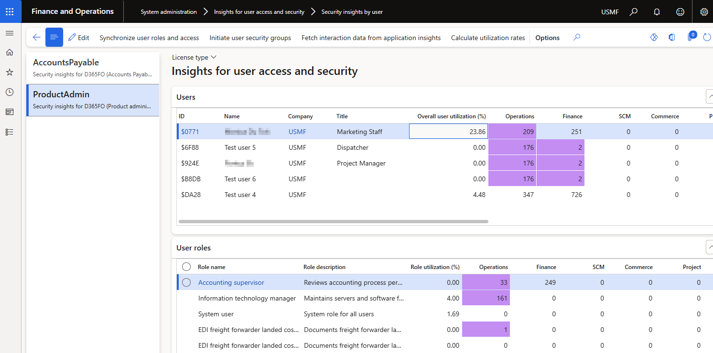

---
# required metadata

title: Security Insights for D365 FO
description: Review Security Insights for D365 FO
author: Monica du Toit
manager: Pontus Ek
ms.date: 2025-11-21
ms.topic: article
ms.prod: 
ms.service: dynamics-ax-applications
ms.technology: 

# optional metadata

ms.search.form: DXCSecurityInsightsUserView, DXCSecurityInsightsLicenseView
audience: Application User/ Azure Administrators
# ms.devlang: 
ms.reviewer: Monica du Toit
# ms.tgt_pltfrm: 
# ms.custom: ["21901", "intro-internal"]
ms.search.region: InsightsForD365FO
# ms.search.industry: [leave blank for most, retail, public sector]
ms.author: Monica du Toit
ms.search.validFrom: 2023-03-28
ms.dyn365.ops.version: 10.0.32
---

# Security Insights for D365 FO

The following view is available to colate and review user access and security utilization:
- **Security insights by user**

Navigate to **System administration > Insights for user access and security**

# Processing
The following steps are available to initiate or update the required fields.

## 1. Initiate user security groups
Ability to automatically group similar users
 
**Parameters:**
- Use **Select foundation data for user group creation** to create the user groups by either:
    - **User groups** - utilizes D365 user groups setup in **System administration > Users > User groups**. For this option it is not required to rerun the initiate step if more users are added or roles/privilegs change for a user.
    - **Microsoft Entra ID security groups** - utilizes Active Directory Security groups, available via 'System administration > Users > Groups'. Option controlled by the MSFT config key for AAD
    - **Security roles** - machine learning is used to group users with similar security roles.
    - **Security privileges** - machine learning is used to group users with similar security privileges.
- Enter the **Maximum number of groups** that should be created. Enabled where 'Security roles' or 'Security privileges' are selected.

When using **User groups** or **Microsoft Entra ID security groups** and an enabled user isn't assigned to one of the groups, a new group **Not assigned** will be created for these users.

## 2. Fetch interaction data from application insights
Fetch user interation data from Azure Applications Insights

**Parameters:**
- Select the applicable **Azure application Insights connection** setup in [Insights for user access and security parameters](Parameters.md)
- Select the required start date in **Activities - start date time**
- Select the required end date in **Activities - end date time**

The records to include are automatically filtered to enabled users and can also be filtered to User Id(s).

The number of records fetched from Azure application Insights can be checked in the batch job history log.

> Note: User accessed menu items date/time data: starts when logging usage data to AppInsights with either DXC's Insights or Standard monitoring.

## 3. Calculate utilization rates
Calculate utilization rates of user roles and privileges based on accessing menu items.  
If there are changes to Security configuration, running this step will refresh the Security Insights' View tables.

The records to include are automatically filtered to enabled users and can also be filtered to User Id(s).

# Review

Next step is to review the utilization.

Example actions that could be taken after review: 
- Where the user hasn't accessed any of the menu items in the specific role, it could be possible to remove the role from the user.
- Where the user only accessed "lower" priority licensed menu items in the role, it could be possible to assign the applicable privileges to a different/new duty and add those to a different/new role which will result in a "lower" license for the user.

After modifying security configuration, rerun the following to update the values on the page:
- Calculate utilization rates

### Sections

The page is split into:
- **Security groups** - Section on left, which are populated by **Initiate user security groups**. All enabled users are split within these groups.
- **Users** - Enabled users per security group
- **User roles** - Displays user roles for the selected user
- **Duties for selected user roles** - Displays all duties for the selected user role
- **Privileges for selected user roles** - Displays all privileges for the selected user role. These privileges could be via a duty or directly on the role.
- **Menu items for selected privilege** - Displays the menu items for the selected privilege and the section is split into:
   - Unused menu items - On left the menu items not accessed by the user in the fetch period.
   - Accessed menu items - On the right the menu items accessed by the user in the fetch period.
 
### Fields

Description of a few of the key fields.

- **Minimum recommended license** - Indicates the lowest priority license that can write access to this menu item, for example 'Operations - Activity'. Thus if this is the only 'Finance' accessed menu item by the user, they could be moved to a different role that excludes the other Finance menu items, and only include 'Operations - Activity' menu items which could reduce their required license from 'Finance' to 'Operations - Activity'. Blank values would be the 'Not required' / Read records in 'License usage summary'. Available on **Menu items for selected privilege**.
- **Active user license** - Indicates the lowest priority user license that can write access to this menu item. For example, the user requires SCM and Finance license, if the menu item can be write accessed by the lower priority license 'Finance', this field would be 'Finance' for this user. This license type is also where the count would be included, see below. Available on **Menu items for selected privilege**.
- **License types** - License types sorted by highest to lowest priority. Available on **Users**, **User roles**, **Duties for selected user roles** and **Privileges for selected user roles**.
- **Securable object entitled count** - The number of menu items / securable objects for each license type is displayed on the user, role, duty and privilege level. The page only shows the license count applicable to the user's required license types, but also indicates what would be the minimum license for the menu item. Where a user requires multiple license types, the page spreads the license count to the lowest priority applicable license. For example if the user needs SCM and Finance licenses, the count will only be included in the lowest priority license applicable for that securable object (menu item) and user. Thus if it could be accessed by SCM and Finance, only Finance count will include this menu item for this user. This makes it simpler to see if a license type is unused based on actual user access. A licensed menu item is flagged as **Entitled** / Write on the **License usage summary**. Available on **Users**, **User roles**, **Duties for selected user roles** and **Privileges for selected user roles**.
- **Utilization %** - Percentage utilization of the licensed menu items. For example if the User role has 20 licensed menu items and the user accessed 10 of those menu items in the fetch period, the role utilization % would be 50%. Available on **Users**, **User roles**, **Duties for selected user roles** and **Privileges for selected user roles**.
- **Interaction type** - Provides additional information on the accessed menu items. For example if the user only viewed Finance license type menu items, they could possibly be switched to a Team member / Activity license type role for the menu items. Available on **Users**, **User roles** and **Privileges for selected user roles**. 
    - **Viewed** - Only opened the form vs.
    - **Edited** - Modified / created records

### Buttons

The following buttons are available on the views:
- **Assign privilege to duty** - Security configuration is opended for the selected privilege with the ability to assign to multiple duties
- **Assign privilege to role** - Security configuration is opended for the selected privilege with the ability to assign to multiple roles
- **Manage privilege assignments** - Security configuration is opended for the selected privilege(s)
- **View related roles** - View related roles for the selected duty / privilege

### Links 

Clicking on a **Role name**, will open **Assign users to roles** form, thus enabling reviewer to see which other users have been assigned to the selected role.

### Highlight unused licenses

**Security insights by user** includes the ability to highlight unused licenses for a user and each role for the selected user. Unused means the applicable user didn't access any menu items / securable object with that license type in the fetch period. 

Select required highlight colour in field **Background color for unused license fields** on Visual tab in **Insights for user access and security parameters** to enable the colour highlights for unused licenses.     In below example the selected user didn't access any Operations licenses in the fetch period   

#### Security insights by user

# Assign users to role
**System administration > Security > Assign users to roles**

**Role utilization %** on form **Assign users to roles** assists in determining if other assigned users utilised the role in the fetched period. 

> Note: Only supported for roles assigned to users in F&O (not 'Microsoft Entra ID security groups')

# License usage summary
**System administration > Security > Security governance > Licenses usage summary**

Following Security Insights fields have been added to this standard form: 
- Utilization %
- Miniumum recommended license
- Interaction type (view vs.edit)
- Last interaction date
