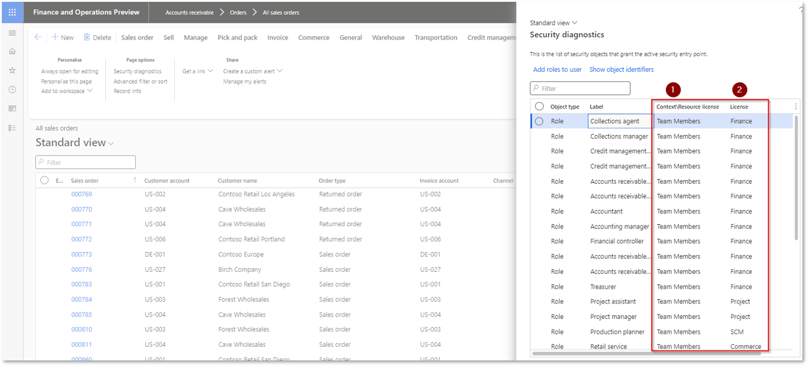

---
# required metadata

title: Security Insights for D365 FO
description: Security diagnostics for Security Insights for D365 FO
author: Monica du Toit
manager: Pontus Ek
ms.date: 2024-07-03
ms.topic: article
ms.prod: 
ms.service: dynamics-ax-applications
ms.technology: 

# optional metadata

ms.search.form: 
audience: Application User/ Azure Administrators
# ms.devlang: 
ms.reviewer: Monica du Toit
# ms.tgt_pltfrm: 
# ms.custom: ["21901", "intro-internal"]
ms.search.region: InsightsForD365FO
# ms.search.industry: [leave blank for most, retail, public sector]
ms.author: Monica du Toit
ms.search.validFrom: 2023-03-28
ms.dyn365.ops.version: 10.0.32
---

# Security Insights for D365 FO

##	Security diagnostics

**Security diagnostics** can be accessed for a menu item on the Options tab on the ActionPane.

The following two fields have been added to display licensing info for Roles and Privileges:
1. **Context \ Resource license** - License for the Menu item
2. **License** - License for the Role or Privilege

