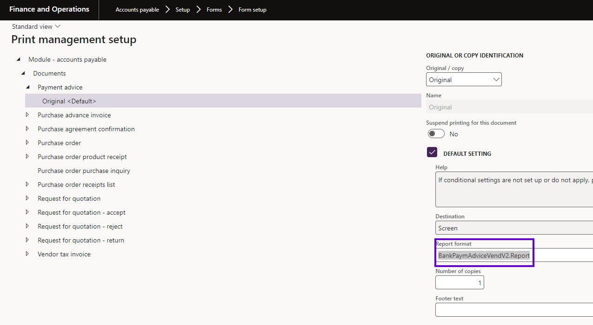
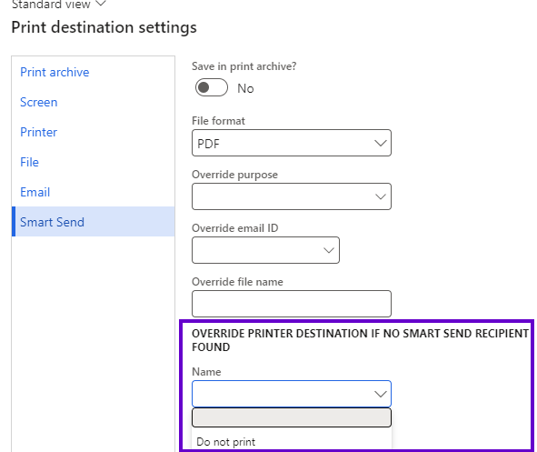
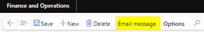
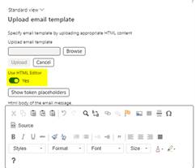
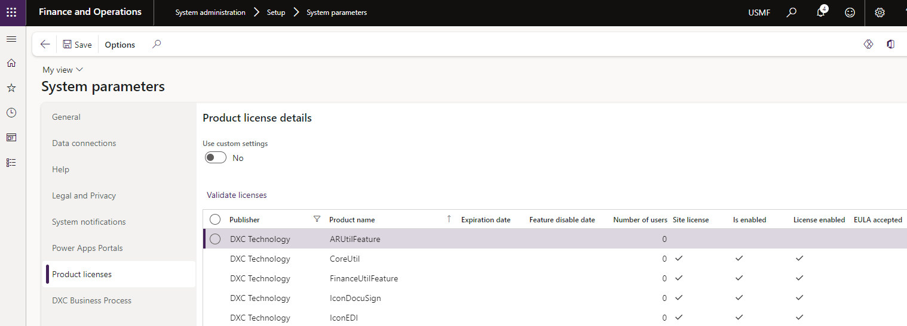

---
# required metadata

title: Smart-Send
description: DXC Smart Business Form Email Manager - Release notes
author: PeterM
manager: Pontus Ek
ms.date: 2023-08-11
ms.topic: article
ms.prod: 
ms.service: dynamics-ax-applications
ms.technology: 

# optional metadata

ms.search.form:  
audience: Application User
# ms.devlang: 
ms.reviewer: Peter Musumeci

# ms.tgt_pltfrm: 
ms.custom: ["21901", "intro-internal"]
ms.search.region: Global 
# ms.search.industry: [leave blank for most, retail, public sector]
ms.author: lcoll
ms.search.validFrom: 2016-05-31
ms.dyn365.ops.version: AX 7.0.1
---

# Release notes
This document describes the features that are either new or changed in the release version mentioned.

# Version compatibility
The matrix shows the minimum DXC build versions that are compatible with Microsoft versions and builds.  
If blank: investigations are ongoing.  

D365 Version	  | Any issues found in testing?	  | Product version tested
:--       	  |:--           			  |:--
Product version: 10.0.40   App build: 10.0.1935.5	  | No | 10.0.37.202403263
Product version: 10.0.41   App build: 10.0.2015.16	  | No | 10.0.37.202403263
Product version: 10.0.42   App build: 10.0.2095	  | No | 10.0.40.202409113
Product version: 10.0.43   App build: 10.0.2177	  | Currently being tested | pending testing results 

Release notes for other models included in the product:
- [DXC Connections](../CONNECTIONS/Release-notes.md)
- [DXC License Manager](../LMG/Release-notes.md#dxc-license-manager)
- [DXC License](../LMG/Release-notes.md#dxc-license)

# Upcoming framework changes 

As part of our ongoing efforts to strengthen our ISV product line and give the most value to our clients, Smart Send will undergo architectural modifications in a future version later this year, replacing outdated and inefficient approaches. This phase will see changes to the code structure to simplify and improve the product's overall performance. Old, out-of-date methods will be removed, and multiple-form outputs will be combined into one structure. This simplifies the procedure for future updates and/or extensions. This may impact any custom changes or extensions made to the product. Customers using the base Smart Send version are expected to remain compatible after the release. Any impacts to customers with bespoke extensions/modifications must follow their standard troubleshooting process.   The release is targeted to occur before the 10.0.44  version release  Due April 2025 see [Targeted release schedule](https://learn.microsoft.com/en-us/dynamics365/fin-ops-core/dev-itpro/get-started/public-preview-releases#targeted-release-schedule-dates-subject-to-change) to allow Customers with custom extensions/modifications to handle any impacts.

# Current version

### Release 10.0.40.20240911

DXC Smart Business Form Email Manager 10.0.40 runs on the following Microsoft releases

Minimum supported version 10.0.40 Proactive Quality Update (2) App build: 10.0.1935.92

Base	  | Version	  | Release
:--       |:--            |:--
Microsoft Dynamics 365 application	| 10.0.40	  | [What’s new or changed in Dynamics 365 application version 10.0.40](https://learn.microsoft.com/en-us/dynamics365/finance/get-started/whats-new-changed-10-0-40)
Microsoft Dynamics 365 application	| 10.0.41	  | [What’s new or changed in Dynamics 365 application version 10.0.41](https://learn.microsoft.com/en-us/dynamics365/finance/get-started/whats-new-changed-10-0-41)
Microsoft Dynamics 365 application	| 10.0.42	  | [What’s new or changed in Dynamics 365 application version 10.0.42](https://learn.microsoft.com/en-us/dynamics365/finance/get-started/whats-new-changed-10-0-42)
Microsoft Dynamics 365 application	| 10.0.43 	  | [What’s new or changed in Dynamics 365 application version 10.0.43](https://docs.microsoft.com/en-us/dynamics365/finance/get-started/whats-new-changed-10-0-43)

#### Build 10.0.40.202409113 

<ins>Bug fixes</ins>

Number	  | Name	          | Description
:--       |:--              |:--
19477	    | Error "Server failed to authenticate the request. Please refer to the information in the www-authenticate header" only when using a Blob connection string | Authentication credentials are not included in the Default endpoint connection string for blob storage. When metadata is passed for an update, Azure Blob storage throws an error which is then received by smart send and thrown to the user. When using  S.A.S strings the authentication credentials are included so metadata update completes successfully. Improvements were made to the DXC Connections model to update the metadata of the file during upload instead of sending metadata as a separate request.    DXC Connections release information - [Release notes](../CONNECTIONS/Release-notes.md)

## Feature management
From 10.0.34.20231026 Smart Send can be enabled via Feature management
Enable the following feature in D365 Feature management:

- DXC Smart Send

If the above feature is not visible, press **Check for updates** to refresh the feature management list.

# Previous version(s)
#### Build 10.0.40.202409112 
### Release 10.0.40.20240911

Number	  | Name	          | Description
:--       |:--              |:--
18765	    | Field Label states "Blog Container Name" instead of "Blob Container Name"| Corrected spelling for Blob Container field.
18979	    | Error "Unable to update metadata of the uploaded file" | When the Packing List is issued for a shipment "/n" was passed as part of the address string in the standard solution, this signifies a new line in FinOps code.  This string is considered invalid by the blob storage client and has been replaced with a blank string before  being passed to the blob storage.  Smart Send does not update the values of addresses or other string values that are added in the token map, but just receives and translates them to the metadata of the blob.  An additional method has been added that will look at removing these escape sequences before updating the metadata.

#### Build 10.0.40.202409111 
### Release 10.0.40.20240911
<ins>Bug fixes</ins>

Number	  | Name	          | Description
:--       |:--              |:--
16791	    | The field with ID '0' does not exist in table 'CustInvoiceTable'| When attempting to perform the View >copy function on a Free Text Invoice the error was displayed.
18226     | Free Text Invoices are not saved to Azure blob storage when issued in multiple | Previously when you selected more than 1 free text invoice or a combination of free text and customer tax Invoices only the first Free Text Invoice was sent to blob storage
18275    |Tax Journal Screen resets when sending records across screens | Issue resolved when multiple records are selected and attempted to be sent via Smart Send
17425  |Update Table Groups | Update Table Groups in line with proposed PPAC copy environment functionality to prevent loss of key data
18916|Smart Send "Test Azure blob storage connection" button is not validating correctly| Changes to how FinOps validated blob storage connections have been made as a result of an invalid dll file bundled by Microsoft causing the failure. As a result of this, the Azure dll was moved to a new model called DXCConnections.    DXC Connections release information - [Release notes](../CONNECTIONS/Release-notes.md)
18842|Azure blob storage setup  mismatches|When changing between Blob connection string or Key Vault storage the Blob connection string would still be displayed instead of looking for the key vault type. Also not allowing blob storage values to be blank when Storage options are set to none 
18792| Request for quotation smart send button  will print to screen| When using the smart send button for Request for quotation this would previously print to screen 
18983|Remove Catch statement| When saving files in blob storage a message would display "See event viewer in LCS for more detail" when a non-Smart Send error occurred. This has been removed in favour of original errors being passed back to Fin ops from blob storage

#### Build 10.0.37.202403263

<ins>Bug fixes</ins>

Number	  | Name	          | Description
:--       |:--              |:--
16730	    | Smart Send License error| When users switched to the Feature management version of Smart Send they would receive an error advising the product was not licensed.  This has now been corrected and users should no longer receive errors when upgrading from a non-feature-managed version of Smart Send|
17433	    | Report  is not set for Smart Send| If a default report has not been set in the Email Parameters and more than 1 report format per report is in use Smart Send will now attempt to find the report by name.|
17623	    | Error Saving to Azure Storage| When the Company logo placeholder is used as part of an organisational email template some characters are being passed through as part of the Metadata that are not supported by Azure Blob storage.  This resulted in an error being displayed referring users to LCS. This has now  been updated and no Image metadata is passed through to Azure|

<ins>New features</ins>

Number	  | Name	          | Description
:--       |:--              |:--
17724		| Licensing	| Improvements to licensing - see [Licensing release notes](../LMG/Release-notes.md#release-10037202404262) for detailed information.

### Release 10.0.37.20240301
#### Build 10.0.37.202403012

<ins>Bug fixes</ins>

Number	  | Name	          | Description
:--       |:--              |:--
16791	    | Error executing code: The field with ID '0' does not exist in table 'CustInvoiceTable'| resolved error displayed When attempting to perform the View >copy function on a Free Text Invoice|
17094| Customer and Vendor Payment advice emails| When utilizing electronic reporting formats, the number of emails sent for the payment advice to customers or vendors was previously exponential to the number of lines for that vendor.|
17123|Report  is not setup for Smart Send| Previously, when a user attempted to utilize the Smart Send functionality and their user security role was limited to a single legal organization, an error message would appear alerting them that Smart Send was not configured.

### Release 10.0.36.20231026
#### Build 10.0.36.202310262

<ins>Bug fixes</ins>

Number	  | Name	          | Description
:--       |:--              |:--
17069	    | Error: Report DXC_BankPaymAdviceVendV2.The report is not set up for Smart Send| Previously when issuing a Customer or Vendor Payment advice with a custom report an error is displayed advising that the report is not set up for Smart Send|
17017| Remove reference to ERDestinationNamedFeatur| Build issues were found in version 10.0.39 because feature key control over electronic reporting via print management was no longer in place and was enabled by default.   This problem has been fixed as Smart Send no longer makes reference to it.|

### Release 10.0.34.20231026

#### Build 10.0.34.202310261

<ins>Bug fixes</ins>

Number	  | Name	          | Description
:--       |:--              |:--
12885	    | Sales agreement - Confirmation issues error TTSBEGIN/TTSCOMMIT| When posting a Confirmation on the Sales agreement form and you set  print to Yes, the “TTSBEGIN/TTSCOMMIT” error will no longer be displayed.
13553	    | Final recipient missing semicolon in email address| When using the "Both" Selection under recipient for purchase order confirmations the final recipient would not have the semi-colon before the email address. With this correction, all email recipients are formatted correctly, and emails are delivered as per standard behaviour.  
13707	    | Error on customer payment journal when processing Smart Send Email | When making multiple payments to a single Customer account in the customer payment journal only the first line will process the correct attachment.  This has now been corrected and each line will be sent to the related Smart Send contacts with the correct attachment.
14831	    | Centralized payment only utilized set up from creation legal entity | When utilizing the Centralized Payment Functionality for Vendor Payment Journals Smart Send would utilize set up from the current legal entity.  This has been updated and centralized payment can now use Smart Send templates from multiple legal entities when making centralized vendor payments.
15821	    | Smart Send does not recognise the difference between a free text invoice and a customer invoice on Invoice Journal | When issuing a Free Text Invoice utilizing the Tax Invoice Journal (Accounts receivable>Enquiries and reports> Invoices >Invoice Journal) a "Report is not set up for Smart Send" Error would appear if the Legal entity did not have a Customer Invoice report set as well.  This has been corrected and both Free text and Customer Invoice can be issued with independent templates.
16073	    | The BankPaymAdviceVendController class has become obsolete by Microsoft in version 10.0.37 and mandatory in 10.0.34 | Smart Send now will only support BankPaymAdviceVendController V2.  Activate “Enable batch processing for bank payment advice reports” via Feature management if not auto-enabled.   This feature lets you use batch processing for both the customer and vendor bank payment advice reports. To use this feature, you must use BankPaymAdviceVendV2 and BankPaymAdviceCustV2 bank payment advice and set them up as the customer and vendor report formats in print management.

Number	  | Name	          | Description
:--       |:--              |:--
16329	    | GER payment advice - Duplicated lines and wrong recipient | When the payment journal contains two lines (two different vendors), when both are lines selected the ‘Smart send payment advice’ functionality created an email to only one vendor and it sends the other vendor’s payment advice to the wrong vendor. The settled invoices lines were also duplicated. This previously applied to customer and vendor payments and has been corrected.

<ins>New features</ins>

Number	  | Name	          | Description
:--       |:--              |:--
9233	    | Additional fields in organizational email template data entity| Additional fields have now been added to the Organization email template Data Entity to incorporate the To, CC and BCC fields from the Smart Send email templates.
9483	    | Company logo placeholder for email template| You can now incorporate your company logo into your Smart Send email template.  Note you must use Tag `` to render image correctly.
9735	    | rich HTML editor | New ability to use HTML editor when building content for Smart Send email templates.
12731	    | Additional placeholders | 2 additional placeholders have been added. For Purchase order confirmation (PurchTable.PurchName) %VendorName% For Sales order Confirmation (SalesTable.SalesName) %CustomerName%
14174	    | key vault is now in drop-down menu | key vault has now been updated to a drop-down menu.  Azure Blob storage will be deprecated in the future. Date to be announced. 
14961	    | change to option "PRINTER DESTINATION IF NO SMART SEND RECIPIENT FOUND" | When no Smart send recipient has been selected you now have the option to set documents to not print via the renamed menu option "PRINTER DESTINATION IF NO SMART SEND RECIPIENT FOUND".  This setting works in conjunction with the Save to Azure Storage options and Alternate Email in email parameters. When “do not print” is enabled documents are not routed if no recipient is found.  By Default, this field is set with no option (Blank) which follows standard Smart Send logic and allows for both Azure storage or Alternate Email delivery.  “Do not print” if enabled will override alternate email and Azure storage options and document will not be routed.  Only occurs if no smart send recipient is found.

Number	  | Name	          | Description
:--       |:--              |:--
6735	    | Support the use of Rich HTML editor| HTML editor is included for editing the body of the organisational email template. To start editing select Email Message from the top menu to open the template then switch the “use HTML editor” toggle button to Yes to allow editing functionality.

## Feature management
From 10.0.34.20231026 Smart Send can be enabled via Feature management
Enable the following feature in D365 Feature management:

- DXC Smart Send

If above feature is not visible, press **Check for updates** to refresh the feature management list.

### Release 10.0.29.20230414

#### Build 10.0.29.202304143

Number	  | Name	          | Description
:--       |:--              |:--
12650	    | Payment Advice not issued when multiple payments for  same vendor  | When there are multiple payments for a single vendor within the one journal previously only the first record would issue the payment advice document when using the Smart Send button, this has now been corrected.

#### Build 10.0.29.202304142

Number	  | Functionality	  | Reason
:--       |:--              |:--
N/A		| License manager	| License manager version 10.8.32.10171   Enhanced Licensing capabilities to assist with licensing support and scaling.   **Note:** Required to upgrade all installed DXC products to at least the following versions:   • EDI 10.0.29.202305053   • Finance utilities 10.0.29.202305051   • SmartSend 10.0.29.202304142   • Core extensions 10.0.29.202304142   • DocuSign 10.0.29.202304211   • Item creation 10.0.29.202304211   •  PLM 10.0.29.202304211   • Forex 10.0.29.202305101   
 
### Release 10.0.27.20220930
	
#### Build 10.0.27.202209301

Number	  | Functionality	  | Reason
:--       |:--              |:--
9929	    | Support for Electronic Report formats | Visibility of Display electronic reports within the Smart Send email parameters form     New print destination Smart Send for use with electronic reporting destinations and electronic reporting named destinations.     Support for electronic reports generated through print management or using the Smart Send button.     Supports saving of the business document to Azure blob storage.     Full functionality of placeholder tokens in line with SSRS formated reports.
	
#### Build 10.0.27.202209302

Number	  | Functionality	  | Reason
:--       |:--              |:--
11641	    | Smart Send button sends the default report format | When using the Smart Send button, the email parameter configuration that is used should be the Default record.     The email parameter configuration does not use the default, it uses the report format defined in print management

### Release 10.0.25.202208151

#### Build 10.0.25.202208151

Number	  | Functionality	  | Reason
:--       |:--              |:--
11122	    | Vendor payment advice report blank when run with Smart Send button | Report data is not included when the vendor payment advice report is run using the Smart Send payment advice button present on the vendor payment journal.

### Release 10.0.25.20220630

#### Build 10.0.25.202206302

Number	  | Functionality	  | Reason
:--       |:--              |:--
10231	    | Support Vendor Tax Invoice report formats | The report type *Vendor Invoice* and the standard report formats *VendInvoiceDocument.Report* and *VendInvoiceDocumentModern.Report* are now available in the Smart Send configuration form ECL_AutoPrintReportMgmt
10288	    | Legal entity name placeholder token | The token placeholder %CompanyName% can now be used to return the name of the legal entity from which the report was generated.

### Release 10.0.29.20230414

#### Build 10.0.29.202304142

<ins>Bug fixes</ins>

Number	  | Name	          | Description
:--       |:--              |:--
12650	    | Payment Advice not issued when multiple payments for  same vendor  | When there are multiple payments for a single vendor within the one journal previously only the first record would issue the payment advice document when using the Smart Send button, this has now been corrected.

### Release 10.0.22.20220413

#### Build 10.0.22.202204131

Number	  | Name	          | Description
:--       |:--              |:--
10230	    | Sales	invoice not dispatched using the Smart Send button  | Resolution for error message received when selecting the Smart Send button on a customer tax invoice.

### Release 10.0.22.20220331

#### Build 10.0.22.202203312

Number	  | Functionality	  | Reason
:--       |:--              |:--
9654	    | Override purpose | Override configurations for print management are currently supported by Smart Send when using different report versions. Where the same report format is used, the email purpose used to identify the email recipient is always sourced from the default report. Print management configuration for an override condition now allows for an override purpose to be defined against the Smart Send destination. If this is entered the override purpose will supersede the purpose configured under email parameters.
9713	    | Key vault added for Blob storage connection string	| As an alternative to the blob connection string field, users can now select to use a key vault value. This is configured on a record level under Azure blob storage setup.

<ins>Bug fixes</ins>

Number	  | Name	          | Description
:--       |:--              |:--
9797	    | Intercompany payment advice 	| Smart Send did not support BankPaymAdviceVendV2.Report for the processing of payment advice for one legal entity from within another legal entity. Support for this has been added, allowing the email address to be sourced from the account in the posting company
9866    | Custom versions of the updated payment advice report were not recognised by the Smart send button	| The Smart Send payment advice button processes the default Smart Send configuration outside of print management. Customized versions based of BankPaymAdviceVendV2.Report were not processed. This button now supports all SSRS payment advice reports.
9947	    | Sales return	| For a sales return report to be sent successfully the user needed to have previously run the report, creating usage data. Without this, the report would error. The report will now run without the cached data.
	
### Release 10.0.18.20211109

#### Build 10.0.18.202111091

<ins>Bug fixes</ins>

Number	  | Name	          | Description
:--       |:--              |:--
9266	  | Email fallback not triggered	| In the absence of an email with the appropriate purpose, the fallback options of an alternative email and/or saving to blob storage are available to be configured in email parameters. These were not being triggered. The absence of an email will still provide a warning, however, the configured fallback option will now also be actioned.

### Release 10.0.18.20210929

#### Build 10.0.18.202109291

Number	  | Functionality	  | Reason
:--       |:--              |:--
5145	|	Payment Advice (Vend/Cust) - V2 introduced		| In D365 10.0.13 Microsoft introduced Payment advice V2. Payment advice V2 is now supported when using the Smart Send payment advice button within the vendor payment and customer payment journals.
9506	|	Payment Advice V2 Report – Payment history		| Payment advice V2 is now supported when using the Smart Send payment advice button within the payment history form, accessible from the vendor.

### Release 10.0.16.20210520

#### Build 10.0.16.202105201

<ins>Deprecation</ins>

Number	  | Name	          | Reason
:--       |:--              |:--
9161	  |Feature Removal: Email Destination fields removed from print destinations email tab	| Fields on the email tab of the print destinations page used in Email Destination Defaults remained following the deprecation of the feature. The field Email ID and File name have now been removed. The email destination defaults feature has been removed.  This feature provided the ability to specify an email template and filename using placeholder tokens for a business form has now been removed, and instead, Smart Send Override email ID (Template) and Override file name features, can be used in print management conditions. The email destination defaults feature had been marked as deprecated since 19 March 2020.

### Release 10.0.16.20210406

#### Build 10.0.16.202104063

Number	  | Functionality	  | Reason
:--       |:--              |:--
6019	|	Smart Send Purchase Order- Add Requestor's/ Orderer's email to Email Template Tokens		| The email template tokens list has been updated for the Purchase Order report being sent via Smart Send. Four new tokens have been added which now include the Requestor’s and Orderer’s name and email address.

<ins>Bug fixes</ins>

Number	  | Name	          | Description
:--       |:--              |:--
5999  | ‘Test Azure blob storage connection' not working correctly	| The ‘Test Azure blob storage connection’ button on the Email parameters>Smart Send form was not working correctly. It is used to display ‘Test connection successful’ in most scenarios of the Blob connection string, even when an incorrect string was passed. This has now been resolved and appropriate errors will be displayed if the string is incorrect.
8785	  | Report title not visible	| The document title for Customer invoice was not set and displayed as blank when the report was sent via Smart Send. This has now been fixed.
  
<ins>Deprecation</ins>

Number	  | Name	          | Reason
:--       |:--              |:--
6041	  |Feature Removal: Email Destination Defaults	| Email destination defaults feature has been removed.  This feature provided the ability to specify an email template and filename using placeholder tokens for a business form has now been removed, and instead, Smart Send Override email ID (Template) and Override file name features, can be used in print management conditions. The email destination defaults feature had been marked as deprecated since 19 March 2020.
  
  
# Installation process
To align with MS best practice and to protect our IP the following applies to the release process.
- The license models DXCLicense and Sable37License will only be released as binaries as part of a deployable package. 
- We will not provide test models for the products as binary or source code. 
- We will only publish the release as a deployable package. 
We can provide model source code at our discretion. It can be requested to debug upgrade errors or if required for extensions.
	- If you have been given the source code to our model for extension or debugging purposes, never modify our models directly! 
	- If you need an extension point, please send an email to ECLANZProductSupport@dxc.com and request it to be implemented. 

Depending on the installation history follow one of these guides to install the new release. 
## Installation without existing installed product
1. Apply the deployable package to your environment. 
2. If you have requested any model for extension or debugging purposes. Install the model source code. 
a.	Note, once the model source code is compiled it will overwrite the binaries installed when the deployable package was applied. 

## Installation with existing installed product
If you’re installing the new release in an installation that already has a previous version of the product installed and you’re not using it for debugging or extension. We recommend that you;  
1. Remove the release product model source code from your source control, if source control is used. 
2. Apply the deployable package, installing the latest version of the product models as binaries.  
3. Check in the binaries for the models to source control, if source control is used. 

If you’re using our model source code for extension or debugging and would like to continue using it, please do the following to apply the new release with the source code. 

1. Remove the product license model from your source control that applies to the release. You’ll find the license model in the deployable package. It will either be called DXCLicense or Sable37License. 
2. Apply the deployable package to your environment to install the latest binaries. Check in the binaries for the license model that was removed in step 1 to source control. Note, that this step will also install the binaries for all the models in the new release. 
3. Install the product release model source code and check into source control. 

If you don’t follow these instructions and continue building your installation deployable package using the license model source code, the installation will continue using the same license model as before applying the release. 
