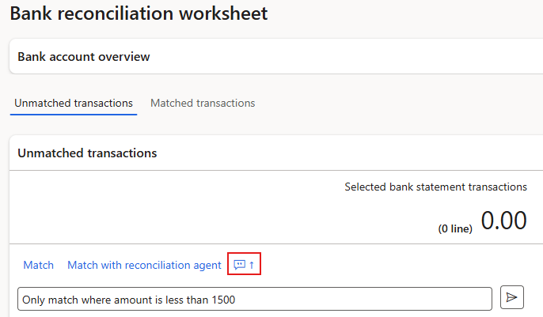
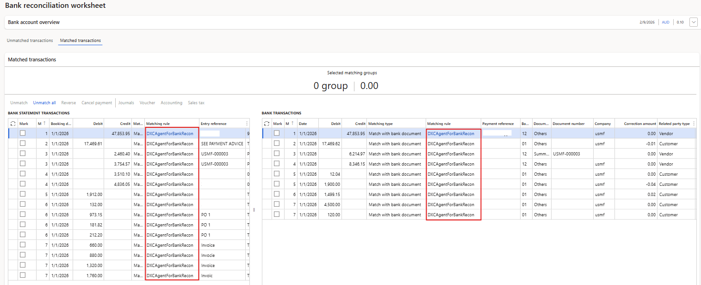

# DXC Agent for Bank reconciliation in D365 FSCM

The **DXC Agent for Bank reconciliation in D365 FSCM** can be run by: 

## Automatically with Bank statement import

See [setup](Setup.md#b4-bank-accounts) for prerequisites.

When importing bank statements with **Reconcile after import** enabled and the prerequisite setup are met the agent will automatically run and match the transactions in applicable Bank reconciliations.

## Manually in Bank reconciliation Worksheet

The agent can be manually run by navigating to **Cash and bank management > Bank statement reconciliation > Bank reconciliation** and selecting the applicable reconciliation's **Worksheet**.

Where the agent is enabled, the following buttons will be enabled in the **Unmatched transactions** tab: 
1. **Match with reconciliation agent**
    - To run the agent for all unmatched bank statement transactions, no need to select any records only click **Match with reconciliation agent**.
    - To run the agent for manually selected records, select the applicable unmatched bank statement transactions and click **Match with reconciliation agent**

2. **Prompt**
    - Instead of manually selecting applicable records, the user can use clear and specific language to specify which records the agent should attempt to match. Examples:
        -  Only match transactions where Related party type is Vendor
        -  Only match where amount is less than 1500
        -  Only match transactions where Related party type is Vendor and amount is less than 300
     

## Results

### Matched transactions

The transactions that have been matched by the Agent can easily be viewed in **Matched transactions** as these are flagged in **Matching rule** with **DXCAgentForBankRecon**.

