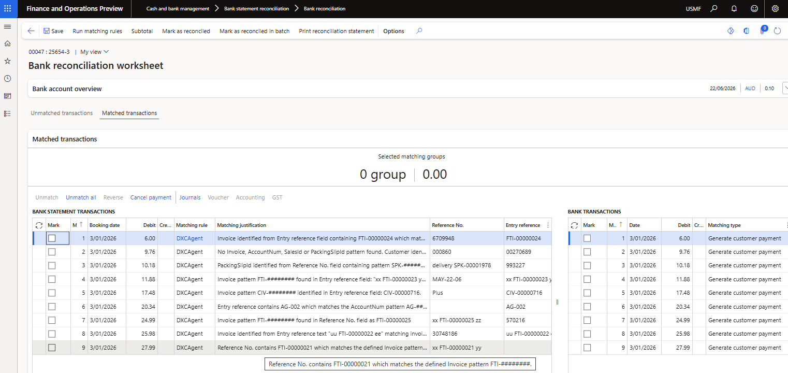

# DXC Agent for bank reconciliation customer payment generation

The **DXC Agent for bank reconciliation payment journal generation** allows users to automatically create new customer payment journals for relevant bank statement records. Users can also choose to post and match these journals as part of the agent process, or leave the journal unposted for review.

Customer payments could be created by the Agent for the following scenarios:
1. **Customer remittance pending payments** - Customer sends a remittance for their payment settling one or more invoices, these records can be stored in the agent's 'Customer remittance pending payments'. Once the payment is received in the bank reconciliation, the agent can create the customer payment and settle the applicable invoices as per the remittance.
2. **Bank statement referring to one invoice** - Customer refers to one invoice on the bank statement record, the agent will create the payment and settle the one invoice.
3. **Bank statement referring to no invoice, but contains a different reference that can be used to find customer account** - Customer doesn't send a remittance and no invoice referenced in the bank statement, the customer is identified either by related bank account or agent knowledge sources. Agent creates the customer payment journal, without any invoices settled.

# Setup

## Prerequisites

Start by setting up the prerequisite **Microsoft Foundry** and **DXC Agent for finance & supply chain management** - [user guide]({{ '/agent/dxcagentframework/Setup' | relative_url }})

##  Enable feature
After deployment, find and enable the following features:
1. DXC Agent for finance & supply chain management
2. DXC Agent for bank reconciliation payment journal generation

##  All agents

Navigate to **Organisation administration > Agents for finance & supply chain management > All agent** to setup the applicable agent per legal entity.

When opening the form, it checks for any new agents and self populates from details from code

See below table for information on fields.

### Agent for Customer Payment Journal Generation

Field                  | Description
:--                    |:--
**Agent name**         | DXCAgentForBankReconciliationCustPaymentJournalGeneration
**Agent description**  | Agent for Customer Payment Journal Generation
**Agent connection details**  | Select the agent created in prerequisite [Agent connection parameters](../dxcagentframework/Setup.md#b2--agent-connection-parameters)
**Agent instructions**  | Automatically populated with default Agent instructions
**Agent output format**  | Automatically populated with default output format
**Enabled**            | Set to _Yes_ in order to enable the agent
**Enable telemetry**   | See below for more details

#### Agent knowledge sources

The following **Agent knowledge sources** are automatically created for this agent based on Number sequences assigned for the applicable **Accounts receivable parameter** fields.

These can be disabled, edited (for example adding more values), etc.

Name        | Description         | Type      | Example value
:--         |:--                  |:--        |:--  
AccountNum    | Customer account    | Text    | The AccountNum will appear in the following format: AG### where ### represents numeric digits.
Invoice       | Invoice             | Text    | The Invoice will appear in the following format: CIV-######## or FTI-######## where # represents numeric digits.
PackingSlipId | Packing slip number    | Text    | The PackingSlipId will appear in the following format: SPK-######## where ######## represents numeric digits.
SalesId        | Sales order        | Text    | The SalesId will appear in the following format: ###### or SO###### where ###### represents numeric digits.

#### Telemetry

Set **Enable telemetry** to _Yes_ to log and view telemetry for _applicable_ agents.  
View the telemetry by using **Go to dashboard** on the ActionPane. This is only enabled for applicable agents.

Per each run, the following telemetry could be logged per agent. The data is displayed by month: 
- Statement count - Number of bank statement records included in runs
- Generated customer payment journal count - Number of customer payments created with _no_ invoice settled
- Generated settled customer payment journal count - Number of customer payments created with invoice settled
- Number of runs - Each time the agent is run, either via import or button in bank reconciliation worksheet

### Agent for pending remittance creation

Utilised for creating the **Customer remittance pending payments** from  Agent Email Content.

Field                  | Description
:--                    |:--
**Agent name**         | DXCAgentForPendingRemittanceCreation
**Agent description**  | Agent for pending remittance creation
**Agent connection details**  | Select the agent created in prerequisite [Agent connection parameters](../dxcagentframework/Setup.md#b2--agent-connection-parameters)
**Agent instructions**  | Automatically populated with default Agent instructions
**Agent output format**  | Automatically populated with default output format
**Enabled**            | Set to _Yes_ in order to enable the agent

#### Agent knowledge sources

This agent doesn't require any Agent knowledge sources.

## Bank accounts

Navigate to **Cash and bank management > Setup > Bank accounts** to setup the following:
- **Customer payment journal posting** - Determines if the created customer payment journal should be posted.
    - **Yes** - The journal will be created, posted and automatically matched to the original bank statement line. **Journal** button on **Matched transactions** in the Reconciliation worksheet allows user to easily navigate to these posted customer payment journals.
    - **No** - The journal will be created, but _not_ posted. The message in Action center will list the **Journal batch numbers** that were created. If the agent is run again, these bank statement records won't be included again, thus no duplication. **Journal** button on **Matched transactions** can't be used for these as the journal has not been posted by the agent. Once the journals have been reviewed and posted, the matching can be done in the reconciliation either by running agent 'DXC Agent for bank reconciliation', reconciliation matching rules or manual matching.
- **Customer payment creation** - Determines the customer payment creation processes applicable to the bank account.
    -  **Do not use remittance** - Agent's 'Customer remittance pending payments' is not in use, and can be skipped.
    -  **Settle from remittance and continue** - Agent's 'Customer remittance pending payments' should be used first and thereafter customer payments can also be created using related bank account and agent knowledge sources.
    -  **Settle from remittance only** - Agent's 'Customer remittance pending payments' should only be used. 

## Bank transaction types

Navigate to **Cash and bank management > Setup > Bank transaction types** and assign the applicable **Action** to each bank transaction type. Only the Actions that create a new bank transaction applies.  
This feature will review the bank statement records where the Action **Generate customer payment** or **Settle customer invoice** is mapped.

Example: **Bank transaction type** value **01** has Action **Settle customer invoice** assigned.

## Transaction code mapping

Navigate to **Cash and bank management > Setup > Advanced bank reconciliation setup > Transaction code mapping** and ensure all the applicable bank transaction types are mapped for the bank account.

Example: Company bank account has **Statement transaction code** value **050** mapped to **Bank transaction type** value **01**.   
Thus all bank statement records with **Bank transaction code** value **050** will be reviewed against **Agent knowledge sources** and table **CustInvoiceForBankReconciliationView**. Where the D365 Customer account can be determined, the customer payment journal will be created. If the **Invoice** was provided within a Bank statement field, this will be populated in the Invoice field in the journal and settled where the Action was **Settle customer invoice**.   

## Default description

This feature uses **Default description** when creating the payment journal line.

1. Enable feature **Enable default descriptions for advanced bank reconciliation**
2. Setup [Default descriptions](https://learn.microsoft.com/en-us/dynamics365/finance/cash-bank-management/apply-cash-adv-bank-rec#enable-default-descriptions-for-advanced-bank-reconciliation) for **Bank - reconciliation worksheet** for each applicable **Language** or select **user**.  

## Cash and bank management parameters

Navigate to **Cash and bank management > Setup > Cash and bank management parameters**.
- **Number sequences** - Setup a **Pending remittance id** number sequence if **Customer remittance pending payments** are to be used.

# Processing

## Customer remittance pending payments

Navigate to **Cash and bank management > Enquiries and reports > Customer remittance pending payments**.

This form contains Customer remittance records that could refer to one or multiple invoices as per the customer's remittance. It is used in creating customer payments from the bank reconciliation and settling all the invoices as per this form. This only applies to where the Bank account's **Customer payment creation** is set to either _Settle from remittance and continue_ or _Settle from remittance only_.

The records can be created from: 
1. **Process emails with agent**: **Agent for pending remittance creation** process messages in DXCAgentEmailContentTable where DXCAgentId is DXCAgentForPendingRemittanceCreation and MessageStatus is set to Waiting. 
2. **Data entities**: Pending remittance header & Pending remittance lines.
3. **New**: Users could use the New buttons to manually create remittance header and lines.

The following fields are available.

### Pending remittance header

Name        | Description when created with Process emails with agent     
:--         |:--  
**Pending remittance id**    | Unique identifier for the remittance record. Created by using the number sequence **Pending remittance id** in Cash and bank management parameters.
**Customer account**         | Customer account is determined by the first invoice in the remittance.
**Payment reference**        | Populated from the remittance.
**Payment date**             | Populated from the remittance.
**Remittance status**        | Record is created with _Pending_ status. Once used in bank reconciliation customer payment creation, the status is changed to _Processed_. Users can also manually change a record's status to _Cancelled_ to exclude it from processing.
**Currency**                 | Populated from the remittance.
**Amount in transaction currency**    | Total payment amount from the remittance.

### Pending remittance lines

Name        | Description when created with Process emails with agent     
:--         |:--
**Invoice**    | Populated from the remittance.
**Currency**   | Populated from the remittance.
**Amount in transaction currency**    | Payment amount per invoice from the remittance.

### Line details

Line details are display fields based on the invoice selected in the Pending remittance lines

## Bank reconciliation

The **DXC Agent for Bank reconciliation in D365 FSCM** can be run by: 

### Automatically with Bank statement import

See [setup]({{ '/agent/bank-recon/setup/all#b4-bank-accounts' | relative_url }}) for prerequisites.

When importing bank statements with **Reconcile after import** enabled and the prerequisite setup are met the agent will automatically run the licensed agents assigned to the workflow that is either assigned to the Bank account, Cash and bank parameters or the system default.

### Manually in Bank reconciliation Worksheet

The agent can be manually run by navigating to **Cash and bank management > Bank statement reconciliation > Bank reconciliation** and selecting the applicable reconciliation's **Worksheet**.

Where the agent is enabled, the **Create customer payment with agent** button will be enabled in the **Unmatched transactions** tab. 
- To run the agent for all unmatched bank statement transactions, no need to select any records only click **Create customer payment with agent**.
- To run the agent for manually selected records, select the applicable unmatched bank statement transactions and click **Create customer payment with agent**

### Results - Matched transactions

Where the Bank account's **Customer payment journal posting** was set to _Yes_, the Customer payment journals are posted and automatically matched to the original bank statement record. 
The following sections only applies to above set to _Yes_.

#### Journals
Button **Journals** will be enabled and allow the user to navigate to the posted journal.

#### Cancel payment
Button **Cancel payment** can be used to create an "opposite"/reversing transaction and move the posted bank document to unmatched.

> Note: Ensure **Bank transaction type** setup against field **NSF** in **Cash and bank management parameters** is the same as your Bank transaction type in your **Method of payment**. If they differ, standard matching doesn't allow these two bank document records to matched against each other, and throws the following error:
> "The criteria to reconcile have not been met. You can reconcile either a single canceled check or two transactions. To reconcile two transactions, the document type must be Other, and the documents must have the same bank account, transaction type, payment reference and have opposite amounts.

#### Matching rule
The transactions that have been matched by the Agent can easily be viewed in **Matched transactions** as these are flagged in **Matching rule** with **DXCAgent**.  

> Note: Reconciliation matching rule **DXCAgent** is automatically created by the product, but only the name is used for flagging the applicable Matched transactions.

#### Matching justication

To view Agent reasoning, see **Matching justification** for more information.

#### Matching type

The **Matching type** will be **Generate customer payment**.

### Analytics

The following agent numbers are available to view on each bank reconciliation and the General tab:
- **Bank statements matched by agent** - Count of bank statements matched by agent for the bank reconciliation
- **Percentage of bank statements matched by agent** - Percentage of bank statements matched by agent for the bank reconciliation
- **Customer payments created by agent** - Count of customer payments created by agent for the bank reconciliation

