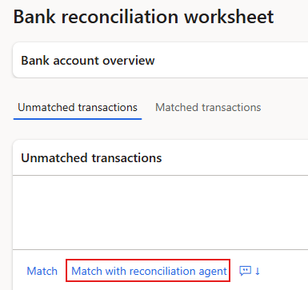
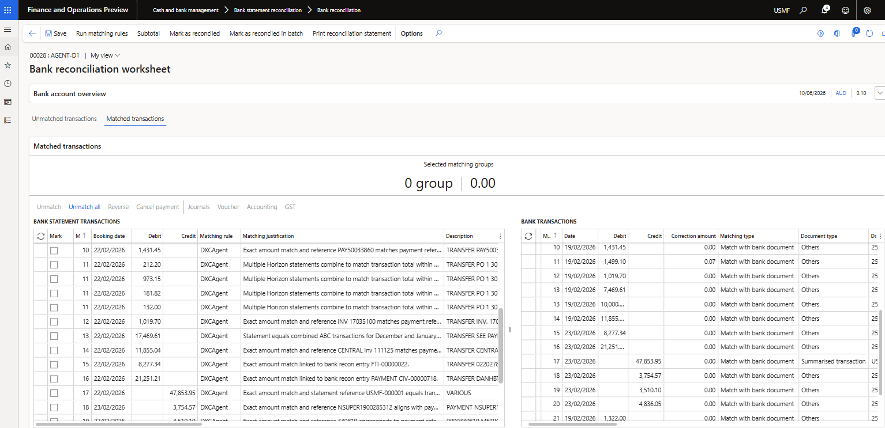

# DXC Agent for Bank reconciliation

The **DXC Agent for Bank reconciliation** allows users to match bank statement transactions with bank documents, and bank documents to bank documents.

# Setup

## Prerequisites

Start by setting up the prerequisite **Microsoft Foundry** and **DXC Agent for finance & supply chain management** - [user guide]({{ '/agent/dxcagentframework/Setup' | relative_url }})

##  Enable feature
After deployment, find and enable the following features:
1. DXC Agent for finance & supply chain management
2. DXC Agent for bank reconciliation

##  All agents

Navigate to **Organisation administration > Agents for finance & supply chain management > All agent** to setup the **DXC Agent for bank reconciliation** per legal entity.

When opening the form, it checks for any new agents and self populates from details from code

See below table for information on fields.

Field                  | Description
:--                    |:--
**Agent name**         | DXCAgentForBankReconciliation & DXCAgentForBankReconciliationValidation
**Agent description**  | Agent for bank reconciliation & Agent for Bank Reconciliation Validation
**Agent connection details**  | Select the agent created in prerequisite [Agent connection parameters](../dxcagentframework/Setup.md#b2--agent-connection-parameters)
**Agent instructions**  | Automatically populated with default agent instructions
**Agent output format**  | Automatically populated with default output format
**Enabled**            | Set to _Yes_ in order to enable the agent
**Enable telemetry**   | See below for more details

### Telemetry

Set **Enable telemetry** to _Yes_ to log and view telemetry for _applicable_ agents.  
View the telemetry by using **Go to dashboard** on the ActionPane. This is only enabled for applicable agents.

Per each run, the following telemetry could be logged per agent. The data is displayed by month: 
- Statement count - Number of bank statement records included in runs
- Document count - Number of bank documents included in runs
- Matched statement count - Number of bank statements matched
- Matched document count - Number of bank documents matched
- Number of matches - Number of matches, for example a many-to-many match would count as one match
- Number of runs - Each time the agent is run, either via import or button in bank reconciliation worksheet

## Bank accounts

Where you want the agent to automatically run when importing the bank statement, navigate to **Cash and bank management > Bank statement reconciliation > Bank accounts**.

1. Select the applicable company bank account, and where **Reconcile after import** is _Yes_ you will be able to set **Run reconciliation agent** to _Yes_.

> Note: The agent will only automatically run where:
> Bank account's **Reconcile after import** is _Yes_, and **Run reconciliation agent** is _Yes_, and
> Import bank statement **Reconcile after import** is _Yes_

## Workflow

Provides the ability to run multiple licensed agents in a specific order. For example where you want the agent to match and thereafter create new transactions.

See [framework agent workflow guide]({{ '/agent/dxcagentframework/Setup.md#b4-agent-workflows' | relative_url }}) for steps on creating a new workflow.

### Override default

If you want to override the default workflow or agent, assign a workflow or agent in:
 - **Cash and bank parameters** - this will override the agent default
 - **Bank account** - this will override any overide in Cash and bank parameters

## Cash and bank parameters

Navigate to **Cash and bank management > Setup > Cash and bank management parameters**.

The following parameters on the **Bank reconciliation** tab influences matching by the agent:  
- **Validate transaction type mapping** - where set to _Yes_, the agent will use **Transaction code mapping** for the bank reconciliation's bank account in the matching criteria
- **Validate date difference between statement lines and bank documents during bank reconciliation process** - where set to _Yes_, the **Allowed date difference** is applied in matching criteria.

# Processing

The **DXC Agent for Bank reconciliation in D365 FSCM** can be run by: 

## Automatically with Bank statement import

See [setup]({{ '/agent/bank-recon/setup/all#b4-bank-accounts' | relative_url }}) for prerequisites.

When importing bank statements with **Reconcile after import** enabled and the prerequisite setup are met the agent will automatically run and match the transactions in applicable Bank reconciliations.

## Manually in Bank reconciliation Worksheet

The agent can be manually run by navigating to **Cash and bank management > Bank statement reconciliation > Bank reconciliation** and selecting the applicable reconciliation's **Worksheet**.

Where the agent is enabled, the following buttons will be enabled in the **Unmatched transactions** tab: 
1. **Match with reconciliation agent**
    - To run the agent for all unmatched bank statement transactions, no need to select any records only click **Match with reconciliation agent**.
    - To run the agent for manually selected records, select the applicable unmatched bank statement transactions and click **Match with reconciliation agent**

2. **Prompt**
    - Instead of manually selecting applicable records, the user can use clear and specific language to specify which records the agent should attempt to match. Examples:
        -  Only match transactions where Related party type is Vendor
        -  Only match where amount is less than 1500
        -  Only match transactions where Related party type is Vendor and amount is less than 300
     

## Results

### Matched transactions

#### Matching rule
The transactions that have been matched by the Agent can easily be viewed in **Matched transactions** as these are flagged in **Matching rule** with **DXCAgent**.  

> Note: Reconciliation matching rule **DXCAgent** is automatically created by the product, but only the name is used for flagging the applicable Matched transactions.

#### Matching justication

To view Agent reasoning, see **Matching justification** for more information.

### Bank reconciliation

The following agent numbers are available to view on each bank reconciliation and the General tab:
- **Bank statements matched by agent** - Count of bank statements matched by agent for the bank reconciliation
- **Percentage of bank statements matched by agent** - Percentage of bank statements matched by agent for the bank reconciliation

