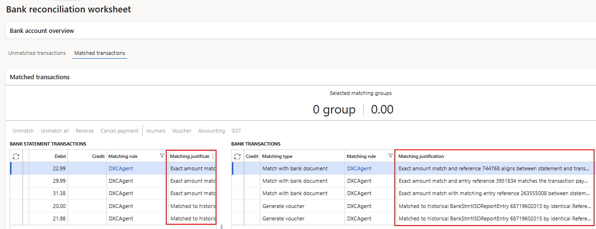

# DXC Agent for bank reconciliation vendor payment generation

The **DXC Agent for bank reconciliation payment journal generation** allows users to automatically create new vendor payment journals for relevant bank statement records. Users can also choose to post and match these journals as part of the agent process, or leave the journal unposted for review.

# Setup

## Prerequisites

Start by setting up the prerequisite **Microsoft Foundry** and **DXC Agent for finance & supply chain management** - [user guide]({{ '/agent/dxcagentframework/Setup' | relative_url }})

##  Enable feature
After deployment, find and enable the following features:
1. DXC Agent for finance & supply chain management
2. DXC Agent for bank reconciliation payment journal generation

##  All agents

Navigate to **Organisation administration > Agents for finance & supply chain management > All agent** to setup the applicable agent per legal entity.

When opening the form, it checks for any new agents and self populates from details from code

See below table for information on fields.

Field                  | Description
:--                    |:--
**Agent name**         | DXCAgentForBankReconciliationVendPaymentJournalGeneration
**Agent description**  | Agent for Vendor Payment Journal Generation
**Agent connection details**  | Select the agent created in prerequisite [Agent connection parameters](../dxcagentframework/Setup.md#b2--agent-connection-parameters)
**Agent instructions**  | Automatically populated with default Agent instructions
**Agent output format**  | Automatically populated with default output format
**Enabled**            | Set to _Yes_ in order to enable the agent
**Enable telemetry**   | See below for more details

### Telemetry

Set **Enable telemetry** to _Yes_ to log and view telemetry for _applicable_ agents.  
View the telemetry by using **Go to dashboard** on the ActionPane. This is only enabled for applicable agents.

Per each run, the following telemetry could be logged per agent. The data is displayed by month: 
- Statement count
- Generated payment count
- Number of runs

### Agent knowledge sources

**Agent knowledge sources** are available to select which table and fields the agent needs to use to find values in the bank statement that will help determine the Vendor account.

**Fields:**
- Enabled - Enable / disable the knowledge source record
- Type - Select the applicable type of source, options are Text, Public website or Field
- Table - Select the applicable table, options are VendBankAccount (Vendor bank accounts), VendInvoiceJour (Vendor invoice journal), VendTable  (Vendors)
- Table name - Display field for table selected
- Field ID - Select the applicable field from the selected table
- Field name - Display field for field selected

**Examples:**

Type         | Table     | Table name    | Field ID | Field name    | Value
:--          |:--        |:--            |:--        |:--             |:--   
Field        | VendTable    |  Vendors   | AccountNum    | Vendor account | The AccountNum will appear in the following format: C### where # represents numeric digits.
Field        | VendBankAccount    |  Vendor bank accounts   | SWIFTNo    | SWIFT code | The SWIFTNo will appear in the following format: ANZBAU3M##### where # represents numeric digits.
Field        | VendInvoiceJour    |  Vendor invoice journal   | InvoiceId    | Invoice | The InvoiceId will appear in the following format: I####### or IN####### or POI######## or ######-# where # represents numeric digits.

## Bank accounts

Navigate to **Cash and bank management > Setup > Bank accounts** to setup the following:
- **Vendor payment journal posting** - Determines if the created vendor payment journal should be posted.
    - **Yes** - The journal will be created, posted and automatically matched to the original bank statement line. **Journal** button on **Matched transactions** in the Reconciliation worksheet allows user to easily navigate to these posted vendor payment journals. 
    - **No** - The journal will be created, but _not_ posted. The message in Action center will list the **Journal batch numbers** that were created. If the agent is run again, these bank statement records won't be included again, thus no duplication. **Journal** button on **Matched transactions** can't be used for these as the journal has not been posted by the agent. Once the journals have been reviewed and posted, the matching can be done in the reconciliation either by running agent 'DXC Agent for bank reconciliation', reconciliation matching rules or manual matching.

## Bank transaction types

Navigate to **Cash and bank management > Setup > Bank transaction types** and assign the applicable **Action** to each bank transaction type.  
This feature will review the bank statement records where the Action **Generate vendor payment** is mapped.

Example: **Bank transaction type** value **12** has Action **Generate vendor payment** assigned.

## Transaction code mapping

Navigate to **Cash and bank management > Setup > Advanced bank reconciliation setup > Transaction code mapping** and ensure all the applicable bank transaction types are mapped for the bank account.

Example: Company bank account has **Statement transaction code** value **000** mapped to **Bank transaction type** value **12**.   
Thus all bank statement records with **Bank transaction code** value **000** will be reviewed against **Agent knowledge sources**. Where the D365 Vendor account can be determined, the vendor payment journal will be created. 

## Default description

This feature uses **Default description** when creating the payment journal line.

1. Enable feature **Enable default descriptions for advanced bank reconciliation**
2. Setup [Default descriptions](https://learn.microsoft.com/en-us/dynamics365/finance/cash-bank-management/apply-cash-adv-bank-rec#enable-default-descriptions-for-advanced-bank-reconciliation) for **Bank - reconciliation worksheet** for each applicable **Language** or select **user**.   

# Processing

The **DXC Agent for Bank reconciliation in D365 FSCM** can be run by: 

## Automatically with Bank statement import

See [setup]({{ '/agent/bank-recon/setup/all#b4-bank-accounts' | relative_url }}) for prerequisites.

When importing bank statements with **Reconcile after import** enabled and the prerequisite setup are met the agent will automatically run the licensed agents assigned to the workflow that is either assigned to the Bank account, Cash and bank parameters or the system default.

## Manually in Bank reconciliation Worksheet

The agent can be manually run by navigating to **Cash and bank management > Bank statement reconciliation > Bank reconciliation** and selecting the applicable reconciliation's **Worksheet**.

Where the agent is enabled, the **Create vendor payment with agent** button will be enabled in the **Unmatched transactions** tab. 
- To run the agent for all unmatched bank statement transactions, no need to select any records only click **Create vendor payment with agent**.
- To run the agent for manually selected records, select the applicable unmatched bank statement transactions and click **Create vendor payment with agent**

## Results

### Matched transactions

Where the Bank account's **Vendor payment journal posting** was set to _Yes_, the Vendor payment journals are posted and automatically matched to the original bank statement record. 
The following sections only applies to above set to _Yes_.

#### Journals
Button **Journals** will be enabled and allow the user to navigate to the posted journal.

#### Cancel payment
Button **Cancel payment** can be used to create an "opposite"/reversing transaction and move the posted bank document to unmatched.

> Note: Ensure **Bank transaction type** setup against field **NSF** in **Cash and bank management parameters** is the same as your Bank transaction type in your **Method of payment**. If they differ, standard matching doesn't allow these two bank document records to matched against each other, and throws the following error:
> "The criteria to reconcile have not been met. You can reconcile either a single canceled check or two transactions. To reconcile two transactions, the document type must be Other, and the documents must have the same bank account, transaction type, payment reference and have opposite amounts.

#### Matching rule
The transactions that have been matched by the Agent can easily be viewed in **Matched transactions** as these are flagged in **Matching rule** with **DXCAgent**.  

> Note: Reconciliation matching rule **DXCAgent** is automatically created by the product, but only the name is used for flagging the applicable Matched transactions.

#### Matching justication

To view Agent reasoning, see **Matching justification** for more information.

#### Matching type

The **Matching type** will be **Generate vendor payment**.

### Bank reconciliation

The following agent numbers are available to view on each bank reconciliation and the General tab:
- **Bank statements matched by agent** - Count of bank statements matched by agent for the bank reconciliation
- **Percentage of bank statements matched by agent** - Percentage of bank statements matched by agent for the bank reconciliation
- **Vendor payments created by agent** - Count of Vendor payments created by agent for the bank reconciliation

