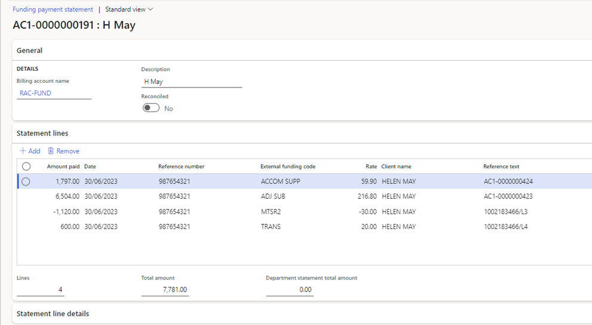

### Import funding claim payment statement

Payment statements must be downloaded from PRODA Care services Online Services (in a CSV format)

**Path: Care services > Funding > Funding claim payment statement**

1.  Click on \< **New** \>
2.  Select \< **Billing account name** \>
3.  Click on \< **Import statement** \>
4.  Click on \<** Browse** \> to browse and select the required payment statement file for import.
5.  Click \< **Upload** \>
6.  Click \< **OK** \>
7.  Click on the **‘Refresh**’ button in the top right corner to refresh the form.
8.  The statement lines will display.

****
