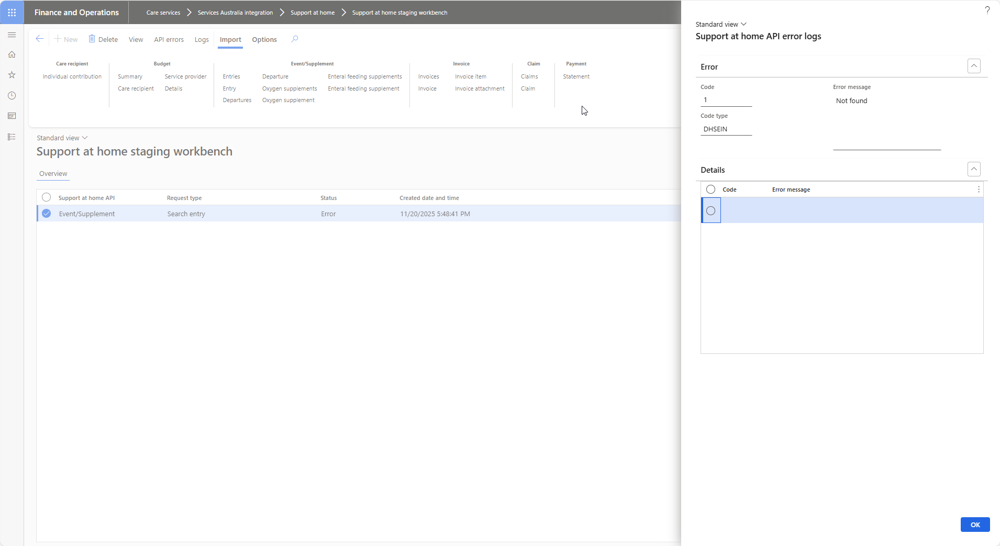
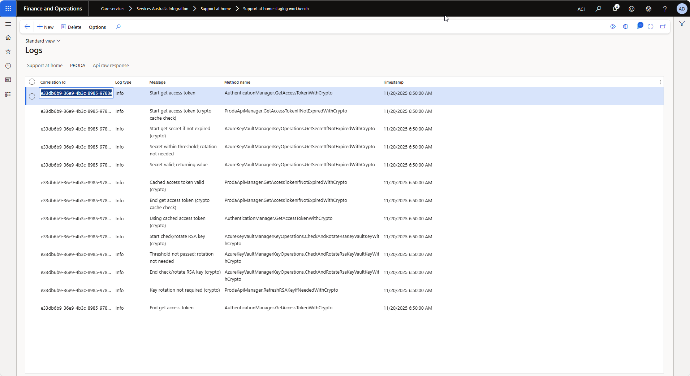
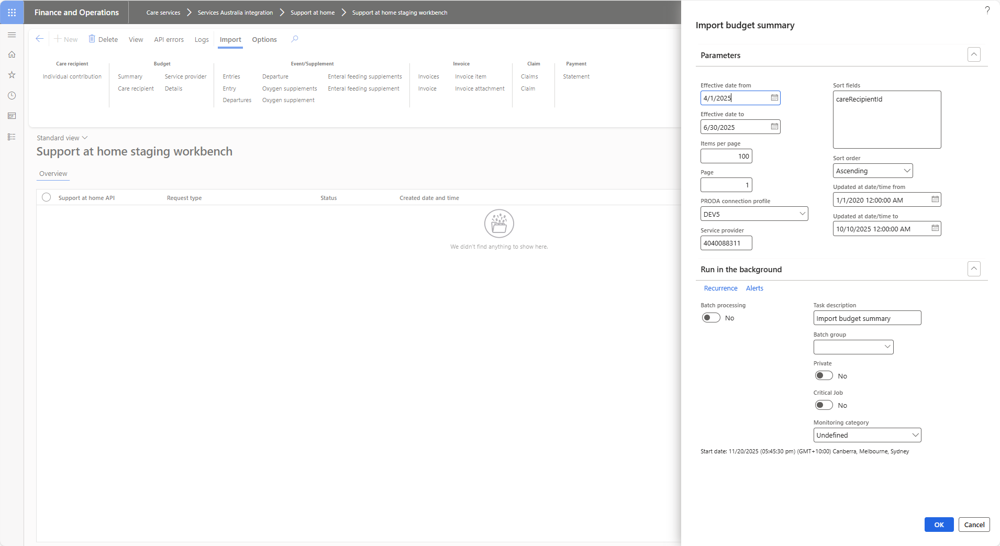

# Services Australia Support at Home Staging Workbench
The Support at Home Staging Workbench provides a unified interface for managing API integration activities, including:
- Viewing staging records
- Monitoring API errors and responses
- Accessing comprehensive integration logs
- Performing data import jobs

## View
Displays the selected records staging data

Example:
Budget summary

   
## API Errors
Displays any errors returned by the API service.

Example: Invalid entry search

## Logs
Displays comprehensive logs for tracking for any request selected.

API execution logs

PRODA authentication logs

RAW response received from API service

## Import
Allows execution of the import jobs. 

Example: Budget summary
