# Creating the Funding Claim — All 12 Steps

[← Go step by step](./cc-step-01.html)

---

**Step 1 — Navigate to Funding claims**

Go to Care Services → Funding → Funding claims.

---

**Step 2 — The funding claim record**

Open the funding claim. AC1-0000003370, SAH-FUND, service SAH-01, $30.00, SERV-0036, date 4/3/2026.

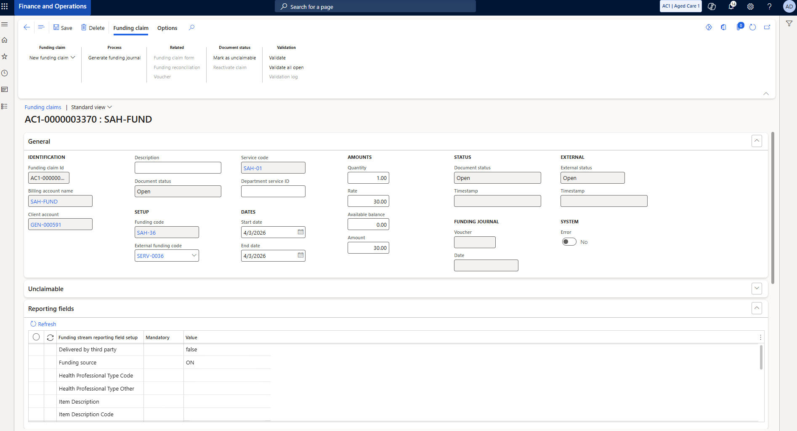

---

**Step 3 — Navigate to Funding claim form**

Go to Care Services → Funding → Funding claim form.

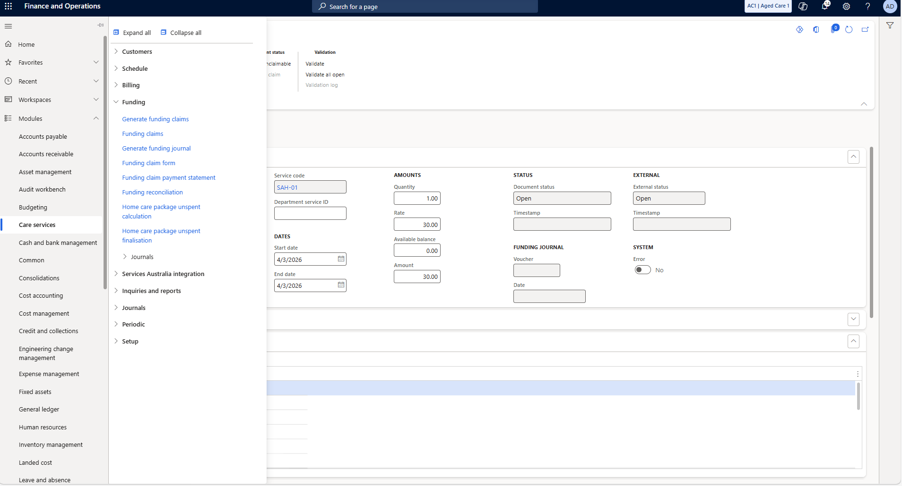

---

**Step 4 — Create a new funding claim form**

Click New funding claim form. Select AC1-0000001331 — SAH-FUND, NAPS ID 19463.

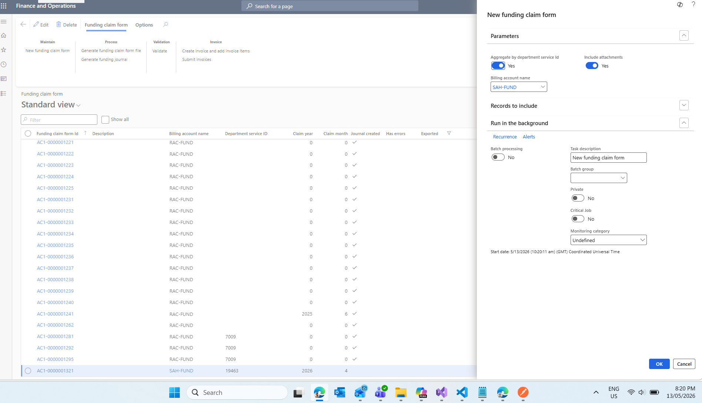

---

**Step 5 — Open the funding claim form record**

Funding claim form AC1-0000001331. Department service ID 19463, line shows 415056224, SAH-01, $30.00.

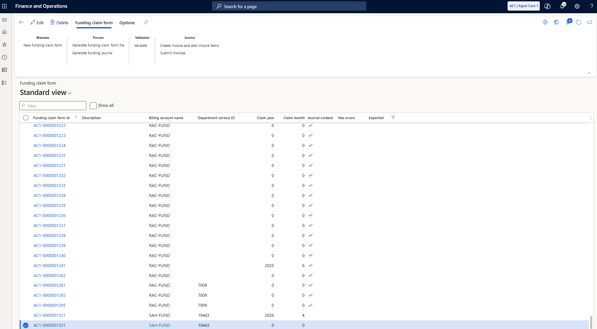

---

**Step 6 — Confirm the form before proceeding**

Journal created No, Has errors No, Exported No. Invoice status None, Claim status None. Ready.

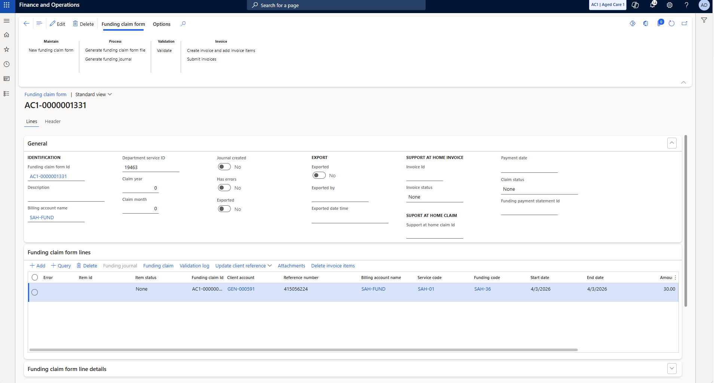

---

**Step 7 — Create the invoice**

Click Invoice → Create invoice and add invoice items. Add attachments Yes. Click OK.

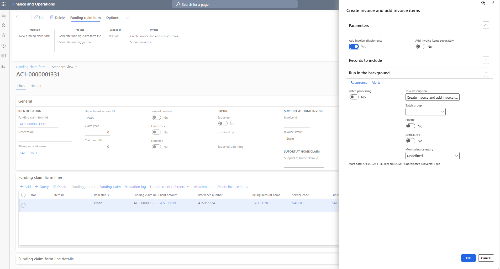

---

**Step 8 — Submit the invoice**

Click Invoice → Submit invoices. Invoice 1000110518 assigned, status Open. Hit OK.

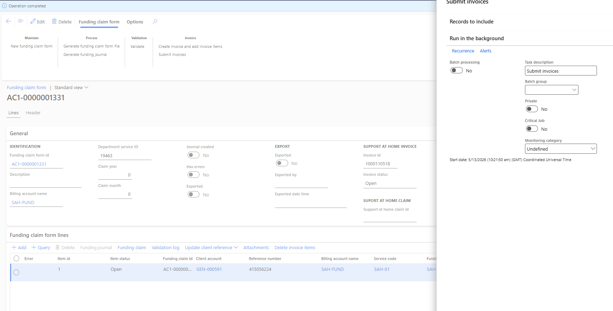

---

**Step 9 — Submit the claim**

Go to Care Services → Periodic → Submit claims.

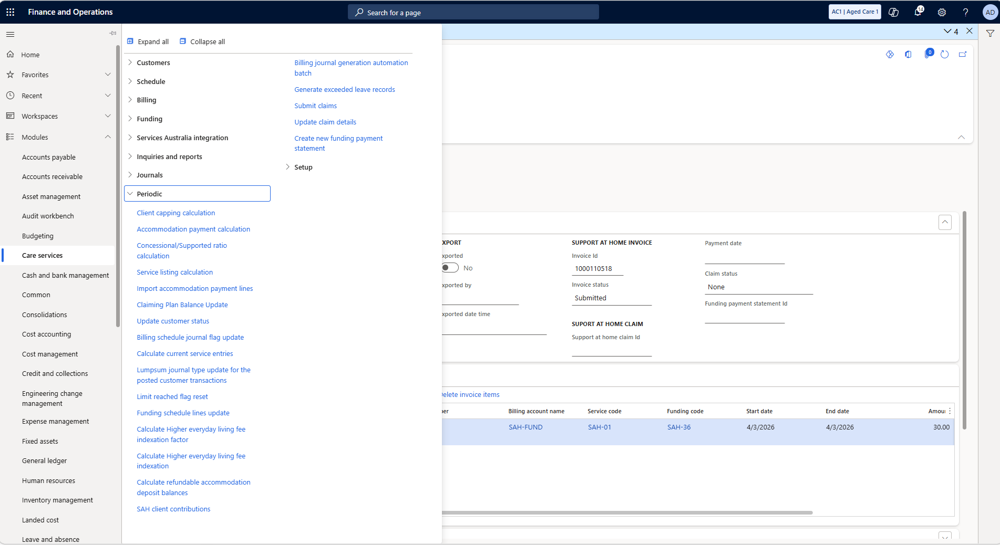

---

**Step 10 — Navigate to view the claim**

Navigate to Care Services → Services Australia integration → Support at home → Claims.

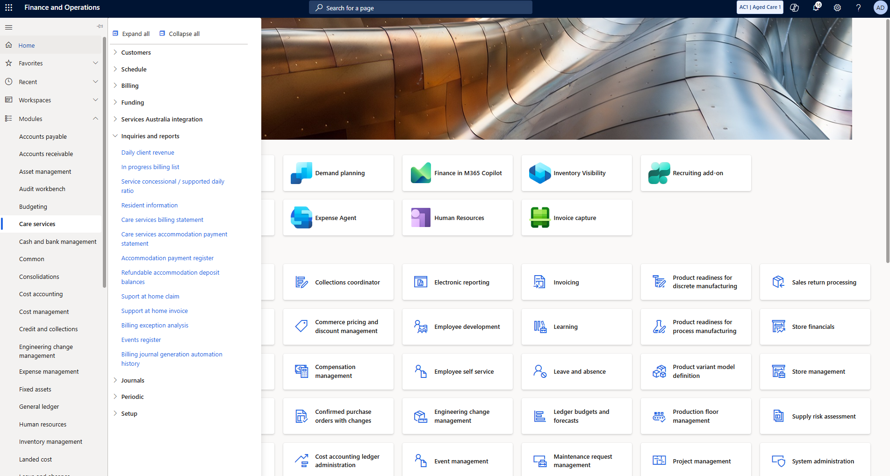

---

**Step 11 — Update claim details**

Open claim 100000005947, status Being calculated. Click Claim → Update claim details.

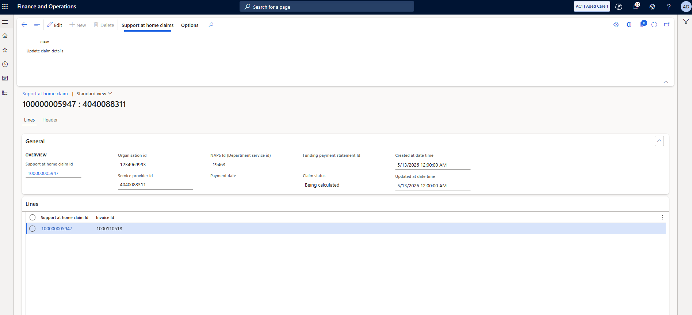

---

**Step 12 — Claim is pending approval**

Status moves to Pending approval. Services Australia has the claim queued for payment.

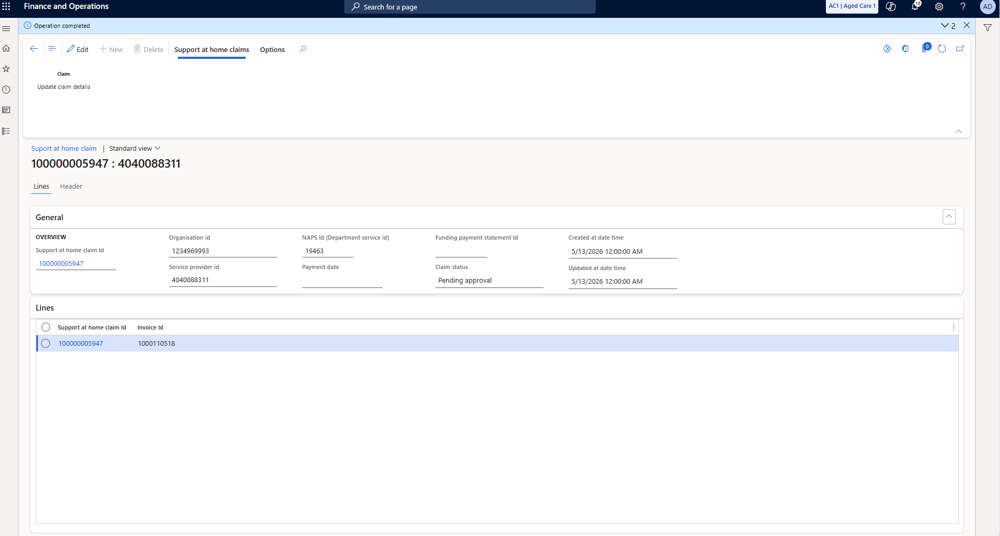

---

[Getting Paid →](./03-getting-paid.html)
