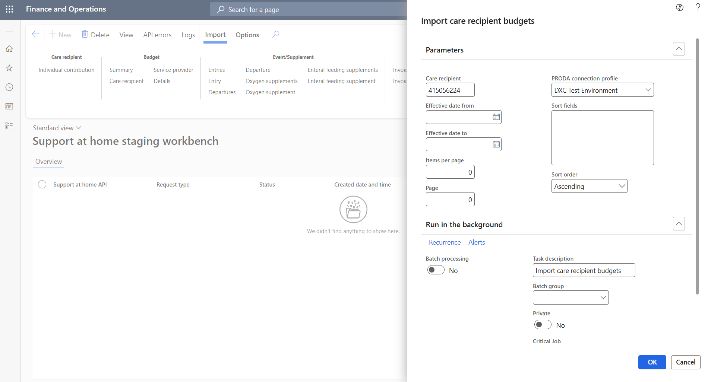
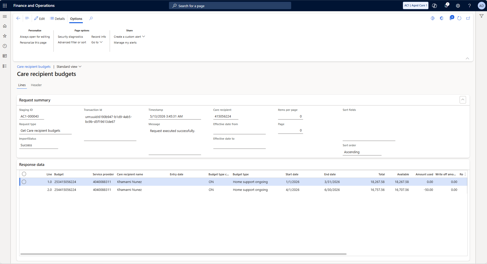
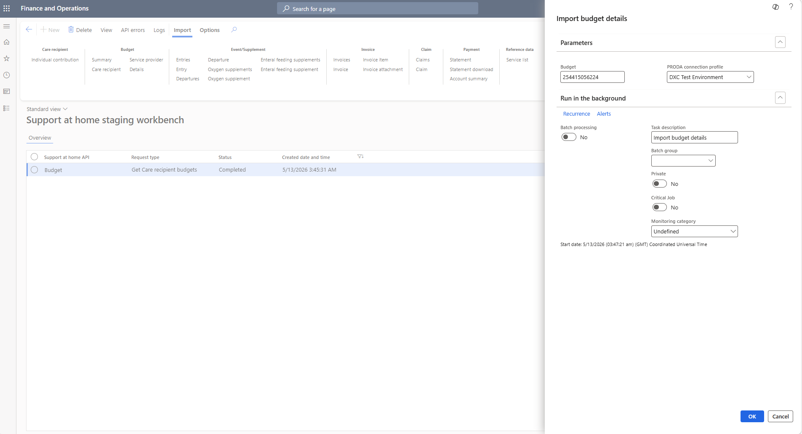
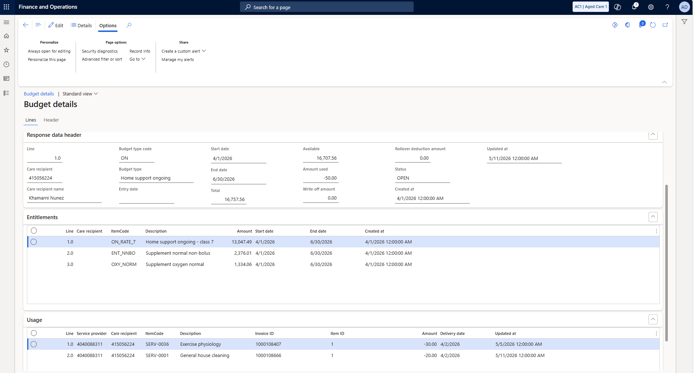
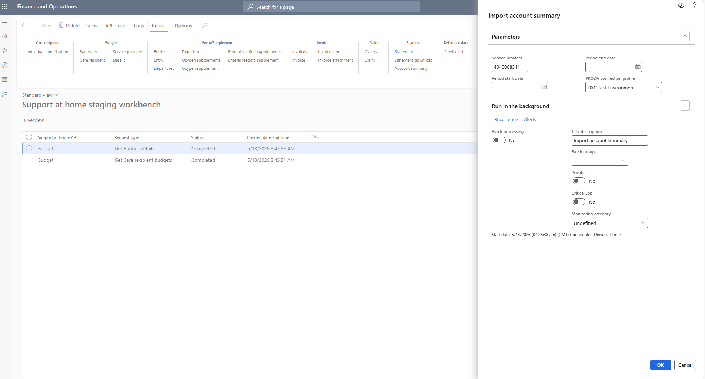
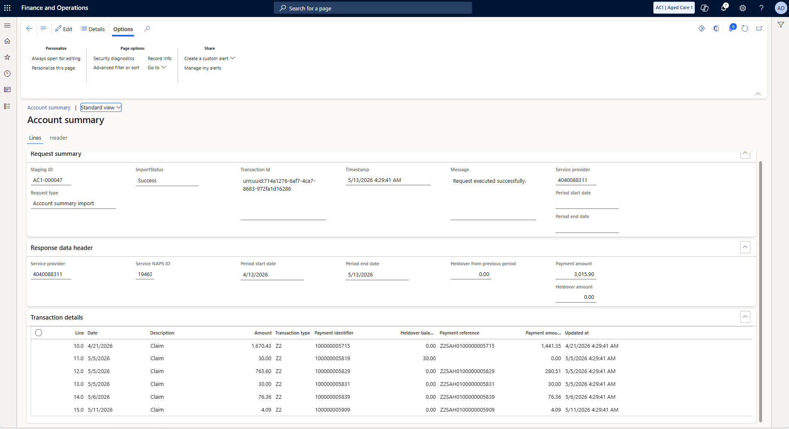

# Closing the Loop — All 6 Steps

[← Go step by step](./cl-step-01.html)

---

**Step 1 — Re-run the care recipient budget import**

Import → Budget → Care recipient. Same care recipient, checking for the updated balance.

---

**Step 2 — Updated budget balance**

The available balance is now lower, amount used has increased to reflect the new claim.

---

**Step 3 — Re-run the budget details import**

Import → Budget → Details. Same budget ID — now you can see the new invoice in the usage section.

---

**Step 4 — New invoice visible in usage lines**

Your new invoice now appears alongside prior ones. Usage total matches the updated amount used.

---

**Step 5 — Re-run the account summary**

Import → Payment → Account summary. Provider-level confirmation the payment is reflected.

---

**Step 6 — Payment confirmed in account**

The new claim and payment appear in the transaction list. The cycle is closed.

---

[↑ Back to Support at Home overview](./index.html)
