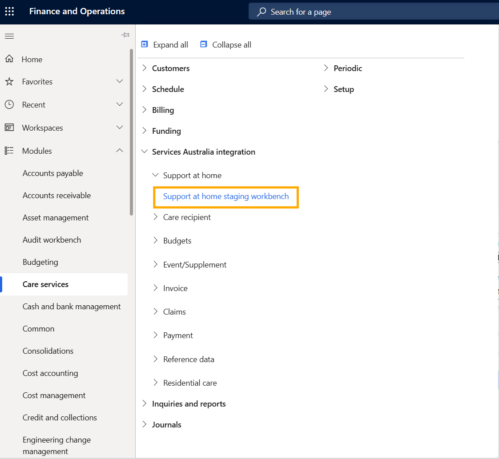
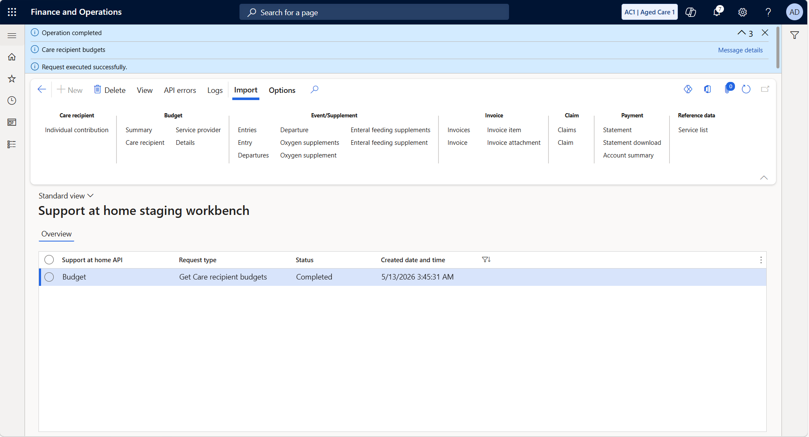
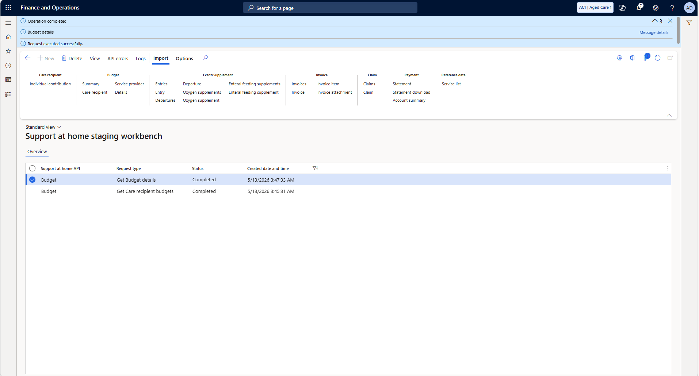
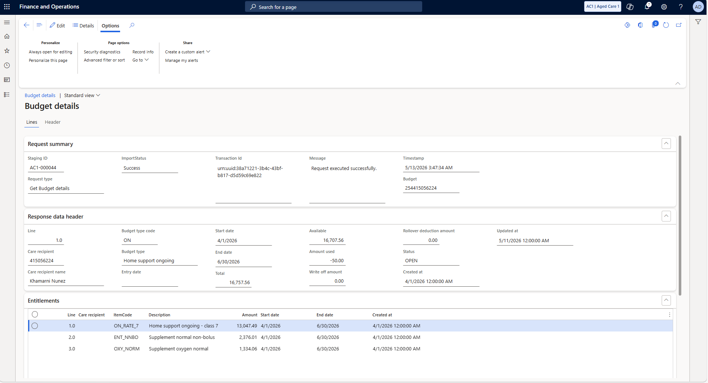
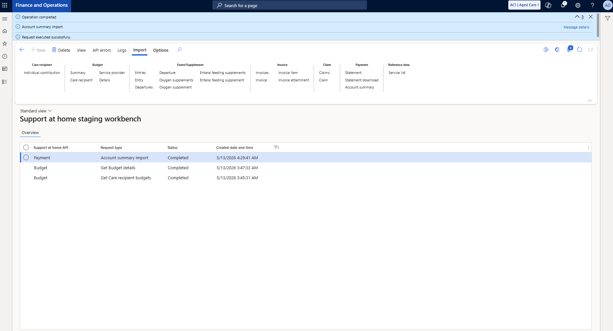

# Your Funding Position — All 11 Steps

[← Go step by step](./fp-step-01.html)

---

**Step 1 — Navigate to the staging workbench**

Go to **Care Services → Services Australia integration → Support at home → Support at home staging workbench**.

---

**Step 2 — Import the care recipient's budget**

Click **Import → Budget → Care recipient**. Enter the care recipient ID and PRODA profile. Hit **OK**.

---

**Step 3 — Import completed**

The workbench shows Budget / Get Care recipient budgets / Completed. Click the row to open the result.

---

**Step 4 — Budget periods returned**

Two periods returned. Q2 (Apr–Jun 2026) is open — **$16,707.56 of $16,757.56 available.** Take note of the Q2 budget ID.

---

**Step 5 — Import the budget details**

Click **Import → Budget → Details**. Enter the Q2 budget ID (254415056224). Hit **OK**.

---

**Step 6 — Budget details completed**

Two rows in the workbench. Click the top row to open the budget details.

---

**Step 7 — Your funding envelope**

Q2 2026, Status OPEN. Total $16,757.56 split across three entitlements: core care (ON_RATE_7), enteral feeding (ENT_NNBO), oxygen supplement (OXY_NORM).

---

**Step 8 — What's already been drawn**

Usage lines show two invoices totalling $50 — matching the -$50.00 in the header exactly.

---

**Step 9 — Import the account summary**

Click **Import → Payment → Account summary**. Enter the provider number (4040088311). Hit **OK**.

---

**Step 10 — Account summary completed**

Three rows in the workbench. Click the top row to see the provider's financial position.

---

**Step 11 — Your account position**

Payment amount $3,015.90 for the period. Transaction details list every processed claim with payment references.

---

**You know where you stand. Time to raise the funding claim.**

[Creating the Funding Claim →](./02-creating-the-claim.html)
