# Getting Paid — All 11 Steps

[← Go step by step](./gp-step-01.html)

---

**Step 1 — Run Create new funding payment statement**

Go to Care Services → Periodic → Create new funding payment statement.

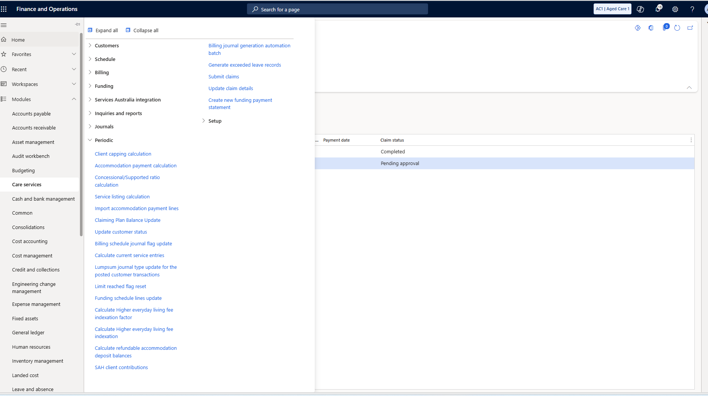

---

**Step 2 — Set the payment statement parameters**

The dialog opens. Filter by Support at home claim ID and service provider.

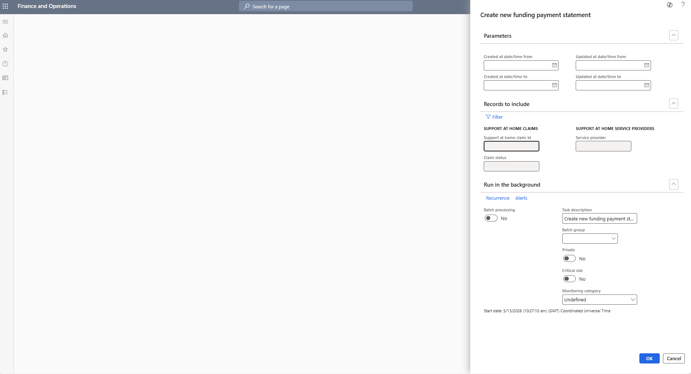

---

**Step 3 — Filter by claim ID**

Set the Support at home claim ID criteria to 100000005909. Click OK.

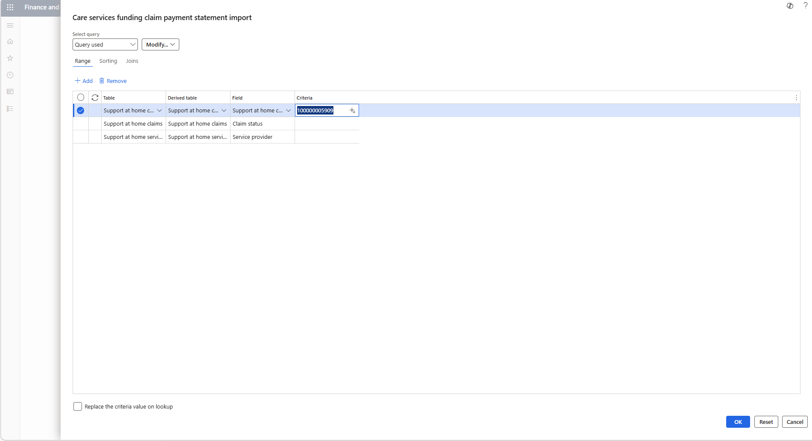

---

**Step 4 — Open the funding payment statement**

Go to Care Services → Funding → Funding claim payment statement. Open 19463-2026-05-11.

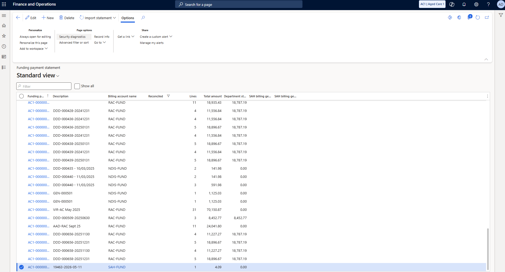

---

**Step 5 — Review the payment statement detail**

Claim 100000005909, payment date 5/11/2026. SERV-0001, $20.00 service, $4.09 paid. Khamarni Nunez.

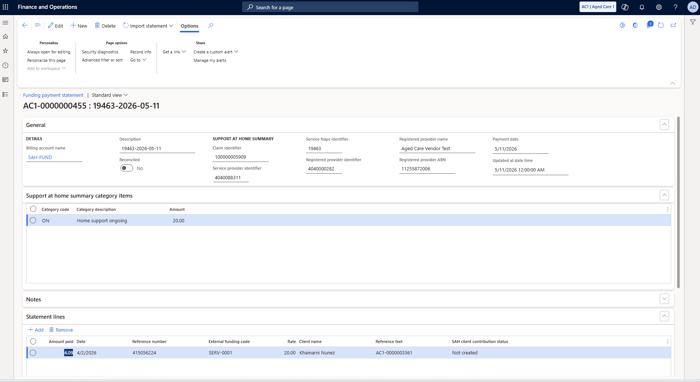

---

**Step 6 — Return to the funding claim form**

Navigate to funding claim form AC1-0000001321. Invoice Completed, Claim Completed, payment statement linked.

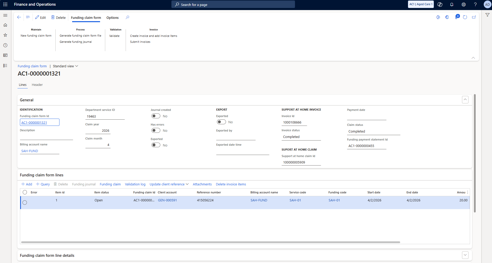

---

**Step 7 — Generate the funding journal**

Click Process → Generate funding journal. Auto post: Default. Click OK.

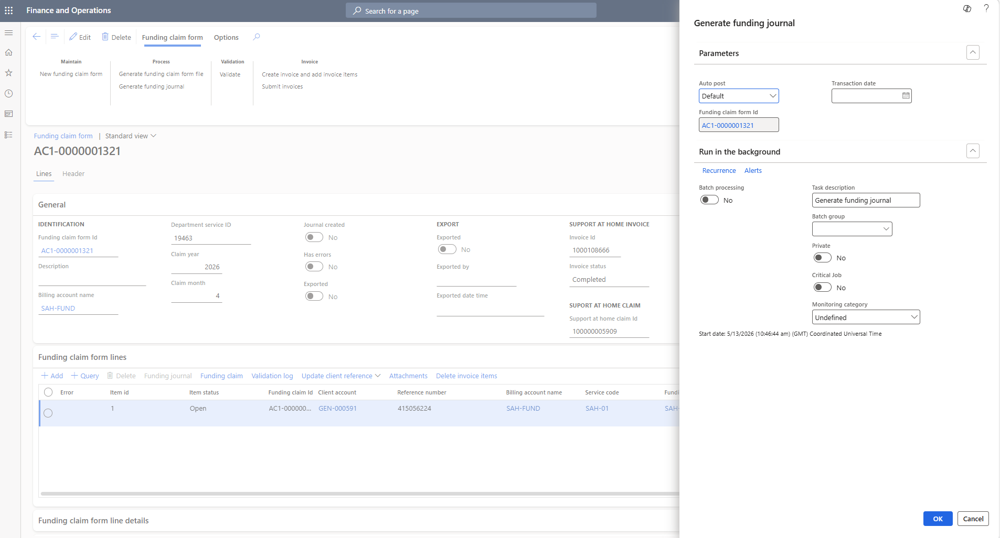

---

**Step 8 — Journal created**

Journal created: Yes. The GL entry is posted. Generate funding journal is now greyed out.

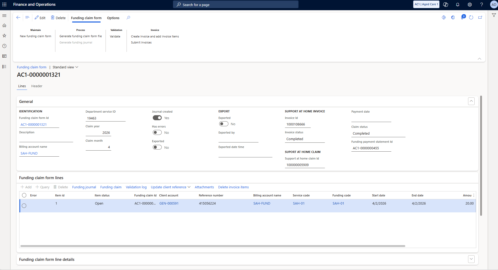

---

**Step 9 — Navigate to Funding reconciliation**

Go to Care Services → Funding → Funding reconciliation.

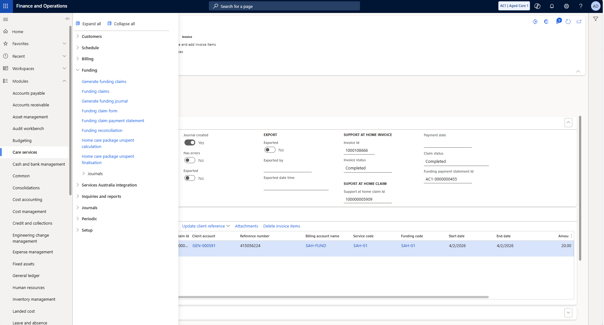

---

**Step 10 — Data auto-populates**

Reconciliation worksheet opens. Funding claim ($20.00) on the left, statement line ($4.09) on the right.

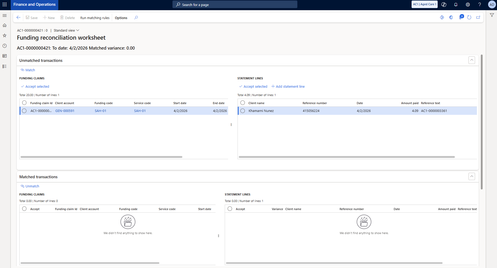

---

**Step 11 — Match successful**

Click Match. Unmatched clears. Matched transactions: SAH-01 $20.00 matched to $4.09. Variance 15.91.

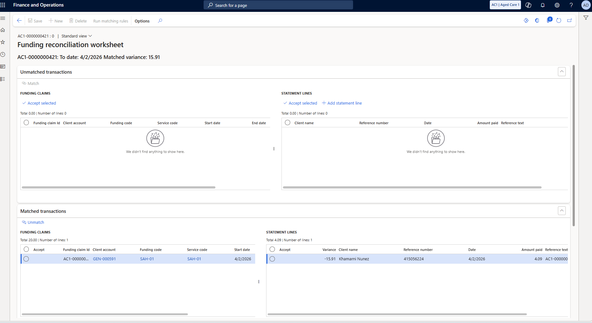

---

[Closing the Loop →](./04-closing-the-loop.html)
