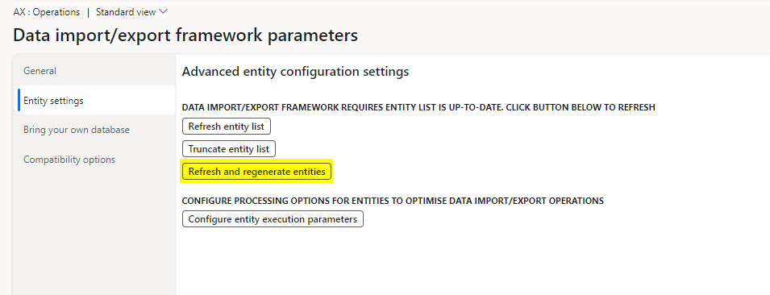
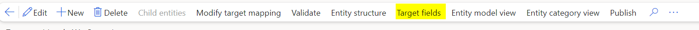

# DMF Toolbox

### DMF Toolbox Overview

The Data Management Framework (DMF) toolbox provides users with the visibility of 2 additional fields within Data Management Entities.

Enum values - a special data type that enables for a variable to be a set of predefined constants. The variable must be equal to one of the values that have been predefined for it. For example, in the Customers data entity the field Time Zone has a pre-defined list of values that can be selected.

Unique indexes - A unique index guarantees that the index key contains no duplicate values and therefore every row in the table is in some way unique. For Example, the customer account number must be unique in the Customers entity.

### Set up

The DMF toolbox is available once the Core extensions Feature has been enabled. To Generate the meta data associated with these new fields the data entities require a full regeneration utilizing the “refresh and regenerate entities” batch job that can be triggered under the entity settings Tab of Framework parameters.

### Enum Values

Once the batch job has completed navigate to the Data entities tile in Data Management and select target fields once you have highlighted your selected data entity.

At the top of the screen the 2 new fields will be displayed

The “Enum Values” field will only activate where the selected field in the data entity has a Data type of “Enum” and subsequently when selected will display the available values.

### Unique indexes

Unique indexes will display the table field and user-friendly name of the fields that require unique values.

