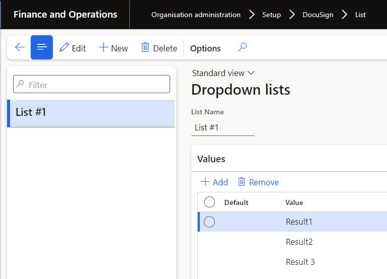

# List

The DocuSign List page is used to set up all dropdown lists. The applicable dropdown list can then be selected when the Template's Signatory details **Tag** is set to _List_ .  
 
The List form can be reached by navigating to **Organization administration** > **Setup** > **Docusign** > **List**

To create a new list:

1. Click on **New** to create a new List.
2. Enter the **List name** field (Maximum 10 characters).
3. In the Values fast tab, select _Add_ to begin adding your list values

| **Field**   | **Description**                                            |
| :---------- | :--------------------------------------------------------- |
| **Default** | Select the applicable value that should be set as default. |
| **Value**   | Enter the dropdown list value. (Maximum 10 characters)     |

  
