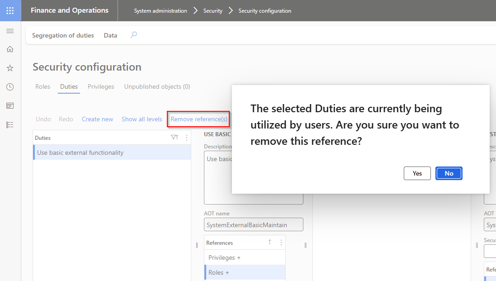
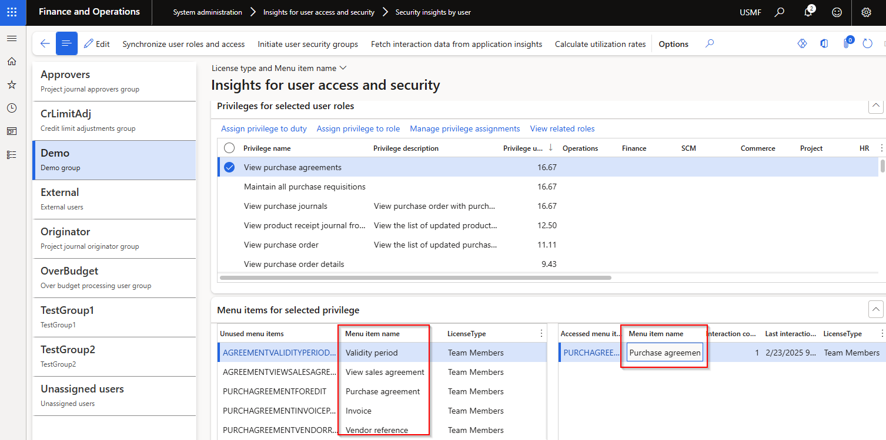

### Release 10.0.42.20250325

#### Build 10.0.42.202503251
Release date: 25 March 2025

<ins>New features</ins>

Number	| Name		 | Description
:--	|:--		  	|:--
20486	| Validation	| New parameter option **Warn when removing utilised reference in security configuration**.   When user selects **Remove reference** in **Security configuration** and fetched utilization exists for the role/duty/privilege combination, and new option is set to:   • **Yes** - Warning will notify user before the reference is removed, and only removed once they confirm.    • **No** - No warning      
19926	| Assign users to roles	| **Role utilization %** added to form **Assign users to roles** to assist in determining if other assigned users utilised the role in the fetched period. Only supported for roles assigned to users in F&O (not 'Microsoft Entra ID security groups')   
21534	| Go to batch jobs	| **Go to batch jobs** link on info log when running Security Insights steps as batch.   
21325	| Menu item name	| When running the **Synchronize user roles and access** step, **Menu item name** will be populated by custom logic to translate Menu item to it's label name.   

<ins>Bug fixes</ins>

Number	| Name		 | Description
:--	|:--		  	|:--
20930	| User access and security groups | Fix for error 'Cannot edit a record in User access and security groups (DXCSecurityInsightsGroups). The record has never been selected.' When adding users to user groups via the users tab.
21205	| Zero role utilization %	| When 1st user in group has 0 Overall user utilization %, and then clicking on user with non-zero %, the Role utilization % for that 2nd user incorrectly shows 0%
21531	| Visual highlights	| Incorrect visual highlights 
21610	| 10.0.43 build issue	| Fix 10.0.43 build issue on **Fetch interaction data from application insights**.   Microsoft.IdentityModel.Clients.ActiveDirectory has been deprecated and no longer supported by FinOps and needs to be upgraded to now use Microsoft.Identity.Client   [Microsoft notice](https://learn.microsoft.com/en-us/dynamics365/fin-ops-core/fin-ops/get-started/removed-deprecated-features-platform-updates#azure-active-directory-authentication-library-adal)

