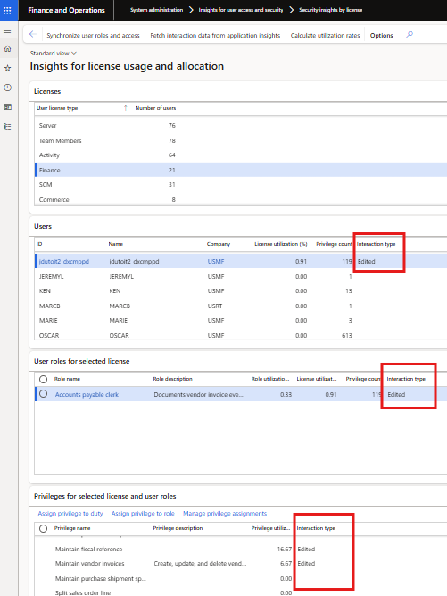

### Release 10.0.43.20250619

#### Build 10.0.43.202506191
Release date: 19 June 2025

<ins>New features</ins>

Number	| Name		 | Description
:--	|:--		  	|:--
22736   22158	| **Interaction type**	| Ability to log Form/Page Interaction types **Viewed** (only opened the form) vs **Edited** (modified / created records) for the accessed menu items. Enable this additional telemetry field by setting **Form edits (Page edits)** to _Yes_ on **Monitoring and telemetry parameters**.  This is useful, for example if the user only viewed Finance license type menu items, they could possibly be switched to a Team member / Activity license type role for the menu items.         Where there was no interaction, or the interaction was prior enabling the new monitoring field, the Interaction type will be Blank.     Interaction type has also been added to the following two Security Insights forms. Please note the Interaction type is a display method on the license view.          
