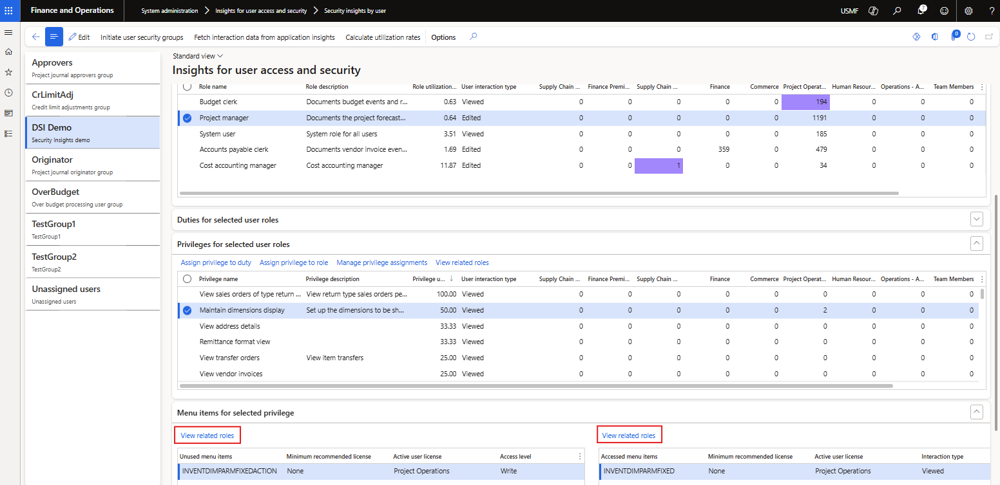

### Release 10.0.44.20251121

#### Build 10.0.44.202511211
Release date: 21 November 2025

<ins>New features</ins>

Number	| Name		 | Description
:--		|:--	     |:--
22886	| License usage summary	| Added Security Insights fields to **License usage summary**:   • Utilization %   • Minimum recommended license   • Interaction type (view vs. edit)   • Last interaction date        
24374	| Licensing tables	| Reworked extensions to std licensing tables - moved to Views. This removes the need for the 'Build license information' button, and 'Sync recommended licenses only' that was added in the previous release. If there are changes to security configuration, running the 'Calculate utilization rates' will refresh the views.
24365	| View related roles	| Added **View related roles** to form **Security insights by user** on the **Menu items for selected privilege**. This makes it easier to view where else (role, duty, privilege) the menu item is used.     
24493	| Read access level	| Populate read access level item's 'Minimum recommended license' and 'Active user license' with the Security Insights calculated value based on data from License usage summary. But the read access levels are still not included in license count, thus doesn't influence the utilization of the full license types.
24214		| DXC License manager	| New 'DXC License manager' version 10.0.43.202509291   [Release notes](../LMG/Release-notes.md)

<ins>Bug fixes</ins>

Number	| Name		 | Description
:--		|:--		 |:--
24513	| User options	| Blank user options. Removed extension fields to sysuserinfo table.