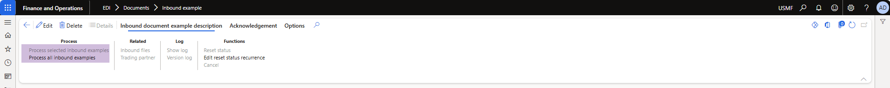

# DXC Electronic Data Interchange (EDI) - Technical Guide

The DXC EDI module provides enhanced functionalities to Microsoft Dynamics 365 for Finance and Operations (FinOps). This guide provides an overview of the technical requirements for making extensions to specific features.

## Create new document type

1. Update your model parameters to reference package, **DXC EDI**  
    Note: if working on customizations for any of the following modules, then please select the appropriate reference packages for it
    - **DXC EDI 3PL Documents**
    - **DXC EDI Customer Documents**
    - **DXC EDI Freight Forwarder Landed Cost Documents**
    - **DXC EDI Vendor Documents**
1. Add new document type  
    - Extend the enum, **SAB_EDIDocumentType** from the parent module, **DXC EDI**
    - Add new element for your inbound or outbound document type and provide an appropriate label for it
1. Create and implement the document type class.
    - See [Implement SAB_EDIDocumentTypeClass for EDI documents](#implement-sab_edidocumenttypeclass-for-edi-documents) for more information.

**EDI > Setup > Document type**


---

**EDI > Files > Inbound files**

  
----

**EDI > Files > Inbound files > Upload files**

  
----
  

Note: If your document type if not visible, navigate to EDI > Setup > EDI parameters > General and run refresh module. 

### Implement SAB_EDIDocumentTypeClass for EDI documents
#### Pre-requisites
1. [Create staging data tables for EDI documents](#create-staging-data-tables-for-edi-documents)
1. [Document settings profile](#document-settings-profile)
1. EDI document processing
    - [Inbound documents](#edi-document-processing-inbound)
    - [Outbound documents](#edi-document-processing-outbound)

#### Inbound documents
1. Extend the abstract class [SAB_EDIDocumentTypeClass](./EDI-module-library.html#sab_edidocumenttypeclass)
1. Add SAB_EDIDocumentTypeFactoryAttribute attribute to the class declaration and pass your SAB_EDIDocumentType enum as value.  
    Example: [SAB_EDIDocumentTypeFactoryAttribute(SAB_EDIDocumentType::InboundExample)]  
1. Implement all of the following methods, see the [class library](./EDI-module-library.html#sab_edidocumenttypeclass) for more information.  
    - documentDescription
    - documentDirection
    - documentHierarchyPath
    - documentName
    - documentRootNodeName
    - processMenuItem
    - processMenuItemSingle
    - stagingHeaderFromCommon
    - stagingHeaderKeyField
    - stagingHeaderTransferStatusFieldId
    - stagingLineFromCommon
    - tableIdHeader
    - tableIdLine
    - tableIdTradingPartnerDefault    

#### Outbound documents
1. Extend the abstract class [SAB_EDIOutboundDocumentTypeClass](./EDI-module-library.html#sab_edioutbounddocumenttypeclass)
1. Add SAB_EDIDocumentTypeFactory attribute to the class declaration and pass your SAB_EDIDocumentType enum as value.  
    Example: [SAB_EDIDocumentTypeFactory(SAB_EDIDocumentType::InboundExample)]  
1. Implement all of the following methods, see the [class library](./EDI-module-library.html#sab_edidocumenttypeclass) for more information.  
    - documentDescription
    - documentHierarchyPath
    - documentName
    - documentRootNodeName
    - stagingHeaderFromCommon
    - stagingHeaderKeyField
    - stagingHeaderTransferStatusFieldId
    - stagingLineFromCommon
    - tableIdHeader
    - tableIdLine
    - tableIdTradingPartnerDefault 

### Create staging data tables for EDI documents
#### Header table
1. Create new table to store your staging header data.  
    Example:  
    - EDI[Extension][Inbound]HeaderStaging  
    - EDI[Extension][Outbound]HeaderStaging
1. Add and link all fields in the map [SAB_EDIStagingHeader](./EDI-module-library.html#sab_edistagingheader) within the table designer.
1. Add any additional fields for your document type to the table

#### Line table
1. Create new table to store your staging line data.  
    Example:  
    - EDI[Extension][Inbound]LineStaging  
    - EDI[Extension][Outbound]LineStaging
1. Add and link all fields in the map [SAB_EDIStagingLine](./EDI-module-library.html#sab_edistagingline) within the table designer.
1. Add any additional fields for your document type to the table

### Document settings profile
1. Create new table for settings profile.   
    Example: SAB_EDIDocumentSettingProfile_[InboundExample]
1. Add [SAB_EDIDocumentSettingsProfile](./EDI-module-library.html#tables) as relation to your table
    1. Add the following field, to be used by EDI to uniquely identify your setting profile
        - Name: DocumentSettingsProfile
        - Data type: Int64
        - EDT - SAB_EDIDocumentSettingsProfileRecId
    1. Create new index
        - Name - DocumentSettingsProfileIdx
        - Field - DocumentSettingsProfile
        - Alternate key - Yes
    1. Add relationship
        - Related table - SAB_EDIDocumentSettingsProfile
        - Cardinality - ExactlyOne
        - Index - RecId
        - On Delete - Cascade
        - Relationship - Association
1. [Implement SAB_EDIDocumentSettingsContract class for document settings profile parameters](#implement-sab_edidocumentsettingscontract-class-for-document-settings-profile-parameters)
1. [Implement SAB_EDIDocumentSettingsDialogService class for document settings profile dialog](#implement-sab_edidocumentsettingsdialogservice-class-for-document-settings-profile-dialog)
1. [Implement SAB_EDIDocumentSettingsUIBuilder class for document settings profile UI](./EDI-module-library.html#sab_edidocumentsettingsuibuilder)
1. Create data entity for the settings profile and assign security privileges as required  
    Example: SAB_EDIDocumentSettingProfile_[InboundExample]Entity, SAB_EDIDocumentSettingProfile_[InboundExample]EntityMaintain, SAB_EDIDocumentSettingProfile_[InboundExample]EntityView

**EDI > Setup > Document types**


---
**[Document name] > Setting profiles > Setup**


#### Implement SAB_EDIDocumentSettingsContract class for document settings profile parameters
1. Extend the abstract class [SAB_EDIDocumentSettingsContract](./EDI-module-library.html#sab_edidocumentsettingscontract)
1. Add DataContract attribute to the class declaration
1. Add SAB_EDIDocumentTypeFactory attribute to the class declaration and pass your SAB_EDIDocumentType enum as value.  
    Example:  
    ``` x++
    [SAB_EDIDocumentTypeFactory(SAB_EDIDocumentType::InboundDocument)]
    ```
1. Add SysOperationContractProcessing attribute to the class declaration and pass your UI builder class as parameter
    Example:  
    ``` x++ 
    [SysOperationContractProcessing(classStr(SAB_EDIDocumentSettingsUIBuilder))]
    ```
1. Implement all of the following methods, see the [class library](./EDI-module-library.html#sab_edidocumentsettingscontract) for more information. 
    - getProfileFieldId
    - getPprofileTableId
    - serviceClassStr
    - serviceMethodStr
- Add your dialog fields as follows  
    Example:  
    ``` x++
    [DataMember,
    SAB_EDIDocumentSettingsFieldMember(fieldStr(SAB_EDIDocumentSettingsProfile_InboundExample, DocumentSettingField1))]
    public Name parmDocumentSettingField1(Name _field1 = documentSettingProfile.DocumentSettingField1)
    {
        documentSettingProfile.DocumentSettingField1 = _field1;

        return documentSettingProfile.DocumentSettingField1;
    }
    ```

#### Implement SAB_EDIDocumentSettingsDialogService class for document settings profile dialog
1. Extend the abstract class [SAB_EDIDocumentSettingsDialogService](./EDI-module-library.html#sab_edidocumentsettingsdialogservice)
1. Add your method that will save the settings
    Example:  
    ``` x++
    public void run(SAB_EDIDocumentSettingsContract_InboundExample _contract)
    {
        this.saveSettings(_contract);
    }
    ```

### EDI document processing (Inbound)
1. Create two action menu items for processing the EDI document.  
    - Example:  
        - SAB_EDIProcessor_InboundExampleSingle  
        - SAB_EDIProcessor_InboundExample    
    - Properties:  
        - Object Type: Class  
        - Object: SAB_EDIProcessorController  
        - Enum Type Parmeter: SAB_EDIDocumentType  
        - Enum Parameter: [Inbound Example] - pass your document type enum  
        - Set the multi-select to yes for the non-single one  
      
     **EDI > Documents > Inbound example** (Note: This will be accessible once step 3 is completed)
      
1. [Implement EDI processor class to process inbound documents](#implement-edi-processor-class-to-process-inbound-documents)
1. [Create staging forms for EDI documents](#create-staging-forms-for-edi-documents)

#### Implement EDI processor class to process inbound documents
1. Extend the EDI processor class dependening on your extension scenario
    - Customers documents - SAB_EDIProcessor_Cust
    - Vendor documents - SAB_EDIProcessor_Vend
    - Freight forwarder landed costs documents - SAB_EDIProcessor_FreightForwarderLandedCost
    - 3PL documents - SAB_EDIProcessor_3PL
    - All other documents - SAB_EDIProcessor
1. Add SAB_EDIDocumentTypeFactory attribute to the class declaration and pass your SAB_EDIDocumentType enum as value.  
    Example:  
    ``` x++
    [SAB_EDIDocumentTypeFactory(SAB_EDIDocumentType::InboundDocument)]
    ```
1. Implement all of the following methods, see the [class library](./EDI-module-library.html#sab_ediprocessor) for more information.  
    - initDocument
    - process
    - postProcess 

### EDI document processing (Outbound)
1. Create nnw action menu items for processing the EDI document.  
    - Example:  
        - SAB_EDIOutboundStagingWriter_OutboundExample
    - Properties:  
        - Object Type: Class  
        - Object: SAB_EDIOutboundStagingWriterServiceController  
        - Enum Type Parmeter: SAB_EDIDocumentType  
        - Enum Parameter: [Outbound Example] - pass your document type enum  
1. [Implement EDI staging writer class to process outbound documents](#implement-edi-staging-writer-class-to-process-outbound-documents)
1. [Create staging forms for EDI documents](#create-staging-forms-for-edi-documents)

#### Implement EDI staging writer class to process outbound documents
1. Extend the SAB_EDIOutboundStagingWriter class dependening on your extension scenario
    - Customers documents - SAB_EDIOutboundStagingWriter_Customer
    - Vendor documents - SAB_EDIOutboundStagingWriter_Vend
    - 3PL documents - SAB_EDIOutboundStagingWriter_3PL
    - All other documents - SAB_EDIOutboundStagingWriter
1. Add SAB_EDIDocumentTypeFactory attribute to the class declaration and pass your SAB_EDIDocumentType enum as value.  
    Example:  
    ``` x++
    [SAB_EDIDocumentTypeFactory(SAB_EDIDocumentType::OutboundDocument)]
    ```
1. Implement all of the following methods, see the [class library](./EDI-module-library.html#sab_edioutboundstagingwriter) for more information.
    - caption
    - composeStagingHeader
    - composeStagingLine
    - initQueryRun
    - initQueryRunFromBuffer
    - sourceTableIdHeader
    - sourceTableIdLine
    - tradingPartnerFromSourceHeader
    - tradingPartnerTableId 

### Create staging forms for EDI documents
1. Create action menu item for EDI document staging form.  
    - Example:  
        - SAB_EDIStagingFormRun_InboundExample    
    - Properties:  
        - Object Type: Class  
        - Object: SAB_EDIStagingFormRun  
        - Enum Type Parmeter: SAB_EDIDocumentType  
        - Enum Parameter: [Inbound Example] - pass your document type enum
1. [Implement SAB_EDIStagingFormClass for EDI documents](#implement-sab_edistagingformclass-for-edi-documents)
1. Create action menu item for EDI workspace.  
    - Example:  
        - SAB_EDIStagingFormRunError_InboundExample   
    - Properties:  
        - Object Type: Class  
        - Object: SAB_EDIStagingFormRun  
        - Enum Type Parmeter: SAB_EDIDocumentType  
        - Enum Parameter: [Inbound Example] - pass your document type enum
1. Extend the EDI menu item and add your staging form run action menu item under Documents

**EDI > Documents > Inbound example**


---


#### Implement SAB_EDIStagingFormClass for EDI documents
1. Extend the SAB_EDIStagingFormClass
1. Add SAB_EDIDocumentTypeFactoryAttribute attribute to the class declaration and pass your SAB_EDIDocumentType enum as value.  
    Example:  
    ``` x++
    [SAB_EDIDocumentTypeFactoryAttribute(SAB_EDIDocumentType::InboundDocument)]
    ```
1. Implement all of the following methods, see the [class library](./EDI-module-library.html#sab_edistagingformclass) for more information.
    - DocumentType
        Example:
        ``` x++
        protected SAB_EDIDocumentType DocumentType()
        {
            return SAB_EDIDocumentType::InboundExample;
        }
        ```
    - HeaderIdentificationFieldGroups
        Example:  
        ``` x++
        protected List HeaderIdentificationFieldGroups()
        {
            List fieldGroups = new List(Types::String);
                    
            fieldGroups.addEnd(tableFieldGroupStr(EDIExtensionInboundHeaderStaging, Overview));
            fieldGroups.addEnd(tableFieldGroupStr(EDIExtensionInboundHeaderStaging, Details));

            return fieldGroups;
        }
        ```
    - LinesHeaderFieldGroups
        Example:  
        ``` x++
        protected List LinesHeaderFieldGroups()
        {
            List fieldGroups = new List(Types::String);
                    
            fieldGroups.addEnd(tableFieldGroupStr(EDIExtensionInboundHeaderStaging, Overview));
            fieldGroups.addEnd(tableFieldGroupStr(EDIExtensionInboundHeaderStaging, Details));

            return fieldGroups;
        }
        ```
    - lineViewGridFieldGroup
        Example:  
        ``` x++
        protected str lineViewGridFieldGroup()
        {
            return tableFieldGroupStr(EDIExtensionInboundLineStaging, Details);
        }
        ```
    - mainGridFieldGroup
        Example:
        ``` x++
        protected str mainGridFieldGroup()
        {
            return tableFieldGroupStr(EDIExtensionInboundHeaderStaging, Overview);
        }
        ```


