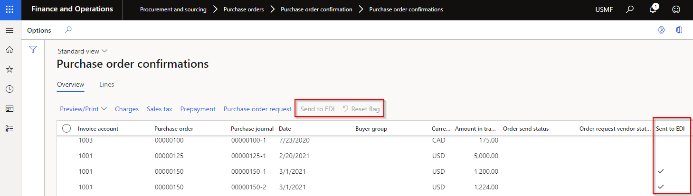
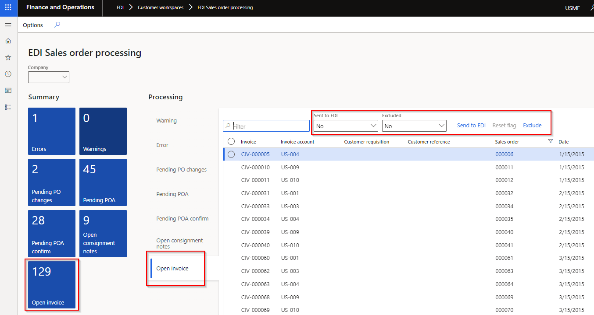

### Release 10.0.22.20220410

#### Build 10.0.22.2022041012

Excludes Inbound Transportation management (ITM) & ITM version Freight forwarder

<ins>**Manual actions required**</ins>  
**EDI > Setup > Batch control** has been replaced with **EDI > Setup > Batch control group**.  
Running **Refresh module** will transfer the “tick’s” (green in screenshot) from deprecated Batch control to new Batch control groups.   Next step is to delete the company specific EDI Batch jobs (via System administration > Inquiries > Batch jobs) and then create new batch jobs for each process via red in below screenshot. These will automatically be created on Company account dat, which enables the batch to run for multiple company accounts.   

<ins>Deprecated</ins>

Functionality		| Reason
:--			|:--
EDI > Setup > Batch control   EDI > Batch control (workspace)	| Replaced with **EDI > Setup > EDI batch control groups**, which allows companies to setup a batch for one or multiple legal entities.   See manual actions required.

<ins>New features</ins>

Number	  | Functionality	  | Reason
:--       |:--              |:--
9314	  | Batch control groups	| Allows companies to setup a batch group for one or multiple legal entities.   **Note**: See note in Deprecated section.
9733	  | Fixed text file template	| Alignment and Padding character have been added to Fixed Text Document Type Templates.   **Note**: new index has been added to Field position for Text fixed templates, which doesn’t allow multiple fields to start in same position. Before upgrading, update template/s if **Field position** isn’t unique.
9732	 | Text file template	| Text Document type’s Setup: Decimal separator ‘None’ option.
9653	 | XML and JSON document template mapping	| **Static values** and **Custom format** on inbound XML and JSON document mapping. Examples:   •	Where a field is in the inbound file, but should be replaced with another value: Use Custom format and substring formula. Example:       •	Where a field isn’t in the inbound file, but a static value should be populated in staging: Use Static value. Example:   
10073	| UOM mapping	| UOM mapping enhanced to include:   •	Company (Blank Company is allowed where Item code is set to All)   •	Item code (Table, Group, All)   •	Item relation   •	Inventory dimensions   **Note**: All existing UOM mappings will have Company set to Blank and Item code set to All. Should be no issues with backwards compatibility.
9660	| EDI batches	| Enable automated retries - if D365 experience a brief loss of connection to MS SQL Server. isRetryable set to True
9792	| Process to outbound	| Added **Records to include** filter on **Process to outbound**
9742	| Sales invoice	 | Additional sales invoice fields:   • Header:   o	Invoice contact name   o	Invoice phone number   •	Lines:   o	Customer account   o	Customer contact name   o	Customer phone number   o	Delivery address details from sales order line   o	Backorder quantity   o	Sales unit price (unit price before discounts excluding tax)   o	Sales unit price include tax (unit price before discounts including tax)   o	Unit discount   o	Unit discount percent
9612	| EDI Document maintenance workspace	| New Tile **File export errors** added to **EDI Document maintenance workspace** (per module).   Displays Outbound files with **Status** is set to _Error_ per module
9714	| Outbound filename	| Enhancements to form layout.   And additional currentSessionDate placeholders.
9692	| Purchase order confirmations	| Procurement and sourcing > Purchase orders > Purchase order confirmation > Purchase order confirmations   Added **Sent to EDI** to list page, and buttons **Send to EDI** and **Reset flag**.   
10084	| Version log’s Message	| Changed **Message** to unlimited type string   
10026	| Stock transfer receipt – Purchase order	| New button **Product receipt** added to staging form. Enabled if the document setting **Auto post receipt** is set to _Yes_.
9496	| Staging line height	| New EDI extended data types to improve staging forms lines’ height.
10147	| Consignment notes	| Removed error message **No document setting specified** where a customer doesn’t have a setting profile assigned to Customer advanced shipping notice document. **Add** button will be disabled if no setting profile assigned. **Add** button is only enabled where document setting **ASN strategy** is set to _Consolidated packing slip_ and **Sent to EDI** is _No_.
9827   9829	| **Sent to EDI** on EDI processing workspaces	| <ins>EDI Sales order processing workspace</ins>   New tile and tab for **Open invoice**. Filtered to sales invoices for customer trading partners with ‘Sales invoice’ document enabled. Below new buttons and filters also added to **Open consignment notes**   <ins>EDI Purchase order processing workspace</ins>   New tile and tab for **Open confirmation**. Filtered to purchase confirmations for vendor trading partners with **Vendor purchase order** document enabled.   <ins>All above processing workspaces</ins>   Additional functionality on Processing for all the Open tabs:   •	Filtered to Sent to EDI is No   •	Filtered to Excluded set to No   •	Buttons:   o	**Send to EDI** - can create staging record from workspace and update **Sent to EDI** to _Yes_   o	**Reset flag** – Enabled when **Sent to EDI** is _Yes_. Reset ‘Sent to EDI’ to No which enables ‘Send to EDI’ button   o	**Exclude / Include** (New functionality) – Ability to exclude the record from the “outstanding” list. Use filter Excluded to view records that has been excluded and can use button Include to include record again. Doesn’t create the staging record, but assist users in managing their “outstanding” list.   

<ins>Bug fixes</ins>

Number	| Name		 | Description
:--	|:--		 |:--
9990	| 10.0.26 PEAP	 | Compile error fixes for 10.0.26 PEAP
10023	| Customer advanced shipping notice	| SSCC blank for 'ASN line configuration' PickingList
9707	| 3PL Document maintenance	| Tile vs. Document list (all legal entities)
9644	| Batch jobs	 | ‘Process to outbound’ ran for all legal entities
9795	| Purchase invoice	| Using OrderedQty instead of InvoiceQuantity
9694	| Saved views	 | Saved views not applied to all EDI forms	
10080	| Staging forms	 | Staging forms wasn’t opening correct record after inserting a column on lines
9820	| XSLT format	 | ‘Format outbound document’ not applied to XSLT
5402	| Display method | Ability to add display method field (example numberOf Lines) to text template mapping and ability to import via entity
8341	| 3PL UI fixes	 | Various small user interface fixes on staging forms (removing duplicates etc.) Also updated entity ‘EDI Shipment Receipt settings – Transfer order’ to ‘EDI Settings Shipment Receipt - Transfer order’ for consistency
4432	| Customer UI fixes | Various small user interface fixes to staging forms, POA document setting profile and adding Store code to Trading partner’s Address

#### Build 10.0.22.2022041013
Includes Inbound Transportation management (ITM) & ITM version Freight forwarder of 2022041012

#### Build 10.0.22.2022041014 
	
Number	| Name	 | Description
:--	|:--	 |:--
10236	| Text document type template	| **Field position** index reverted to not unique 

#### Build 10.0.22.2022041015
Includes Inbound Transportation management (ITM) & ITM version Freight forwarder of 2022041014

