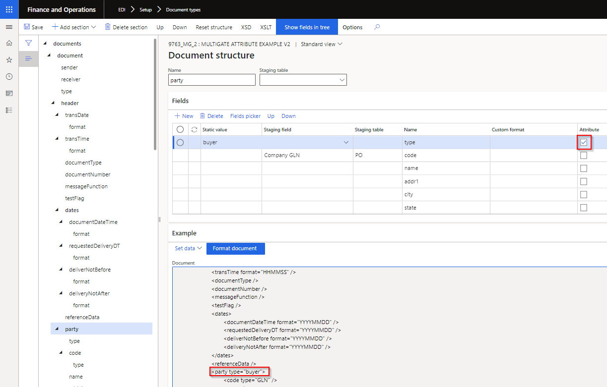

### Release 10.0.22.20220630

#### Build 10.0.25.202206301

Excludes Inbound Transportation management (ITM) & ITM version Freight forwarder

<ins>**Manual actions required**</ins>
 - Recreate Import batch

<ins>New features</ins>

**License manager** - Applies to all products

Number	| Functionality	  | Reason
:--	|:--		  |:--	
10341	| DXC License manager   10.8.32.10141	| New workspace **Organization administration > Workspaces > DXC support**.   Links for licensed products to:   • User guide   • Release notes   • Contact - email address for support	

**Core module**	- Applies to all modules

Number	| Functionality	  | Reason
:--	|:--		  |:--	
9767	| Import - batch group with multiple companies			| After moving Batch control to groups, the import batch can fail when another legal entity isn't setup for EDI. This change will ensure the remaining legal entities are still processed.
9659 	| Document template - Custom format	| Ability to set a custom date format on inbound file	
9608	| Document template - Dates		| Allow empty dates
8321	| Copy		| **Copy** button on Document type's Template, Setting profiles, Validation profiles and Trading partner
8268	| Outbound file name	| Improvements to outbound file name **Editor**. Can also set date format, example currentSessionDate(ddMMyyyy)	
9763	| XML document template mapping	| Ability to send and extract **Attributes** for XML document templates. New button **Show fields in tree** added to facilitate mapping. **Refresh module** will update **Attribute** column on existing templates.   	
9819	| Functional acknowledgement received | Company field has been added to **EDI > Inquiries and reports > Functional acknowledgement received**. Previously using Trading partner's company, which prevented Company filter to filter appropriately.
10229	| Outbound files	| Additional fields on where file will be/have been sent:   • File transfer type   • Original folder. Only applies to new records.
10442	| Connection type	| New Incoming path type **Error**. Where file already exists in D365 for trading partner and document type, the file will be moved from Import path to Error path. If the Error path isn't setup, the duplicate file will remain in Import path.
10446	| EDI parameters	| Removed **About** tab on EDI parameters

**Customer module**	

Number	| Functionality	  | Reason
:--	|:--		  |:--	
4302	| Customer purchase order & Customer purchase order change	| New document setting **Blank unit** for documents **Customer purchase order** and **Customer purchase order change** (Add additional item). Where the staging record will create a new sales line and the **Unit** is not provided in the file, the document setting provides options to use one of the following for the blank units:   • Sales unit   • Sales trade agreement unit   • Inventory unit   • Error (errors the complete staging record)
10436	| Customer purchase order	| New field **Comment** added to Header and line staging. Written to new EDI fields on D365 Sales order	header and lines.

**Vendor module**	

Number	| Functionality	  | Reason
:--	|:--		  |:--	
2129	| Purchase order line	| Add **Line change type** to Purchase order line EDI tab. 	
10372	| Purchase invoice	| **Product receipt quantity to match**. A Purchase invoice could be partial, i.e. not match the complete qty of the product receipt processed on D365. Previously when PackingSlipID is blank (not provided in file), EDI fully matches to the product receipt(s) processed for the order, even if Invoice qty < Product received qty. Now EDI will check staging line field ShippedQuantity, if InvoiceQuantity is less than ShippedQuantity, then 'Product receipt quantity to match' will be set to InvoiceQuantity.

**3PL module**	

Number	| Functionality	  | Reason
:--	|:--		  |:--	
9830	| **Sent to EDI** on EDI processing workspaces	| <ins>EDI Inventory adjustment workspace</ins>   New tile and tab for following 3PL documents, where the document is enabled for the 3PL trading partner, but record's **Sent to EDI** is set to _No_:   • Open Picking list   • Open shipment advice - Purchase order    • Open shipment advice - Return order   • Open shipment advice - Voyage     Additional functionality on Processing for all the Open tabs:   •	Filtered to Sent to EDI is No   •	Filtered to Excluded set to No   •	Buttons:   o	**Send to EDI** - can create staging record from workspace and update **Sent to EDI** to _Yes_   o	**Reset flag** – Enabled when **Sent to EDI** is _Yes_. Reset ‘Sent to EDI’ to No which enables ‘Send to EDI’ button   o	**Exclude / Include** (New functionality) – Ability to exclude the record from the “outstanding” list. Use filter Excluded to view records that has been excluded and can use button Include to include record again. Doesn’t create the staging record, but assist users in managing their “outstanding” list.   	

<ins>Bug fixes</ins>

**Core module**	- Applies to all modules	

Number	| Name		 | Description
:--	|:--		 |:--
9261	| Show log on outbound staging		| Showed Empty for previously processed outbound staging records
8312	| Trading partner			| Connection profile wasn't saved if adding a connection to newly created trading partner or adding to newly created document on the trading partner
10149	| Trading partner			| When a template for Vendors and/or Customers exist and user opens the EDI Trading partner's form, the options to 'Select a template for Vendors' and 'Select a template for Customers' pop ups.
10485	| Text template type	| Fixed text type template with missing closing double quote in source file caused **Process to staging** batch to remain in Executing status
10433	| Connection type - FTP	| Port fix

**Customer module**	

Number	| Name		 | Description
:--	|:--		 |:--
10305	| Entity **EDI Settings - PO**	| Fix error "Results. Field 'Relation type field' must be filled in. Results. validateWrite failed on data source 'AgreementClassification (AgreementClassification)'"
10406	| Customer purchase order	| When store code is not provided in staging, the staging header's address fields are used to find the applicable address on the customer to set on the sales order header. When the address doesn't exist on the D365 customer, the address is added to the customer.
10514	| EDI Sales order processing workspace	| Fix to filter when opening tile **Pending PO changes**

**Vendor module**	

Number	| Name		 | Description
:--	|:--		 |:--
6642	| Can't delete Vendor outbound files			| Previously errored with: "File exports cannot be deleted while dependent EDI Vendor purchase order exist. Delete dependent EDI Vendor purchase order and try again." Will now allow deletion of outbound file.
10374	| Purchase invoice	| Error 'Item % Update has been cancelled' when processing a Purchase invoice with blank 'Product receipt' and the purchase order includes a cancelled product receipt.
10514	| EDI Purchase order processing workspace	| Fix to filter when opening tile **Pending POA** and **Pending POA  confirm**

**3PL module**	

Number	| Name		 | Description
:--	|:--		 |:--
9691	| Shipment receipt - Purchase order	| Same PackingSlipId on multiple lines
10514	| EDI Inventory adjustment workspace	| Fix to filter when opening tile **Open count journals** and **Open movement journals**

#### Build 10.0.25.202206302
Includes Inbound Transportation management (ITM) & ITM version Freight forwarder of 10.0.25.20220630

