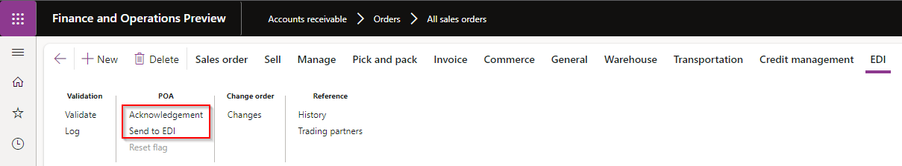

### Release 10.0.34.20231031

#### Build 10.0.34.202310312

Release date: 31 October 2023  

<ins>New features</ins>

**Core module** - Applies to all modules

| Number | Name             | Description                                                                                                                                                                                                                 |
| :----- | :--------------- | :-------------------------------------------------------------------------------------------------------------------------------------------------------------------------------------------------------------------------- |
| 16412  | DXC License      | DXC License 10.0.34.202310311.   DXC License updated to include feature managed SmartSend and Core extensions. If your environment includes these products, they would also require upgrade to feature managed releases. |
| 12020  | Outbound files   | Trading partner button on Outbound files                                                                                                                                                                                    |
| 16326  | Trading partners | Increased Trading partner's **Search mask** length from 30 to 60 characters                                                                                                                                                 |

**Customer module**

| Number           | Name                                                                      | Description                                                                                                                                                                                                                                                                                                                                                                                                                                                                                                                                                                                                                                                                                                                                                                                                                                                                                                                                                                                                                                                                                                                                        |
| :--------------- | :------------------------------------------------------------------------ | :------------------------------------------------------------------------------------------------------------------------------------------------------------------------------------------------------------------------------------------------------------------------------------------------------------------------------------------------------------------------------------------------------------------------------------------------------------------------------------------------------------------------------------------------------------------------------------------------------------------------------------------------------------------------------------------------------------------------------------------------------------------------------------------------------------------------------------------------------------------------------------------------------------------------------------------------------------------------------------------------------------------------------------------------------------------------------------------------------------------------------------------------- |
| 16125            | Customer purchase order                                                   | New Setting profile option **Suppress add new address**. Not applicable to staging records that have **Store code** populated, only applicable where the staging header's address fields are used to create the new sales order. When the staging header's address can't be found against the customer and **Suppress add new address** is set to _Yes_, a new address will not automatically be added to the customer and used on the sales order - the staging record will error instead.                                                                                                                                                                                                                                                                                                                                                                                                                                                                                                                                                                                                                                                        |
| 16292            | Customer purchase order                                                   | Increased **Buyer code** EDT length from 20 to 60 characters.                                                                                                                                                                                                                                                                                                                                                                                                                                                                                                                                                                                                                                                                                                                                                                                                                                                                                                                                                                                                                                                                                      |
| 16131            | Customer purchase order     Customer purchase order acknowledgement | New Customer purchase order setting profile option **Skip error lines**.   When set to _Yes_, the staging lines that _can't_ be created as sales order lines are skipped and the sales order contains only the lines that could be created.   Examples currently supported: product is stopped for sales, or item number can't be found.     The customer purchase order acknowledgement to the customer still contains the skipped line(s), with **POA code item** set to the mapped value for new POA response code **Line item - error**.     Implementation requirements to use new functionality:   • Set Customer purchase order setting profile **Skip error lines** to _Yes_   • If POA will be sent, set a mapped value for new response code **Line item - error**                                                                                                                                                                                                                                                                                                                                               |
| 16299   16350 | Customer purchase order acknowledgement                                   | Staging line field 'POA code item' is a concat of 'Price code + Qty code + Pack code + Inner Code'. Field 'POA code item' stays as-is.   We've added a new "summarised" field called 'POA code line' with either of the following results (if new response codes are mapped):   • **Line - accept**: If all the applicable line codes are accept   • **Line - reject**: If all the applicable line codes are reject   • **Line - advise**: If all the applicable line codes are combination of advise and reject     New response codes have been added to 'Customer setup > POA response code group' for these three "summarised" response codes.   Response code is only applicable if mapped.     The following responses are deemed Accept:   • Line price - accept   • Line item - accept   • Line item - pack accept   • Line item - inner accept   • Response code not mapped     The following responses are deemed Reject:   • Line price - advise   • Line item - out of stock   • Line item - withdrawn   • Line item - pack difference   • Line item - inner difference |

**Vendor module**

| Number | Name                                                        | Description                                                                                                                                                                                                                                                                                                                                                                                                                                                                                                                                                                                                                                                                                                                                                               |
| :----- | :---------------------------------------------------------- | :------------------------------------------------------------------------------------------------------------------------------------------------------------------------------------------------------------------------------------------------------------------------------------------------------------------------------------------------------------------------------------------------------------------------------------------------------------------------------------------------------------------------------------------------------------------------------------------------------------------------------------------------------------------------------------------------------------------------------------------------------------------------ |
| 15272  | Vendor purchase order change - Order line change type group | Ability to limit when a staging record is created.   Staging record will not be created where all line's **Order line change type**'s **Don't send change** is set to _Yes_.                                                                                                                                                                                                                                                                                                                                                                                                                                                                                     |
| 15356  | Vendor purchase order change - Order line change type group | **Order line change types** - Additional options added:   • **Price change** - Price change only to existing purchase order line. X12 example: PC   • **Quantity decrease** - Only quantity decrease to existing purchase order line. X12 example: QD   • **Quantity increase** - Only quantity increase to existing purchase order line. X12 example: QI   • **Reschedule** - Only requested delivery date change to existing purchase order line. X12 example: RS   • **No change** - No changes to existing purchase order line. X12 example: NC     **Order line change types** - Existing option modified:   • **Changes to line items** - Multiple changes to existing purchase order line, for example quantity and price. X12 example: CA |

**3PL module**

| Number | Name                      | Description                                                                                                                                                                                                                                                            |
| :----- | :------------------------ | :--------------------------------------------------------------------------------------------------------------------------------------------------------------------------------------------------------------------------------------------------------------------- |
| 16009  | Shipment receipt - Voyage | Ability for inbound document to create a D365 batch if it doesn't exist in D365.   • Setting profile: New option **Create batch**   • Staging lines: New fields **Manufacturing date** and **Expiration date** - to be used when creating the new batch in D365. |
| 16128  | Shipment advice - Voyage  | Additional fields add to staging and template lines:   • **Line number** - Staging line number   • **Line number document** - Source document's line number   • **Order** - Source Purchase order or Transfer order number                                    |

**Freight forwarder landed cost module**

| Number | Name           | Description                                                                                                                                                                                                                                                                                                                                                                                                                                                                                                                                                                                                                                                                                          |
| :----- | :------------- | :--------------------------------------------------------------------------------------------------------------------------------------------------------------------------------------------------------------------------------------------------------------------------------------------------------------------------------------------------------------------------------------------------------------------------------------------------------------------------------------------------------------------------------------------------------------------------------------------------------------------------------------------------------------------------------------------------- |
| 16030  | Voyage advice  | New outbound document that provides the ability to send **Purchase order details** to the Landed cost freight forwarder.   [User guide](FREIGHT-FORWARDER/DOCUMENTS/Voyage-advice.md)     **Setup**:   Add Templates and Outbound files on **Document types** and assign to applicable **Freight forwarder landed cost Trading partner**     **Processing**:   • Assign applicable **Shipping company** on the Purchase order header Landed cost FastTab.   • Use **Send to EDI** on the Purchase order's Action Pane, Purchase tab, Landed cost heading, to create the outbound staging record    |
| 16343  | Voyage creator | New option on Setting profile's **Source line search strategy** and new **Staging lines** field called **Line number document**.   Provides the ability for Voyage creator to match to the source document's (Purchase or Transfer order) **Line number** when creating the Voyage lines.                                                                                                                                                                                                                                                                                                                                                                                                         |

<ins>Bug fixes</ins>

**Core module** - Applies to all modules

| Number | Name           | Description                                                                                                             |
| :----- | :------------- | :---------------------------------------------------------------------------------------------------------------------- |
| 14981  | Document types | When using the **Copy** button on **Setting profiles** and **Validation profiles**, limit the string size for **Name**. |

**Customer module**

| Number | Name                                    | Description                                                                                                                                                                                                                                                                                                                                                                                                                                      |
| :----- | :-------------------------------------- | :----------------------------------------------------------------------------------------------------------------------------------------------------------------------------------------------------------------------------------------------------------------------------------------------------------------------------------------------------------------------------------------------------------------------------------------------- |
| 16356  | Customer purchase order acknowledgement | If the user clicked 'Send to EDI' on the Sales order's Action pane (EDI tab) without opening Acknowledgement first, the POA codes haven't been initialised yet and blank values would be populated for the POA codes in the staging record. The POA codes are now also initialised when clicking 'Send to EDI' on the Sales order's Action Pane (if POA codes are blank).    |
| 16121  | Customer advanced shipping notice       | The ASN staging record wasn't displayed in Sales order's EDI **History**.                                                                                                                                                                                                                                                                                                                                                                        |
| 16394  | Customer advanced shipping notice       | Blank **Ship date** and **Scheduled delivery date** for Intercompany ASN.                                                                                                                                                                                                                                                                                                                                                                        |
| 16402  | Customer advanced shipping notice       | Only relevant to Intercompany ASN. When the intercompany shipping sales order had multiple shipments, received error 'Cannot create a record in Consignment note lines (SAB_EDIConsignmentNoteLines). The record already exists.'                                                                                                                                                                                                                |

**3PL module**

| Number | Name                                                    | Description                              |
| :----- | :------------------------------------------------------ | :--------------------------------------- |
| 10528  | Shipment advice - Voyage   Shipment receipt - Voyage | Missing security to access staging forms |

**Freight forwarder landed cost module**

| Number | Name                                | Description                                                                                                                                                                                                                                                                                                                                                                                                                                                                                                                                                                            |
| :----- | :---------------------------------- | :------------------------------------------------------------------------------------------------------------------------------------------------------------------------------------------------------------------------------------------------------------------------------------------------------------------------------------------------------------------------------------------------------------------------------------------------------------------------------------------------------------------------------------------------------------------------------------- |
| 16149  | Voyage creator                      | When the purchase order line contained a different unit to the product's inventory unit and the voyage creator line used the same unit as the purchase order line, the voyage quantity was incorrectly multiplied by the unit conversion.   To support this fix, we implemented 16343 **Source line search strategy** called **Line number document** for voyage creator to find the applicable source line's unit for correct unit conversion.   Thus if your purchase order line's unit differ to inventory unit, you need to use this new source line search strategy option. |
| 10637  | Voyage creator   Voyage tracking | Voyages button enabled prior to processing of record                                                                                                                                                                                                                                                                                                                                                                                                                                                                                                                                   |
| 12598  | Document types                      | Description in Document types updated for new records for:   • Voyage creator   • Voyage tracking                                                                                                                                                                                                                                                                                                                                                                                                                                                                                |
| 16055  | Voyage tracking                     | 'SAB_EDIStagingHistory::logHistory has been incorrectly called' error when processing staging record when 'Voyage id source' set to 'External id'                                                                                                                                                                                                                                                                                                                                                                                                                                      |
