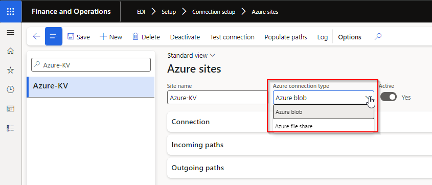
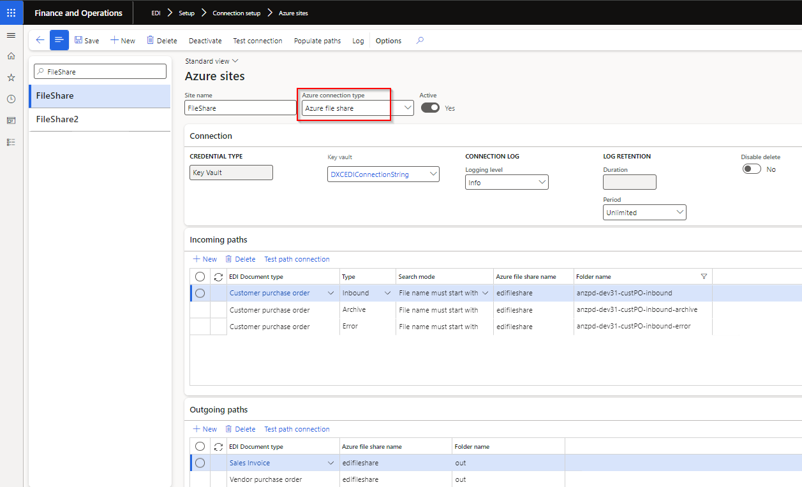

### Release 10.0.40.20240905

#### Build 10.0.40.202409051

Release date: 5 September 2024  

<ins>Manual actions required</ins>

With additional new Azure connection option **Azure file share**, we've added a new field called **Azure connection type** to Azure sites.   If using Azure connections, and your existing Azure sites have **Azure connection type** set to blank, please select _Azure blob_
  

<ins>New features</ins>

**Core module** - Applies to all modules

| Number | Name                               | Description                                                                                                                                                 |
| :----- | :--------------------------------- | :---------------------------------------------------------------------------------------------------------------------------------------------------------- |
| 18222  | Connection type - Azure file share | New option to use **Azure file share** in Connection type **Azure sites**.    |
| 18224  | DXC connections                    | Azure dll moved to new model called DXCConnections.   DXC Connections release 10.0.40.202409192 - [Release notes](../CONNECTIONS/Release-notes.md)       |

**Customer module**

| Number | Name                    | Description                                                                                                                                                                                                                                                                                                                                                                                                                                              |
| :----- | :---------------------- | :------------------------------------------------------------------------------------------------------------------------------------------------------------------------------------------------------------------------------------------------------------------------------------------------------------------------------------------------------------------------------------------------------------------------------------------------------- |
| 18346  | Customer purchase order | Find Customer and Address by Store code functionality.   New Customer Trading partner field **Enable store code identification** provides the ability to use the Customer purchase order header **Store code** field to find the applicable Trading partner to create the sales order against.   This is useful where the orders are sent for various GLN/Store codes, but these various GLN/store codes are created as one D365 customer account. |

**3PL module**

| Number | Name         | Description                                                    |
| :----- | :----------- | :------------------------------------------------------------- |
| 18152  | Picking list | Two new document line fields:   • SalesUnit   • SalesQty |

<ins>Bug fixes</ins>

**Standard formats module**

| Number | Name | Description                                                               |
| :----- | :--- | :------------------------------------------------------------------------ |
| 18340  | X12  | X12's Document type Template ISA mapping not displayed in Example section |

**Customer module**

| Number | Name                     | Description                                                                                                                                                                                                                                            |
| :----- | :----------------------- | :----------------------------------------------------------------------------------------------------------------------------------------------------------------------------------------------------------------------------------------------------- |
| 18432  | Sales order packing slip | Couldn't post a packing slip for a picking list when:   • Consignment note populated on picking list registration and   • Customer doesn't have Customer Advanced shipping notice   Incorrectly errored with "No document setting specified." |
| 18616  | Skip error lines         | Where the Customer purchase order acknowledgement line wasn't created on the sales order via 'Skip error lines' functionality, POA staging line fields 'Bar code' now obtained from the original Customer purchase order's 'Bar code' field.           |

**3PL module**

| Number | Name                                     | Description                                                                                                                                                    |
| :----- | :--------------------------------------- | :------------------------------------------------------------------------------------------------------------------------------------------------------------- |
| 18315  | Product master                           | Base physical dimensions on the Product master unit                                                                                                            |
| 18596  | Transfer order picking list registration | Error when processing Transfer order Picking list registration Inbound file to Staging: Function SAB_EDIStagingHistory::logHistory has been incorrectly called |
