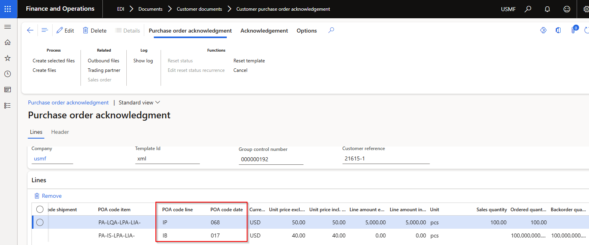
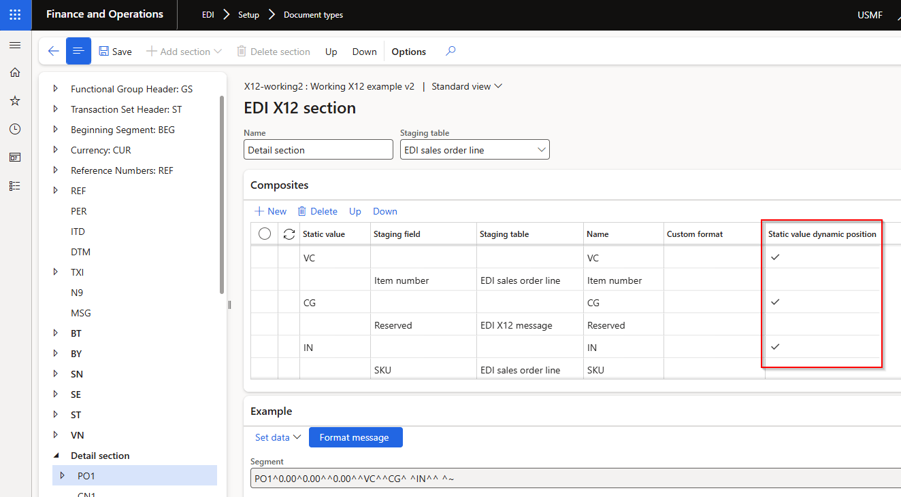
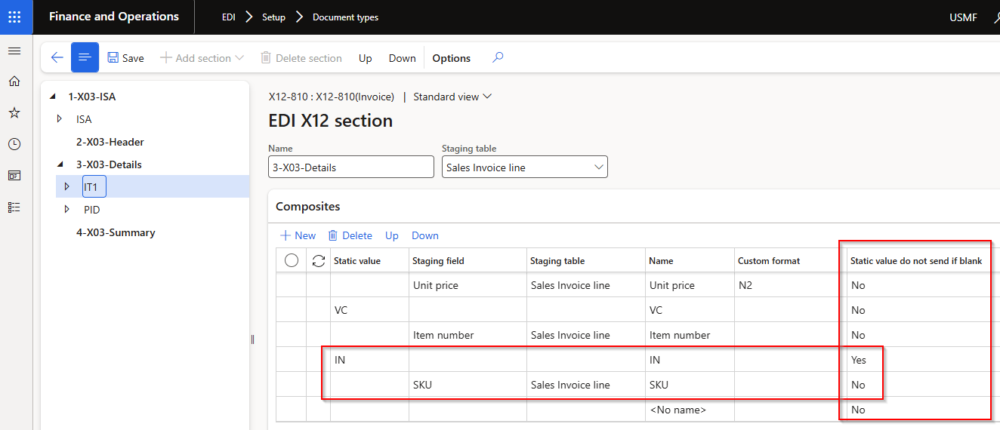

### Release 10.0.42.20250403

#### Build 10.0.42.202504031
Release date: 3 April 2025

<ins>New features</ins>

**Customer module**	

Number	| Name		 | Description
:--	|:--		  	|:--	
21615	| • Customer purchase order acknowledgement (POA) | New **POA code** options on **POA response group**:   • Line - out of stock   • Line - partial stock   • Line - price advice   • Date - backorder   • Date - confirmed          <ins>Updated logic</ins>:   POA staging line field **POA code line**:   • **Line - out of stock**: 100% out of stock / full backorder   • **Line - partial stock**: <100% out of stock / partial backorder    • **Line - price advice**: full shipment with only price change    • **Line - advice**: full shipment with multiple changes    • **Line - accept**: full shipment with no changes    • **Line - reject**: line rejected     New POA line staging field **POA code date**:    • **Date - backorder**: When 'Line - out of stock' applies (only full backorder)    • **Date - confirmed**: When 'Line - out of stock' doesn't applies (partial backorder and full shipment)   
21729	| • Customer purchase order acknowledgement (POA)   • Customer advanced shipping notice (ASN)   • Sales invoice | Added line field **SKU** from EDI Customer purchase order lines to all outbound documents. Also added to Sales order Line details, EDI tab.
21714	| • Customer advanced shipping notice (ASN)   • Sales invoice | Added field **Order line number** to staging lines. Source is EDI Customer purchase order line's 'Line number', and for non-EDI sales orders it will populate with same value as ASN and Invoice's 'Line number document'.
21849	| • Customer advanced shipping notice (ASN)   • Sales invoice | Added header field **Buyer code** from EDI Customer purchase order header.
21887	| • Customer Trading partner   • Customer purchase order	| Added new field **Buyer code** to Customer trading partner. Where **Buyer code** is blank in Customer purchase order header staging record, it will use the Buyer code from the Trading partner on the Sales order header, EDI section. And subsequently on all outbound customer documents.

**Standard formats module**	

Number	| Name		 | Description
:--	|:--		 |:--
21811	| X12 template	 | Inbound documents: Added **Static value dynamic position**. In below example the values for VC, CG and IN can be found in any order in the file.        Outbound documents: Added **Static value do not send if blank**. In below example if staging value for SKU is blank it won't send IN elements.   

<ins>Bug fixes</ins>

**Customer module**	

Number	| Name		 | Description
:--	|:--		  	|:--	
21725	| • Customer advanced shipping notice (ASN)   • Sales invoice | Use **Company GLN** from Customer purchase order staging record. For non EDI sales orders or consolidated packing slips, use the **Company GLN** from the Trading partner setup.

