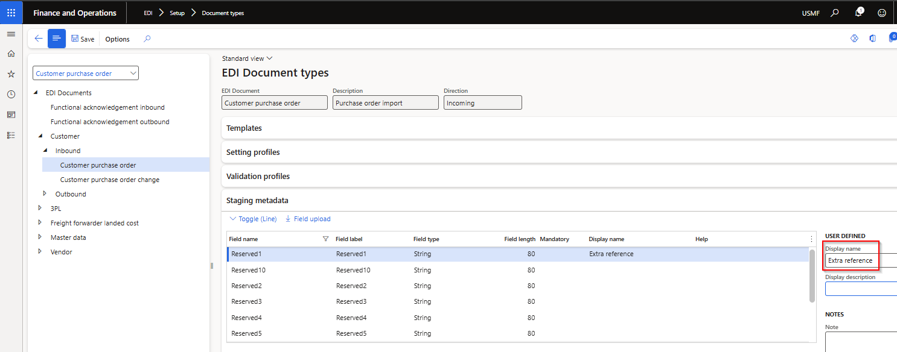

### Release 10.0.43.20250509

#### Build 10.0.43.202505091
Release date: 9 May 2025

<ins>New features</ins>

**Core module**	- Applies to all modules	

Number	| Name		 | Description
:--	|:--		 |:--
19356	| DXC connections - SFTP	| DXC Connections 10.0.42.202504042. SFTP library moved to DXC Connections model. [Release notes](../CONNECTIONS/Release-notes.md)

**Standard formats module**	

Number	| Name		 | Description
:--	|:--		 |:--
21993	| X12 template	| New outbound template mapping field **Skip segment if blank**. Where set to Yes and the staging value is blank, the segment will be skipped when creating the outbound X12 file.   In below example the SAC segment will not be sent where the sales invoice has no charges.   

**Customer module**	

Number	| Name		 | Description
:--	|:--		  	|:--
21982	| • Customer purchase order   • Customer purchase order acknowledgement (POA)   • Customer advanced shipping notice (ASN)   • Sales invoice	| **SKU** line field size increased
21997	| • Customer purchase order acknowledgement (POA)   • Customer advanced shipping notice (ASN)   • Sales invoice	| **Product name** and **Text** line fields standardised across customer documents.
22052	| • Customer purchase order   • Customer purchase order acknowledgement (POA)   • Customer advanced shipping notice (ASN)   • Sales invoice	| New **LineNumText** field added to in and outbound customer documents. This supports the requirement where the customer purchase order's line number field is not numeric (for example 001) and these needs to be used in the same format on the outbound documents.
22067	| • Customer purchase order   • Customer purchase order acknowledgement (POA)   • Customer advanced shipping notice (ASN)   • Sales invoice	| Ten **Reserved** header string fields to assist rapid start implementations. These fields can be used where Customer purchase order values, not covered by existing EDI fields, needs to populate header fields on the outbound customer documents.   Companies can update the field label of these fields via Document types Staging metadata.   

**Vendor module**	

Number	| Name		 | Description
:--	|:--		  	|:--	
16024	| Purchase invoice	| Performance improvement on posting EDI Purchase invoice - Batch administration enabled.

<ins>Bug fixes</ins>

**Customer module**	

Number	| Name		 | Description
:--	|:--		  	|:--	
21845	| Customer purchase order	| Skip error lines - Fix to incorrect error when staging line needs to be skipped where 'Skip error lines' applies to the Trading partner. Error 'Cannot edit a record in EDI sales order line (SAB_EDISalesOrderLineStaging).The record has never been selected.'
21893	| Customer purchase order acknowledgement	| Summarised 'POA code line' value was reliant on mapped values in POA code response groups. "Duplicate" mappings caused an issue with the value in 'POA code line'.
21988	| Sales order processing workspace	| Where the Customer purchase acknowledgement was created via 'Send to EDI' on the Sales order processing workspace, the POA response codes where not populated.

**Standard formats module**	

Number	| Name		 | Description
:--	|:--		 |:--
22064	| X12 template	 | Few scenarios where hanging when processing X12 inbound file to processing. Issue on PO1 line level.
