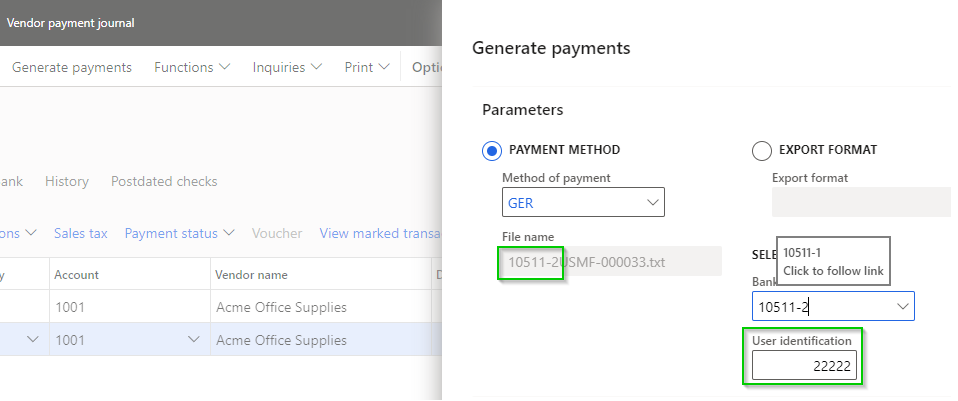

### Release 10.0.25 & 10.0.27.20220714

#### Build 10.0.25.202207142

Release date: 14/07/2022  

| Number | Functionality                       | Reason                                                                                                                                                                                                                                                                                                                                                                                                                                                                                                                                                                                                                                                                                                                                                                                                                                                                                                                                                     |
| :----- | :---------------------------------- | :--------------------------------------------------------------------------------------------------------------------------------------------------------------------------------------------------------------------------------------------------------------------------------------------------------------------------------------------------------------------------------------------------------------------------------------------------------------------------------------------------------------------------------------------------------------------------------------------------------------------------------------------------------------------------------------------------------------------------------------------------------------------------------------------------------------------------------------------------------------------------------------------------------------------------------------------------------- |
| 10367  | Reconciliation matching rule        | Ability to set **Account**'s **Financial dimensions** on **Reconciliation matching rules** with Action **Mark new transactions**.      New posting logic for financial dimensions:   • Account is Bank   • Offset account is Ledger, Customer, Vendor or Bank.    When new bank statement transactions with Offset account type _Ledger_, _Vendor_ or _Bank_'s are matched by using Reconciliation matching rules, the calculated financial dimensions for Account and Offset account are populated on the **Matched transaction**'s **Financial dimensions** tab and can be overriden prior 'Mark as reconciled'.   Offset account type _Customer_ creates customer receipt journal(s) with the calculated financial dimensions for Account and Offset account. |
| 10511  | Vendor payments - Generate payments | Current vendor payment journal line's **Method of payment** and **Bank account** used to populate fields on **Generate payments** dialog.                                                                                                                                                                                                                                                                                                                                                                                                                                                                                                                                                                                                                                                                                                                                                                                                                  |

<ins>Bug fixes</ins>

| Number | Name                                | Description                                                                                                                                                                                                                                                                                     |
| :----- | :---------------------------------- | :---------------------------------------------------------------------------------------------------------------------------------------------------------------------------------------------------------------------------------------------------------------------------------------------- |
| 10511  | Vendor payments - Generate payments | Electronic reporting format: **User id** and **File name** updated if Bank account is changed on **Generate payments** dialog.                                                                                   |
| 10603  | Bank reconciliation                 | Where a bank deposit slip has been cancelled the MS calculated totals are incorrect and resulted in an unmatched amount. Financial utilities unmatched amount calculation has been updated to avoid this issue.    |

#### Build 10.0.27.202207142

Release date: 14/07/2022  

Same as 10.0.25.202207142, and includes the fix for Payment advice V2 required from 10.0.27:

| Number | Functionality             | Reason                                                                                                                                                       |
| :----- | :------------------------ | :----------------------------------------------------------------------------------------------------------------------------------------------------------- |
| 10284  | Eclipse Payment advice V2 | Resolves the **breaking change** with Microsoft introduced new 10.0.27 features when **Enable batch processing for bank payment advice reports** is enabled. |

