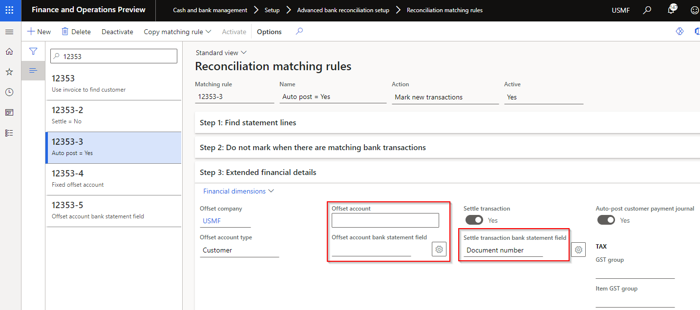

### Release 10.0.29.20230131

#### Build 10.0.29.202301317

Release date: 17 April 2023  

<ins>Bug fixes</ins>

| Number | Functionality       | Description                                                                          |
| :----- | :------------------ | :----------------------------------------------------------------------------------- |
| 13788  | Bank reconciliation | Modified fix for 13592 to use **Accounting currency** instead of Reporting currency. |

#### Build 10.0.29.202301316

Release date: 30 March 2023  

<ins>Bug fixes</ins>

| Number | Functionality                | Description                                                                                                                                                                                                                                                                         |
| :----- | :--------------------------- | :---------------------------------------------------------------------------------------------------------------------------------------------------------------------------------------------------------------------------------------------------------------------------------- |
| 13592  | Bank reconciliation          | Exchange rate issue when using Mark as new and Offset account type is set to **Vendor**. When the currency differs to the legal entity, and the posted vendor transaction is selected to be used in settlement, the transaction's amount doesn't update the **Settlement balance**. |
| 13620  | Vendor bank account approval | From 10.32 MS has introduced their own Vendor bank account approval. MS used the same method name processChangesForApproval as we used for Finance utilities functionality. We've updated ours to avoid compile issues from 10.0.32.                                                |

#### Build 10.0.29.202301315

Release date: 3 March 2023  

<ins>Bug fixes</ins>

| Number | Functionality                 | Description                                                                                                                                                                                                                                                                                                                                                                  |
| :----- | :---------------------------- | :--------------------------------------------------------------------------------------------------------------------------------------------------------------------------------------------------------------------------------------------------------------------------------------------------------------------------------------------------------------------------- |
| 11505  | Reconciliation matching rules | Bank reconciliation: When running multiple Reconciliation matching rules with **Action** set to _Mark new transactions_ and **Offset account type** set to _Customer_, errored with 'No statement lines have been marked. The match has an imbalance of %amount%'.                                                                                                           |
| 12801  | Reconciliation matching rules | Bank reconciliation: When running Reconciliation matching rules with **Action** set to _Mark new transactions_ and **Offset account type** set to _Customer_ and **Auto-post customer payment journal** set to _Yes_, and there was an issue with posting the customer payment journal (for example customer is stopped) the bank statement transactions were still matched. |

#### Build 10.0.29.202301314

Release date: 27 February 2023  

<ins>New features</ins>

| Number | Functionality         | Description                                       |
| :----- | :-------------------- | :------------------------------------------------ |
| 12934  | Bank statement import | Support DXC X++ replacement for XSLT depreciation |

#### Build 10.0.29.202301313

Release date: 22 February 2023  

<ins>Bug fixes</ins>

| Number | Functionality  | Description                                                                                                                               |
| :----- | :------------- | :---------------------------------------------------------------------------------------------------------------------------------------- |
| N/A    | DXC Encryption | Update to DXC encryption. Resolve error: Module 'DXCEncryption' is missing the following dependencies: 'ApplicationFoundationFormAdaptor' |

#### Build 10.0.29.202301312

Release date: 14 February 2023  

| Number | Functionality  | Description                      |
| :----- | :------------- | :------------------------------- |
| 12825  | DXC Encryption | Remove unwanted model references |

#### Build 10.0.29.202301311

Release date: 31 January 2023  

<ins>New features</ins>

| Number | Functionality                       | Description                                                                                                                                                                                                                                                                                                                                                                                                                                                                                                                                                                                                                                                                                       |
| :----- | :---------------------------------- | :------------------------------------------------------------------------------------------------------------------------------------------------------------------------------------------------------------------------------------------------------------------------------------------------------------------------------------------------------------------------------------------------------------------------------------------------------------------------------------------------------------------------------------------------------------------------------------------------------------------------------------------------------------------------------------------------ |
| 11653  | Encryption / Decryption             | New model **DXC Encryption**.   Encryption/decryption options added to following Finance utilities functionality:   • Encrypt option on **Electronic reporting export connections** to send encrypted GER Vendor EFT files   • Decrypt option on **Financial utilities connection** to decrypt a bank statement file imported using periodic task **Import bank statements via financial utilities connection**.   [User guide](Setup/ENCRYPTION/Encryption-decryption.md)                                                                                                                                                                                                            |
| 12119  | Financial utilities connection      | **Log** ability added to all connection types. Ability to set **Logging level** and **Retention period**. This provides users the ability to set Custom alerts. For example if a connection can't connect a log with level _Error_ can be created.                                                                                                                                                                                                                                                                                                                                                                                             |
| 12353  | Reconciliation matching rules       | Ability to use invoice to find the D365 customer account.   Applicable to **Offset account type** set to _Customer_ and where **Offset account** and **Offset account bank statement field** are both blank.   When running the Reconciliation matching rule, the field mapped to **Settle transaction bank statement field** (D365 invoice number) will be used to find the **D365 customer account**, to create the **Customer payment journal line**.   [User guide](Setup/CASH-AND-BANK-MANAGEMENT/Bank-reconciliation-matching-rules.md#mark-as-new---additional-defaults)   |
| 10419  | Data entity - Bank accounts         | Added following field to entity 'Bank accounts':   • Financial utilities connections                                                                                                                                                                                                                                                                                                                                                                                                                                                                                                                                                                                                           |
| 10425  | Data entity - Vendor payment method | Added following field to entity 'Vendor payment method':   • Sundry method of payment   • Auto payment reference number   • BPAY method of payment                                                                                                                                                                                                                                                                                                                                                                                                                                                                                                                                       |
| N/A    | License manager                     | License manager version 10.8.32.10156.   **Help** includes links to applicable GitHub user guide page/s                                                                                                                                                                                                                                                                                                                                                                                                                                                                                                                                   |

<ins>Bug fixes</ins>

| Number | Functionality         | Description                                                                                                                                                                                                                                                                                                                                                                                                                                                                                                               |
| :----- | :-------------------- | :------------------------------------------------------------------------------------------------------------------------------------------------------------------------------------------------------------------------------------------------------------------------------------------------------------------------------------------------------------------------------------------------------------------------------------------------------------------------------------------------------------------------ |
| 12324  | Bank statement import | When a custom bank statement format was used and the file contained a bank account that isn't setup for advanced bank reconciliation, the bank statement headers were created for the bank accounts setup with advanced bank reconciliation, but no bank statement lines were created.   The fix now creates the bank statement lines for the bank accounts setup as advanced.   Note: Std GER doesn't import any bank statements where the file contains a bank account not setup as advanced bank reconciliation. |

