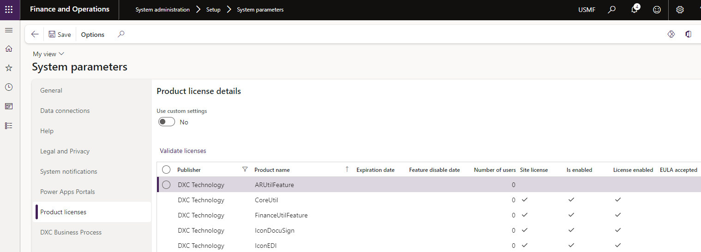

### Release 10.0.29.20230505

#### Build 10.0.29.202305051

Release date: 5 May 2023  

<ins>New features</ins>

| Number | Functionality                   | Description                                                                                                                                                                                                                                                                                                                                                                                                                                                                                                                                                                                                                                                                       |
| :----- | :------------------------------ | :-------------------------------------------------------------------------------------------------------------------------------------------------------------------------------------------------------------------------------------------------------------------------------------------------------------------------------------------------------------------------------------------------------------------------------------------------------------------------------------------------------------------------------------------------------------------------------------------------------------------------------------------------------------------------------- |
| 12644  | Customer references             | Ability to set multiple references against customers - [Setup](Setup/ACCOUNTS-RECEIVABLE/Customer-reference.md).   These references can be used in the following scenarios:   • Customer remittance file refers to a reference unique to the customer, but not an invoice number. This reference can be used to find the applicable customer account when creating the customer payment journal while importing customer remittances using the additional licensed feature AR Utilities.   • Roadmap: Reconciliation matching rules additional ability to use the customer reference to find the applicable customer account when creating the customer payment journal. |
| 11357  | Import customer remittance file | New licensed feature included in **AR Utilities**.   Enhancement to import customer remittance files from ftp, sftp or Azure blob storage using data entity Customer payment journal.   A wide variety of setup options allows flexibility on method to find the customer account, settlement, posting date, custom file mapping etc.   • [Import customer remittance setup](Setup/ACCOUNTS-RECEIVABLE/Customer-remittance.md)   • [Import customer remittance processing](Processing/Accounts-Receivable/Customer-remittance.md)                                                                                                                                     |
| 13907  | Financial utilities connection  | Where file is moved to **error** path/container, the Financial utilites connection's Log Level will be set to _Error_.   Set connection's **Logging level** to _Error_ and use custom alerts to be alerted when a file has been moved to error path.                                                                                                                                                                                                                                                                                                                                                    |
| N/A    | License manager                 | License manager version 10.8.32.10171   Enhanced Licensing capabilities to assist with licensing support and scaling.   **Note:** Required to upgrade all installed DXC products to at least the following versions:   • EDI 10.0.29.202305053   • Finance utilities 10.0.29.202305051   • SmartSend 10.0.29.202304142   • Core extensions 10.0.29.202304142   • DocuSign 10.0.29.202304211   • Item creation 10.0.29.202304211   • PLM 10.0.29.202304211   • Forex 10.0.29.202305101                                                                                  |

<ins>Bug fixes</ins>

| Number | Functionality                                 | Description                                                                                                      |
| :----- | :-------------------------------------------- | :--------------------------------------------------------------------------------------------------------------- |
| 12857  | Data entity - Reconciliation matching rules   | Reverse changes for 11749. Removed fields added back.                                                            |
| 12888  | Data entity - Financial utilities connections | Fixed entities required to import Financial utilties connections                                                 |
| 10429  | Data entity - Reconciliation matching rule    | When importing entity, the Offset account was imported with Chart of account delimiter after the ledger account. |
| 14093  | Reconciliation matching rules                 | Security: Maintain privilege added for **Copy matching rule**. Added to Duty 'Enable bank management process'.   |

