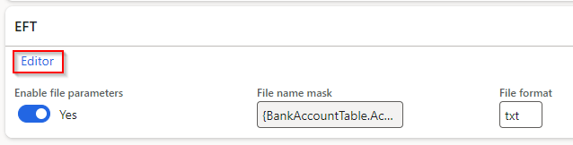

### Release 10.0.35.20230731

#### Build 10.0.35.2023073156

Release date: 14 November 2023  

<ins>Bug fixes</ins>

| Number | Module                   | Functionality                              | Description                                                                                                                                                                                                                                                                                                                                                                                                                                                                                                                                                                               |
| :----- | :----------------------- | :----------------------------------------- | :---------------------------------------------------------------------------------------------------------------------------------------------------------------------------------------------------------------------------------------------------------------------------------------------------------------------------------------------------------------------------------------------------------------------------------------------------------------------------------------------------------------------------------------------------------------------------------------- |
| 16460  | Cash and bank management | Intercompany bank Mark as new transactions | 16338's change to intercompany bank mark as new, created a bank statement in the destination company to create intercompany reconciled bank transactions. This has now been changed to not create a bank statement in the destination legal entity. It now creates an unreconciled bank transaction in the destination company using the following from originating company: Debit/Credit Amount, OffsetLedgerDimension, BankTransType, OffsetTxt, OffsetCompany, OffsetAccountType, ExchRateSecond, ExchRate, CurrencyCode, Voucher, TransDate, LedgerDimension, AccountType, JournalNum |

#### Build 10.0.35.2023073143

Release date: 2 November 2023  

<ins>New features</ins>

| Number | Module                   | Functionality                   | Description                                                                                                                                                                                                                                                                                                                                                                             |
| :----- | :----------------------- | :------------------------------ | :-------------------------------------------------------------------------------------------------------------------------------------------------------------------------------------------------------------------------------------------------------------------------------------------------------------------------------------------------------------------------------------- |
| 16429  | Cash and bank management | Bank statement / reconciliation | Update ledgers used for mark as new **Intercompany bank** transactions. Previously used LedgerInterCompany fields CustLedgerDimension and DebitLedgerDimension, but these aren't available in the Intercompany accounting form. Now using: OriginatingDebitLedgerDimension or OriginatingCreditLedgerDimension and DestinationCreditLedgerDimension or DestinationDebitLedgerDimension. |

<ins>Bug fixes</ins>

| Number | Module                   | Functionality                              | Description                                                                                                                                                                                                                                                                                                                                                                                                                                                                                                                                            |
| :----- | :----------------------- | :----------------------------------------- | :----------------------------------------------------------------------------------------------------------------------------------------------------------------------------------------------------------------------------------------------------------------------------------------------------------------------------------------------------------------------------------------------------------------------------------------------------------------------------------------------------------------------------------------------------- |
| 16338  | Cash and bank management | Intercompany bank Mark as new transactions | Additions to 15578. Applicable to when a bank statement line is marked as new and offset to an **intercompany bank account**.   Previously only supported when bank statement is posted via 'Mark as reconciled' (Auto-post bank statement is set to _Yes_), and feature 'Advanced bank reconciliation improvement: enable filtering and provide separate grid for new transactions' disabled.   Now supports the feature enabled and posting the bank statement from the Bank statement page (Auto-post bank statement is set to _No_) as well. |
| 16250  | Cash and bank management | Import statement                           | Incorrect warning message when importing bank statement and the file contains multiple bank accounts and the import parameters is filtered to one bank account that exists in the file: 'Failed to match with bank account'.   It also warned about No matching bank account found for bank accounts that doesn't exist in D365, but the import was only filtered to one specific bank account.                                                                                                                                                     |

#### Build 10.0.35.2023073131

Release date: 4 October 2023  

<ins>Bug fixes</ins>

| Number | Module         | Functionality                      | Description                                                                                             |
| :----- | :------------- | :--------------------------------- | :------------------------------------------------------------------------------------------------------ |
| 16114  | ABN Validation | Customer and Vendor ABN validation | Decouple DXCABNValidation from DXCFinanceUtilities enabling companies to remove model DXCABNValidation. |

#### Build 10.0.35.2023073122

Release date: 31 August 2023  

<ins>New features</ins>

| Number | Module                   | Functionality            | Description                                                                                                                                                                                                                                                                                                                              |
| :----- | :----------------------- | :----------------------- | :--------------------------------------------------------------------------------------------------------------------------------------------------------------------------------------------------------------------------------------------------------------------------------------------------------------------------------------- |
| 15017  | Accounts payable         | EFT file name generation | Ability to set static values and select placeholders for EFT file name in Vendor's Method of payment   [User guide](Setup/ACCOUNTS-PAYABLE/Vendor-payments.md#eft-file-name-generation)       |
| 15578  | Cash and bank management | Bank reconciliation      | When bank statement line is marked as new and offset to an **intercompany bank account**, the postings will now be created as intercompany. Example:   • **Current company**: Debit I/C Receivable and Credit Bank account   • **Intercompany**: Debit Bank account and Credit I/C Payable                                         |

<ins>Bug fixes</ins>

| Number | Module                   | Functionality       | Description                                                                                                                                                                                                   |
| :----- | :----------------------- | :------------------ | :------------------------------------------------------------------------------------------------------------------------------------------------------------------------------------------------------------ |
| 15891  | Cash and bank management | Bank reconciliation | Only issue in **10.0.35.202307311**.   When running matching rules, the lines are not moved to matched/new transactions                                                                                    |
| 15976  | Cash and bank management | Bank reconciliation | When running Reconciliation matching rule offsetting to account type **Customer**, the customer payment journal line's **Approved** will now be set to _Yes_. Else the record is not available to be settled. |
| 15899  | Accounts payable         | Payments report     | Only issue in 10.0.35.   When printing the **Payments** report in Vendor payments, every 2nd page is blank.                                                                                                |

#### Build 10.0.35.202307311

Release date: 31 July 2023  

<ins>New features</ins>

| Number | Module                   | Functionality                         | Description                                                                                                                                                                                                                                                                                                                                                                                                                                                                                                                                                                                                                                                                                                                                                                                                                          |
| :----- | :----------------------- | :------------------------------------ | :----------------------------------------------------------------------------------------------------------------------------------------------------------------------------------------------------------------------------------------------------------------------------------------------------------------------------------------------------------------------------------------------------------------------------------------------------------------------------------------------------------------------------------------------------------------------------------------------------------------------------------------------------------------------------------------------------------------------------------------------------------------------------------------------------------------------------------- |
| 14578  | Cash and bank management | Bank reconciliation                   | Support for manually setting offset details when enabling feature **Advanced bank reconciliation improvement: enable filtering and provide separate grid for new transactions**. This feature adds section **New transactions** in the Bank reconciliation and in 10.0.35 MS added additional button **Line details**.   Finance utilities now utilises **Line details** for the ability to manually set offset details for mark as new transactions.       _Note: Using button Cancel on Line details currently still saves any changes. Bug has been reported to Microsoft and fix will be included in 10.0.37_                                                                                                                                      |
| 14929  | Cash and bank management | Bank statement import                 | **Decimal adjustment** was limited to 5 decimals.   Have been changed to dynamic and now supports higher than 5 decimals.                                                                                                                                                                                                                                                                                                                                                                                                                                                                                                                                                                                                                                                                                                         |
| 14088  | Cash and bank management | Bank statement import - Periodic task | Currently when the periodic task **Import bank statements via financial utilities connection**'s Bank statement format's **Custom format** is:   • **Yes**: By design if there are issues with creating bank statement for any of the accounts in the file (example bank account doesn't exist in D365) , no bank statements are created and the file is moved to error path (instead of archive).   • **No**: Std creates bank statements for all valid bank accounts using the Electronic reporting configuration - we have no control over this.   **This change**: will move the file to **Error path / container** (instead of archive path) if not all bank statements could be created when using the periodic task and the bank statement format's **Custom format** is set to _No_.                                |
| 15410  | Accounts payable         | Vendor bank account approval          | Support for 10.0.32 feature 'Vendor bank account change proposal workflow’ / ‘Supplier bank account change proposal workflow' which is on by default from 10.0.35.   Added the following Finance utilities fields to **Vendor bank account approval**:   • Biller code   • Lodgement reference   Note: Finance utilities includes vendor bank accounts fields in **Vendor approval**, which has now been replaced by this MS feature, and will be deprecated in the next Finance utilities release. Please migrate your vendor bank account approval setup from **Vendor approval** to **Vendor bank account approval** before the next release.   [Deprecation notice](#vendor-bank-account-change-workflow)    |
| 14099  | Accounts receivable      | AR Utilities                          | Added Amount **Decimal adjustment** option to Remittance format                                                                                                                                                                                                                                                                                                                                                                                                                                                                                                                                                                                                                                                                                       |
| N/A    | Licensing                | DXC License & DXC License manager     | New versions included:   • DXC License 10.0.34.202307311   • DXC License Manager 10.0.32.202307312                                                                                                                                                                                                                                                                                                                                                                                                                                                                                                                                                                                                                                                                                                                             |

<ins>Bug fixes</ins>

| Number | Module                   | Functionality                          | Description                                                                                                                                                                                                                                                                                                                                                                                                                                                                                                                                                                                                                                                                                                                                                                                                                                                                                                                                                                                                     |
| :----- | :----------------------- | :------------------------------------- | :-------------------------------------------------------------------------------------------------------------------------------------------------------------------------------------------------------------------------------------------------------------------------------------------------------------------------------------------------------------------------------------------------------------------------------------------------------------------------------------------------------------------------------------------------------------------------------------------------------------------------------------------------------------------------------------------------------------------------------------------------------------------------------------------------------------------------------------------------------------------------------------------------------------------------------------------------------------------------------------------------------------- |
| 14619  | Cash and bank management | Bank statement import - Custom formats | Ability to map non transaction record custom line codes. Previously if Opening or Closing balance custom line codes where set in **Custom line codes**, these were imported as transaction records.                                                                                                                                                                                                                                                                                                                                                                                                                                                                                                                                                                                                                                                                                                                                                                                                             |
| 15482  | Cash and bank management | Bank statement import - Custom formats | When using mapped **Ending balance** field, the opening balance was added to the imported bank statement's ending balance                                                                                                                                                                                                                                                                                                                                                                                                                                                                                                                                                                                                                                                                                                                                                                                                                                                                                       |
| 15199  | Cash and bank management | Reconciliation matching rules set      | Extension to **processMatchRuleSet** to support reprocessing unmatched bank statement lines.   The issue came in where the filter criteria for each rule in the set found the same bank statement lines, but the rules used different bank statement fields to find the D365 customer account to post the customer payment journal.     Example - Reconciliation matching rule set where all the rules filters to same criteria that matches to 15 bank statement lines:   Rule 1: Uses Bank statement field **Description** to find the D365 customer account, but only 3 lines could find a D365 customer account in this field to successfully post.   Rule 2: Uses Bank statement field **Entry reference** to find the D365 customer account. The expectation would be that Rule 2 would find the remaining 12 bank statement lines and post the applicable ones, but it found 0.   Before this change, only rule 1 in the set found bank statement lines, and subsequent rules found 0. |
| 15390  | Cash and bank management | Bank reconciliation                    | When running a **Mark new transactions** Reconciliation matching rule that:   • Posts customer payment journals and   • Financial utilities parameters **Only match posted statement lines** was set to _Yes_ and   • **No** journals were successfully posted (for example couldn't find any matching D365 customer account for all the lines)   All unmatched bank statement transactions, that matched the criteria, where moved to matched.                                                                                                                                                                                                                                                                                                                                                                                                                                                                                                                                                     |

