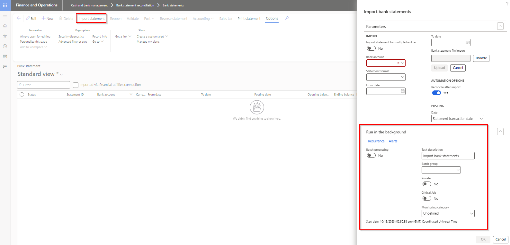

### Release 10.0.36.20231116

#### Build 10.0.36.2023111671

Release date: 2 February 2024  

<ins>New features</ins>

| Number | Module                     | Functionality                                  | Description                                                                                                                                                                            |
| :----- | :------------------------- | :--------------------------------------------- | :------------------------------------------------------------------------------------------------------------------------------------------------------------------------------------- |
| 16332  | System administration      | Business event for electronic reporting export | New Business event **Electronic reporting file exported to azure blob**. Option to create an event when exporting ER file to Azure Blob via 'Electronic reporting export connections'. |
| 16596  | Organization adminstration | Electronic reporting export connection         | 'Validate connection' functionality added                                                                                                                                              |

<ins>Bug fixes</ins>

| Number | Module                                    | Functionality                                                                    | Description                                                                                                                                                                                                                                                                           |
| :----- | :---------------------------------------- | :------------------------------------------------------------------------------- | :------------------------------------------------------------------------------------------------------------------------------------------------------------------------------------------------------------------------------------------------------------------------------------ |
| 16873  | Accounts payable                          | Payment advice print                                                             | Finance utilities was referencing 'ECL_BankPaymAdviceVendV2' report when printing Vendor Payment advice. When the report wasn't deployed to an environment, printing would error with 'Parameter \_reportName cannot be null or empty'. Reference to the ECL report has been removed. |
| 16897  | Accounts payable   Accounts receivable | ABN validation                                                                   | Only applicable to 10.0.36.2023111661. When ABN validation was active for the legal entity, any changes on the vendor/customer resulted in ABN validation dialog popping up.                                                                                                          |
| 16959  | Various                                   | - Financial utilities connections   - Electronic reporting export connections | Increase EDT for usernames, passwords (sftp, ftp) and storage account name, storage account key (Azure blob)                                                                                                                                                                          |
| 16976  | Accounts reveivable                       | Interest note - Due date                                                         | Waive, reinstate and reverse of interest notes also now utilize 'Use customer payment terms' option.                                                                                                                                                                                  |

#### Build 10.0.36.2023111661

Release date: 12 January 2024  

<ins>Bug fixes</ins>

| Number           | Module          | Functionality                                                  | Description                                                                                                                                                                                                                                                                                                                                                                                     |
| :--------------- | :-------------- | :------------------------------------------------------------- | :---------------------------------------------------------------------------------------------------------------------------------------------------------------------------------------------------------------------------------------------------------------------------------------------------------------------------------------------------------------------------------------------- |
| 16822   16754 | Data management | ABN validation - Import entities TaxVATNumTable & VendVendorV2 | ABN validation GUI popup wrapped around a condition for data import scenarios. Also removed the previous 'Skip validation' method when importing Vendors entity.   When ABN validation is enabled for the legal entity and the entities imported, ABN validation will occur without the GUI popup. Records with valid ABNs will be imported and only invalid ABN staging records will error. |

#### Build 10.0.36.2023111651

Release date: 21 December 2023  

<ins>Bug fixes</ins>

| Number | Module           | Functionality   | Description                                                                                                                                                                                |
| :----- | :--------------- | :-------------- | :----------------------------------------------------------------------------------------------------------------------------------------------------------------------------------------- |
| 16794  | Accounts payable | Vendor approval | Related only to earlier versions of 10.0.36.20231116 - deprecating Vendor bank account approval.   Resulted in values not being retained for client extended fields in Vendor approval. |

#### Build 10.0.36.2023111642 & 10.0.35.2023111641

Release date: 14 December 2023  

<ins>Bug fixes</ins>

| Number | Module           | Functionality                               | Description                                                         |
| :----- | :--------------- | :------------------------------------------ | :------------------------------------------------------------------ |
| 16758  | Accounts payable | Vendor approval                             | Proposed changes disregarded for changes to standard vendor fields. |
| 16765  | Accounts payable | Method of payment   EFT file name Editor | Label fix and saving of changes to file name mask.                  |

#### Build 10.0.36.2023111631

Release date: 8 December 2023

<ins>Bug fixes</ins>

| Number | Module | Functionality | Description                                                                                                                                                                                                                                                                                     |
| :----- | :----- | :------------ | :---------------------------------------------------------------------------------------------------------------------------------------------------------------------------------------------------------------------------------------------------------------------------------------------- |
| 16747  | N/A    | Deployment    | Bug fix only applicable to 10.0.36.2023111621, which included unit tests.   To remove unit tests, use the following [instructions](https://learn.microsoft.com/en-us/dynamics365/fin-ops-core/dev-itpro/deployment/uninstall-deployable-package) to remove the package/uninstall unit tests. |

#### Build 10.0.36.2023111621 & Build 10.0.35.2023111622

Release date: 30 November 2023  

<ins>New features</ins>

| Number | Module                   | Functionality                   | Description                                                                                                                                                                                                                                                                                                               |
| :----- | :----------------------- | :------------------------------ | :------------------------------------------------------------------------------------------------------------------------------------------------------------------------------------------------------------------------------------------------------------------------------------------------------------------------ |
| 15693  | Cash and bank management | Reverse mark as new transaction | Support added for reversing **mark as new** transactions offsetting to **vendor, bank or customer** within the same legal entity.   Supports features:   • Enable bank reconciliation reversal even new transactions exist in posted bank statement   • Reverse posted bank statement with new transactions   |

<ins>Bug fixes</ins>

| Number | Module           | Functionality                | Description                                                                      |
| :----- | :--------------- | :--------------------------- | :------------------------------------------------------------------------------- |
| 16584  | Accounts payable | Vendor bank account approval | Proposed changes disregarded for changes to standard vendor bank account fields. |

#### Build 10.0.36.202311161 & 10.0.35.202311161

Release date: 16 November 2023  

<ins>Deprecated</ins>

| Number | Module                   | Functionality                          | Description                                                                                                                                                                                   |
| :----- | :----------------------- | :------------------------------------- | :-------------------------------------------------------------------------------------------------------------------------------------------------------------------------------------------- |
| 15394  | Accounts payable         | Vendor bank account change workflow    | Deprecate Vendor bank account fields in Vendor approval.   See [Deprecated features notice - Vendor bank account change workflow](#vendor-bank-account-change-workflow) for more details.  |
| 16002  | Cash and bank management | Mark as new transaction's Posting date | Deprecate **Posting date** functionality for Mark as new transactions.   See [Deprecated features notice - Posting date](#new-bank-statement-transaction---posting-date) for more details. |

<ins>New features</ins>

| Number | Module                   | Functionality                             | Description                                                                                                                                                                                                                                                                                                                                |
| :----- | :----------------------- | :---------------------------------------- | :----------------------------------------------------------------------------------------------------------------------------------------------------------------------------------------------------------------------------------------------------------------------------------------------------------------------------------------- |
| 15488  | Accounts receivable      | Interest notes - Due date                 | New field called **Use customer payment terms** added to **Accounts receivable parameters** and **Credit and collections parameters** (Collections tab).   If set to _Yes_, the customer's payment terms will be used to determine Due date when posting Interest notes.   [Guide](Setup/ACCOUNTS-RECEIVABLE/Customer-parameters.md) |
| 16039  | Cash and bank management | Bank statement import                     | **Run in the background / Batch** functionality added to **Import bank statements**                                                                                                                                                               |
| 16471  | Encryption               |                                           | DXC encryption parameters: Rename field KeyVaultSignerPublicKey (Signer's public key) to KeyVaultReceiverPublicKey (Receiver's public key)                                                                                                                                                                                                 |
| 16401  | Accounts payable         | Vendor bank account - Lodgement reference | Increased Lodgement reference EDT from 18 to 20                                                                                                                                                                                                                                                                                            |
| N/A    | DXC License              |                                           | DXC License 10.0.34.202310311 - Includes feature managed SmartSend and Core extensions                                                                                                                                                                                                                                                     |

<ins>Bug fixes</ins>

| Number | Module                   | Functionality                         | Description                                                                                                                                                                                                       |
| :----- | :----------------------- | :------------------------------------ | :---------------------------------------------------------------------------------------------------------------------------------------------------------------------------------------------------------------- |
| 16069  | Unit tests               |                                       | Fix 10.0.37 build issues for Finance utilities Unit tests                                                                                                                                                         |
| 16244  | Cash and bank management | Import statement                      | Code change in 10.0.37 that makes 'Bank account' mandatory when using 'Import statement for multiple bank accounts in all legal entities'                                                                         |
| 16036  | Data management          | Import data entity **Document types** | Couldn't import the entity with Finance utilities field DFUGEREXPORTCONNECTION.   Error: 'The column ErrorCode in entity Document types has incorrect data. Please correct the data and try the import again.' |

