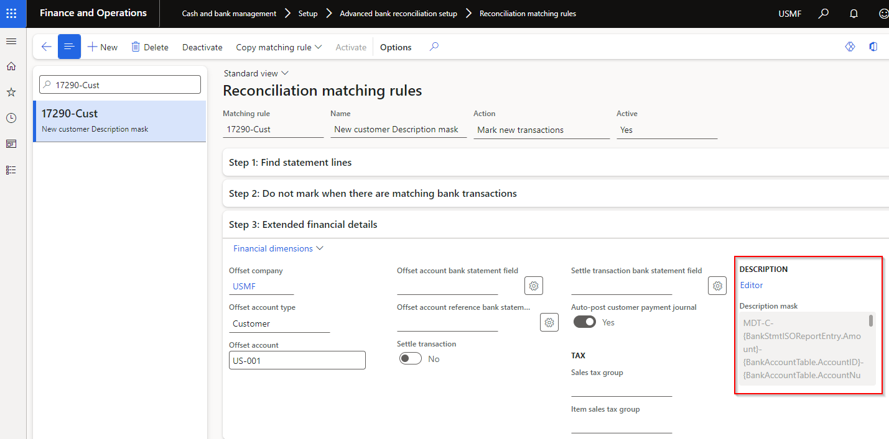
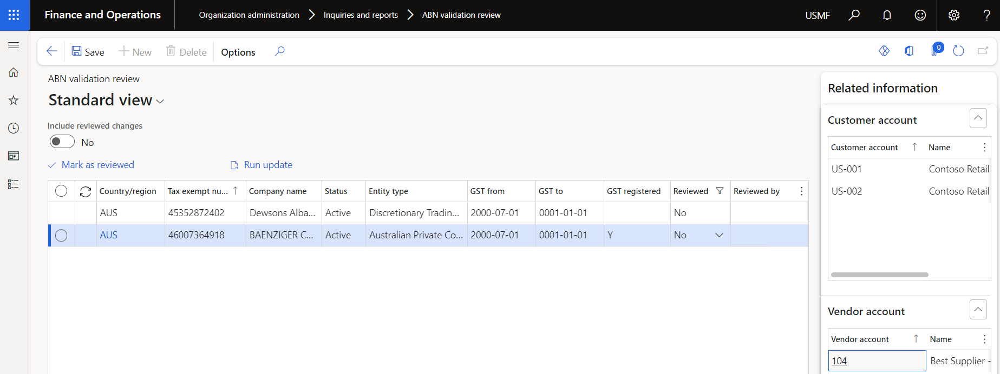
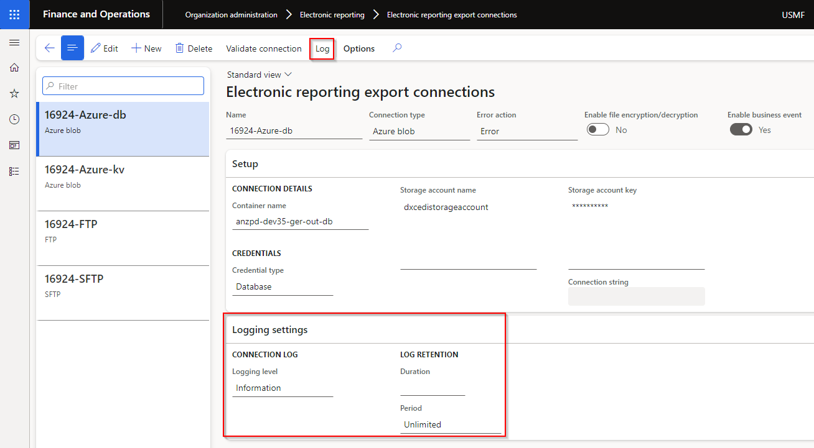
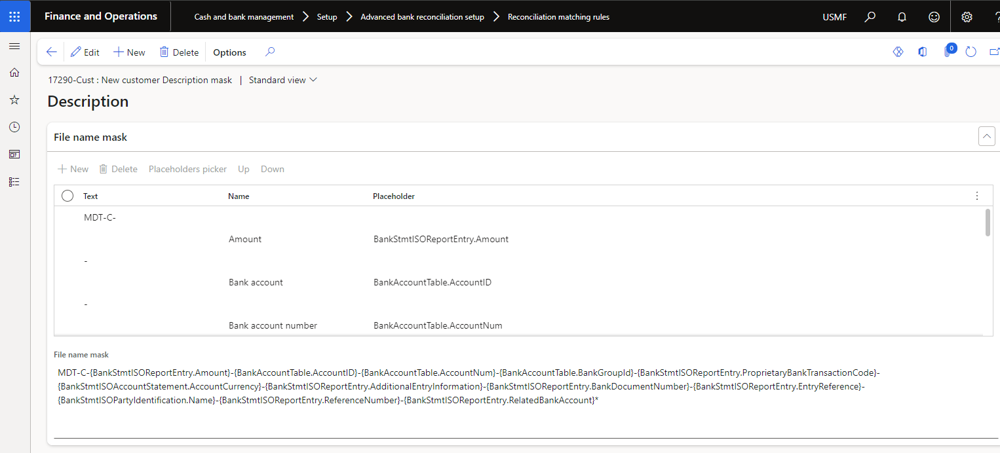

### Release 10.0.37.20240325

#### Build 10.0.37.2024032531

Release date: 16 May 2024  

<ins>New features</ins>

| Number | Module  | Functionality   | Description                                                                                                                                                                                                                                                                                                                                                                                                                                        |
| :----- | :------ | :-------------- | :------------------------------------------------------------------------------------------------------------------------------------------------------------------------------------------------------------------------------------------------------------------------------------------------------------------------------------------------------------------------------------------------------------------------------------------------- |
| 17524  | Various | SFTP connection | Upgrade SFTP SSH.NET to latest [2024.0.0](https://github.com/sshnet/SSH.NET/releases/tag/2024.0.0) release. Applicable to:   • Cash and bank management > Setup > Advanced bank reconciliation setup > Financial utilities connections   • Accounts receivable > Payments setup > Financial utilities connections (AR utilities feature)   • Organization administration > Electronic reporting > Electronic reporting export connections |

<ins>Bug fixes</ins>

| Number | Module              | Functionality     | Description                                                                                      |
| :----- | :------------------ | :---------------- | :----------------------------------------------------------------------------------------------- |
| 17966  | Accounts receivable | Generate payments | Fix for error 'Root element is missing', when generating a payment using a non ER Export format. |

#### Build 10.0.37.2024032522

Release date: 26 April 2024  

<ins>New features</ins>

| Number | Module                   | Functionality                | Description                                                                                                                                                                                                                                                                                                                                                                                                                                                                                                                                                                                                                                                                                                                                                                                                |
| :----- | :----------------------- | :--------------------------- | :--------------------------------------------------------------------------------------------------------------------------------------------------------------------------------------------------------------------------------------------------------------------------------------------------------------------------------------------------------------------------------------------------------------------------------------------------------------------------------------------------------------------------------------------------------------------------------------------------------------------------------------------------------------------------------------------------------------------------------------------------------------------------------------------------------- |
| 17385  | Cash and bank management | Reconciliation matching rule | Ability to set a **Description** mask for Mark new transactions for offset types **Ledger, Vendor and Bank**.   Related to 17290 that added this functionality for offset type Customer.   **Editor** provides the ability to set a combination of static fields and placeholders:   • Currency   • Description   • Amount   • Document number   • Entry reference   • Bank statement transaction code   • Reference No.   • Related bank account   • Name (Trading party)   • Bank account   • Bank account number   • Bank groups   Note: If File name mask is not populated, the Bank statement line's Description will be written to new transaction's Description.    |
| 17724  | Licensing                | N/A                          | Improvements to licensing - see [Licensing release notes](../LMG/Release-notes.md#release-10037202404262) for detailed information.                                                                                                                                                                                                                                                                                                                                                                                                                                                                                                                                                                                                                                                                        |

<ins>Bug fixes</ins>

| Number | Module              | Functionality                                  | Description                                                                                                                                                                         |
| :----- | :------------------ | :--------------------------------------------- | :---------------------------------------------------------------------------------------------------------------------------------------------------------------------------------- |
| 17633  | Accounts receivable | Interest notes - Due date                      | When AR parameter setting 'Use Customer payment terms' was set to _Yes_, it resulted in incorrect due dates for Free text invoices.   Only relevant to release 10.0.36.202403251 |
| 17448  | Accounts payable    | Method of payment - EFT file name Placeholders | Editor Placeholder picker displayed Bank statement fields added for Reconciliation matching rule's Description mask.   Only relevant to release 10.0.36.202403251                |
| 17479  | Accounts receivable | Method of payment - EFT file name Placeholders | Editor Placeholder picker displayed Vendor's Method of payment and Description. Updated to use Customer for these two fields.   Only relevant to release 10.0.36.202403251       |

#### Build 10.0.36.202403251

Release date: 25 March 2024  

<ins>New features</ins>

| Number           | Module                                                    | Functionality                                                                    | Description                                                                                                                                                                                                                                                                                                                                                                                                                                                                                                                                                                                                                                                                                                                                                                                                                                                                                                                                                                                                                                                             |
| :--------------- | :-------------------------------------------------------- | :------------------------------------------------------------------------------- | :---------------------------------------------------------------------------------------------------------------------------------------------------------------------------------------------------------------------------------------------------------------------------------------------------------------------------------------------------------------------------------------------------------------------------------------------------------------------------------------------------------------------------------------------------------------------------------------------------------------------------------------------------------------------------------------------------------------------------------------------------------------------------------------------------------------------------------------------------------------------------------------------------------------------------------------------------------------------------------------------------------------------------------------------------------------------- |
| 17092            | Accounts payable   Accounts receivable                 | ABN and GST validation                                                           | _Only applicable to Australia and only visible where ABN validation is enabled for the Legal entity_   • New fields added to TaxVatNumTable:   - **Status**: ABN status for example Active or Cancelled   - **Entity type**: Entity type for the ABN, for example 'Australian Private Company'   - **GST from**: Populated where the ABN is registered for GST _   - **GST to**: Populated where the ABN is registered for GST _   - **GST registered**: Set to _Yes_ where 'GST to' date is in the future _      _ The three new GST fields have also been added to the **ABN status** dialog.      Above new fields are updated to current government data when running either:   • **Update ABN validation** periodic task   • **Run update** on ABN validation review form   • When adding new records via **ABN lookup**   [User guide](Processing/ABN/ABN-lookup-and-validation.md) |
| 17159   17233 | Accounts payable   Accounts receivable                 | ABN validation                                                                   | _Only applicable to Australia and only visible where ABN validation is enabled for the Legal entity_   New form **ABN validation review** for users to review new/updated ABN records. For example an ABN is not registered for GST anymore.   Select applicable record(s) and select **Mark as reviewed** to update their reviewed status.   **Run update** can be used to run the web service to update ABNs with current data from the Australian Business Register.   Update can also be run via 'Organization administration > Periodic > **Update ABN validation**                                                                                                                                                                                                                                                                                                                                                                                                                           |
| 17286            | Accounts payable                                          | ABN validation                                                                   | _Only applicable to Australia and only visible where ABN validation is enabled for the Legal entity_   Ability for users to check the current ABN and GST status for a vendor while entering an invoice.   **ABN status** button is enabled when the 'Tax exempt number'/'ABN' is populated for the vendor invoice line.                                                                                                                                                                                                                                                                                                                                                                                                                                                                                                                                                                                                                                           |
| 16924            | Organisation administration                               | Electronic reporting export connections                                          | Log functionality added                                                                                                                                                                                                                                                                                                                                                                                                                                                                                                                                                                                                                                                                                                                                                                                                                                                                                                                                                                                              |
| 17248            | Cash and bank management   Organisation administration | • Financial utilities connections   • Electronic reporting export connections | New Connection type option **API Endpoint**.   Can thus now import bank statements as an inbound web service or export ER files as an outbound web service.   Also works with Azure function.   [Import user guide](Setup/CASH-AND-BANK-MANAGEMENT/Finance-utilities-connections.html#api-endpoint)   [Export user guide](Setup/ACCOUNTS-PAYABLE/Save-electronic-reporting-file-to-secure-location.html#step-1---setup-electronic-reporting-export-connections)   [Web API Endpoint Technical guide](Technical/Web-API-Endpoint.md)                                                                                                                                                                                                                                                                                                                                                                                                                                                                                                                      |
| 17290            | Cash and bank management                                  | Reconciliation matching rule                                                     | Ability to set a **Description** mask for Mark new transactions.   This release includes only **Customer** offset types. Roadmap: include the other offset types Vendor, Bank and Ledger.   **Editor** provides the ability to set a combination of static fields and placeholders:   • Currency   • Description   • Amount   • Document number   • Entry reference   • Bank statement transaction code   • Reference No.   • Related bank account   • Name (Trading party)   • Bank account   • Bank account number   • Bank groups   Note: If File name mask is not populated, the Bank statement line's Description will be written to new transaction's Description.                                                                                                                                            |
| 16827            | Accounts receivable                                       | EFT file name on Method of payment                                               | Ability to set EFT file name for Customer payment files (direct debits) on the Method of payment.   [User guide](Setup/ACCOUNTS-RECEIVABLE/Customer-payments.md)                                                                                                                                                                                                                                                                                                                                                                                                                                                                                                                                                                                                                                                                                                                                                                                                                                                                                                     |
| 16600            | Accounts payable                                          | Vendor payment journal                                                           | When the vendor payment is generated, the **Export file name** displayed on the Generate payments dialog is written to the relevant vendor payment journal lines' new field called **Export file name**.   Note: This does not yet include file names generated by Electronic reporting config.                                                                                                                                                                                                                                                                                                                                                                                                                                                                                                                                                                                                                                                                                         |
| 17422            | N/A                                                       | N/A                                                                              | Update to **Table groups** to support "transaction" types being truncated in copy environment feature via Power platform admin center.                                                                                                                                                                                                                                                                                                                                                                                                                                                                                                                                                                                                                                                                                                                                                                                                                                                                                                                                  |

<ins>Bug fixes</ins>

| Number | Module                                    | Functionality                             | Description                                                                                                                                                                                                                                                                                                                                                                                                                    |
| :----- | :---------------------------------------- | :---------------------------------------- | :----------------------------------------------------------------------------------------------------------------------------------------------------------------------------------------------------------------------------------------------------------------------------------------------------------------------------------------------------------------------------------------------------------------------------- |
| 16997  | Accounts payable                          | EFT file name editor on Method of payment | Refresh required to save updates to the file name using Editor                                                                                                                                                                                                                                                                                   |
| 16827  | Accounts receivable                       | EFT file name on Method of payment        | If the same payment method PaymMode exists in the Accounts payable (AP) module, the EFT file name setup from the AP method of payment was used                                                                                                                                                                                                                                                                                 |
| 17063  | Accounts receivable                       | Interest notes - Due date                 | Due date now updated before the transaction records are created.   Resolves error: "Cannot edit a record in Customer transactions (CustTrans). An update conflict occurred due to another user process deleting the record or changing one or more fields in the record."                                                                                                                                                   |
| 17119  | Accounts payable   Accounts receivable | ABN lookup                                | Fix to 'Company name' in Search results                                                                                                                                                                                                                                                                                                                                                                                        |
| 16925  | Organisation administration               | Electronic reporting jobs                 | When using an Electronic reporting destination with document type in conjunction with Electronic reporting export connection, the record created in the Electronic reporting jobs will now also contain:   • Document handling attachment - ensure your file extension is added to supported File types in Document management parameters   • Field 'Files' populated with the file name.                                |
| 17012  | Cash and bank management                  | Reverse mark as new transaction           | Support added for reversing **mark as new** transactions offsetting to **vendor, bank or customer** within the same legal entity.   15693 resulted on an incorrect sign on the reverse transaction on the bank, vendor and customer   Supports features:   • Enable bank reconciliation reversal even new transactions exist in posted bank statement   • Reverse posted bank statement with new transactions   |
| 17126  | Cash and bank management                  | Reconciliation matching rule              | When used to create automatically posted Customer dishonour payments, the automatically matching in the Bank reconciliation failed.                                                                                                                                                                                                                                                                                            |
| 17437  | Cash and bank management                  | Bank statement periodic import            | Archive issue when connection has high latency. File deleted before it could copy to Archive. Change: Before delete the result of copy is awaited and retried for 1 seconds 3 times before marking as an exception.                                                                                                                                                                                                            |
