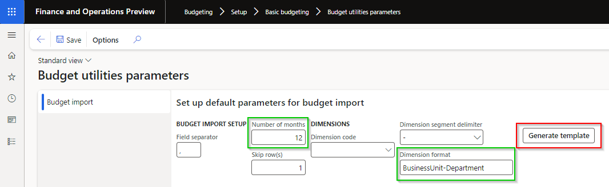

### Release 10.0.37.20240625

#### Build 10.0.37.202406251

Release date: 25 June 2024  

<ins>Manual steps required</ins>

- If using DXC encryption / decryption, please see 17274. Required to update new field **Counter party's public key** with the applicable key.

<ins>New features</ins>

| Number | Module                      | Functionality                  | Description                                                                                                                                                                                                                                                                                                                                                                                                                                                                                                                                                                                                  |
| :----- | :-------------------------- | :----------------------------- | :----------------------------------------------------------------------------------------------------------------------------------------------------------------------------------------------------------------------------------------------------------------------------------------------------------------------------------------------------------------------------------------------------------------------------------------------------------------------------------------------------------------------------------------------------------------------------------------------------------- |
| 18126  | Accounts payable            | Generate file per payment line | New option called **Generate file per payment line** on **Methods of payment** for _Electronic reporting export formats_.   When set to Yes, the vendor payment's **Generate payments** will create an EFT file per journal line.                                                                                                                                                                                                                                                                |
| 17230  | Various                     | Azure Connection               | Ability to use **Azure SAS Storage account level token** for Connection string on Azure connections.   Applicable to:   • Cash and bank management > Setup > Advanced bank reconciliation setup > Financial utilities connections   • Accounts receivable > Payments setup > Financial utilities connections (AR utilities feature)   • Organization administration > Electronic reporting > Electronic reporting export connections                                                                                                                                                             |
| 18158  | Various                     | SFTP Connection                | New **Credential type** option **Private key** provides the option to store SSH key file in Azure, setup in D365 as Key vault parameter and use on Finance utilities SFTP connection.   Applicable to:   • Cash and bank management > Setup > Advanced bank reconciliation setup > Financial utilities connections   • Accounts receivable > Payments setup > Financial utilities connections (AR utilities feature)   • Organization administration > Electronic reporting > Electronic reporting export connections      |
| 17274  | Organization administration | DXC encryption parameters      | **Public key** (sender's public key) and **Receiver's public key** replaced with new field **Counter party's public key**.   Note: Manual step required to update new field with the applicable key.                                                                                                                                                                                                                                                                                                                                                                                                      |
| 18149  | Budgeting                   | Import budget                  | Ability to **Generate template** based on setup on **Budget utilities parameters**:   • Number of months   • Dimension format                                                                                                                                                                                                                                                                                                                                                               |

<ins>Bug fixes</ins>

| Number | Module                   | Functionality                                           | Description                                                                                                                                                                                                                                                                                                                      |
| :----- | :----------------------- | :------------------------------------------------------ | :------------------------------------------------------------------------------------------------------------------------------------------------------------------------------------------------------------------------------------------------------------------------------------------------------------------------------- |
| 18174  | Cash and bank management | Reconciliation matching rule set - Customer offset type | Where the Reconciliation matching rule set contained:   • Multiple **Mark new transactions** rules offsetting to **Customer** and   • Set to automatically post the journal and   • One of the rules failed to post the journal (for example customer was stopped for payments)   The subsequent rules were not run. |
| 18202  | Accounts receivable      | Interest notes - Due date                               | When AR parameter field 'Use customer payment terms' for Interest notes is set to Yes, the Due date correctly included payment terms for the interest note in Customer transactions, but not on 'Settle transactions' or 'Detailed due date list report'.                                                                        |
