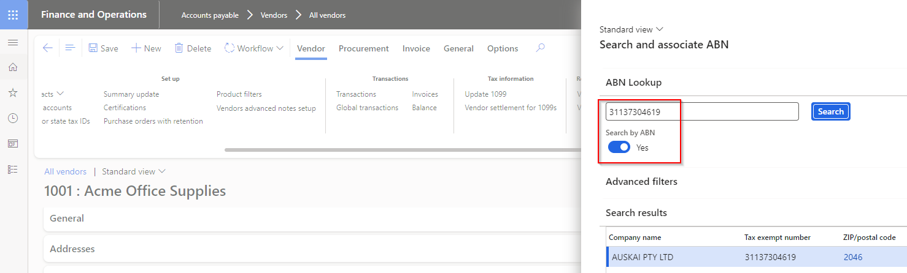
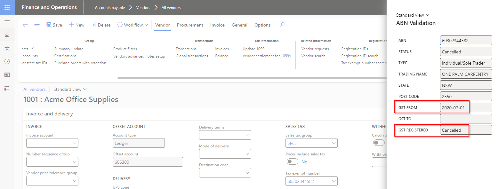

### Release 10.0.40.20240916

#### Build 10.0.40.202409162

Release date: 16 September 2024  

<ins>New features</ins>

| Number | Module              | Functionality            | Description                                                                                                                                                                                                                                                                                                                                                                           |
| :----- | :------------------ | :----------------------- | :------------------------------------------------------------------------------------------------------------------------------------------------------------------------------------------------------------------------------------------------------------------------------------------------------------------------------------------------------------------------------------ |
| 18870  | Various             | ABN lookup               | New field **Search by ABN** available in **ABN lookup**. When set to:   • No: Search by Company name   • Yes: Search by ABN                                                                                                                                                                                 |
| 18851  | Various             | ABN status               | Where the GST is **Cancelled** for an ABN, the **From date** will be obtained from Historical details to indicate from which date the GST has been cancelled.                                                                                                                                               |
| 18987  | Various             | ABN / TaxVatNumTable     | New fields added to TaxVatNumTable:   • Created by   • Created date and time   • Modified by   • Modified date and time   • Reviewed date                                                                                                                                                                                                                              |
| 18509  | Accounts receivable | AR Utilities             | Ability to obtain part of a field in the remittance file, by using **Field format** on below fields:   • Customer reference   • Tax invoice   [User guide](Setup/ACCOUNTS-RECEIVABLE/Remittance-format.md#field-format)         |
| 19087  | Various             | Azure connections        | Azure dll moved to new model called DXCConnections.   DXC Connections release 10.0.40.202409192 - [Release notes](../CONNECTIONS/Release-notes.md)                                                                                                                                                                                                                                 |
| 19023  | Accounts payable    | Sundry method of payment | Allow Generic electronic Export formats where Sundry method of payment is set to Yes.                                                                                                                                                                                                                                                                                                 |

<ins>Bug fixes</ins>

| Number | Module                      | Functionality                   | Description                                                                                                                                                                                                                                                                                                                                                                                                                                                                              |
| :----- | :-------------------------- | :------------------------------ | :--------------------------------------------------------------------------------------------------------------------------------------------------------------------------------------------------------------------------------------------------------------------------------------------------------------------------------------------------------------------------------------------------------------------------------------------------------------------------------------- |
| 18984  | Organisation administration | ABN validation review           | When **Reviewed** changes from _Yes_ to _No_ by an update to the ABN record, the **Reviewed by** used to still store the previously reviewed by user which is not valid since the record is not reviewed anymore.                                                                                                                                                                                                                                                                        |
| 19014  | Cash and bank management    | Web API import & DXC Encryption | Added a check on warning for files imported via WebAPI . If file is empty, a warning will be added to the batch job logs and no files will be added for further process of mapping from file to BankStatement tables.   In addition to this, a check and warning has been added in the DXC Encryption model code. If an empty is received for decryption, a warning will be displayed to the user to indicate file stream is empty.   New DXC Encryption version 10.0.41.202409161 |
| 18802  | Various                     | Azure connections               | Unable to find manual secret value                                                                                                                                                                                                                                                                                                                                                                                                                                                       |
