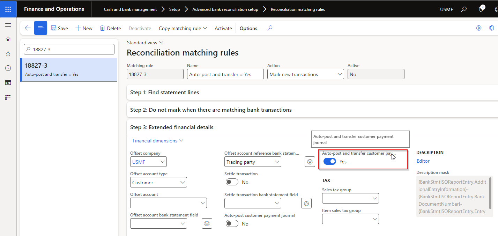

### Release 10.0.40.20240919

#### Build 10.0.40.2024091941

Release date: 19 November 2024

<ins>Bug fixes</ins>

| Number           | Module                   | Functionality                                         | Description                                                                                                                                                                                                                                                                                                                                         |
| :--------------- | :----------------------- | :---------------------------------------------------- | :-------------------------------------------------------------------------------------------------------------------------------------------------------------------------------------------------------------------------------------------------------------------------------------------------------------------------------------------------- |
| 19934   20173 | Cash and bank management | Mark as new - offset to intercompany account          | 1. Fix to related vouchers for intercompany vouchers.   2. Fix to financial dimensions, as per below. This also resolves the incorrect warning where a financial dimension is used for intercompany offset, but suspended for bank recon's legal entity.    |
| 20177            | Cash and bank management | Mark as new                                           | Blank distribute amount                                                                                                                                                                                                                                                                                                                             |
| 20180            | Cash and bank management | Bank statement                                        | New Security privilege 'Maintain vouchers to be reversed' added to DFUBankStatementReversalDialog. Added to std duty 'Enable bank management process'                                                                                                                                                                                               |
| 20184            | Cash and bank management | Mark as new - offset to intercompany account with tax | Where the intercompany offset type ledger included tax, the tax was incorrectly posted in bank recon's legal entity. Tax is now posted with the expense/income in the intercompany legal entity.                                                                                                                                                    |

#### Build 10.0.40.2024091931

Release date: 28 October 2024

<ins>Bug fixes</ins>

| Number | Module                   | Functionality                                                                        | Description                                                                                                      |
| :----- | :----------------------- | :----------------------------------------------------------------------------------- | :--------------------------------------------------------------------------------------------------------------- |
| 19587  | Cash and bank management | Reconciliation matching rules - offset to intercompany customer and settling invoice | Issue with finding the intercompany invoice                                                                      |
| 19571  | Cash and bank management | Mark as new - offset to same bank account                                            | Missing subledger entry when offsetting to same bank account. Issue came from 18692 in release 10.0.38.202408071 |
| 19576  | Cash and bank management | Mark as new - offset to intercompany account                                         | Offset ledger, customer and vendor not posted in Intercompany legal entity                                       |

#### Build 10.0.40.202409192

Release date: 3 October 2024

<ins>Bug fixes</ins>

| Number | Module  | Functionality     | Description                                                                                                                                                                                                                                                                                                                                                                                                                                                                         |
| :----- | :------ | :---------------- | :---------------------------------------------------------------------------------------------------------------------------------------------------------------------------------------------------------------------------------------------------------------------------------------------------------------------------------------------------------------------------------------------------------------------------------------------------------------------------------- |
| 19353  | Various | Azure connections | Fix to **Azure blob** connection types using **Shared access signature (SAS)** to access Azure Blob Storage at account level.   Fix for error: "**No valid combination of account information found**"   Applicable to versions 10.0.40.202409162 & 10.0.40.202409191   • Cash and bank management > Setup > Advanced bank reconciliation setup > Financial utilities   • Organisation administration > Electronic reporting > Electronic reporting export connections. |

#### Build 10.0.40.202409191

Release date: 19 September 2024

<ins>New features</ins>

| Number | Module                   | Functionality                                      | Description                                                                                                                                                                                                                                                                                                                                                              |
| :----- | :----------------------- | :------------------------------------------------- | :----------------------------------------------------------------------------------------------------------------------------------------------------------------------------------------------------------------------------------------------------------------------------------------------------------------------------------------------------------------------- |
| 18827  | Cash and bank management | Reconciliation matching rules - offset to customer | New option **Auto-post and transfer customer payment journal** enables customer payment journal to be posted and any error lines transferred to a new unposted journal (example stopped customer). Both customer payment journals' **Document** will refer to the Bank reconciliation.    |
| 19151  | Cash and bank management | Reconciliation matching rules - data entity        | Field 'Description mask' added to data entity                                                                                                                                                                                                                                                                                                                            |
| 18837  | Accounts payable         | Payments report                                    | Use Vendor bank account's BPAY **Biller code** and **Lodgement reference** fields where payment line's method of payment **BPAY method of payment** is _Yes._   [User guide](Processing/Accounts-Payable/Vendor-payments.md#payments-report)                                                          |
