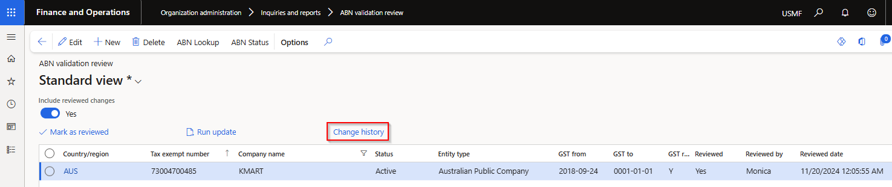
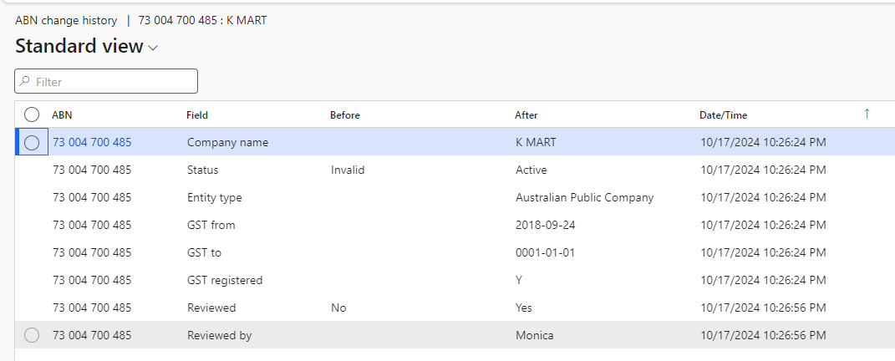

### Release 10.0.40.20241204

#### Build 10.0.40.202412041

Release date: 4 December 2024

<ins>New features</ins>

| Number | Module                      | Functionality                                                    | Description                                                                                                                                                                                                                                                                                                                                                                                                                                                                                                                                                                                                                                                                                                                                                                                                                                                                                                                                                                                                                                                                                                                      |
| :----- | :-------------------------- | :--------------------------------------------------------------- | :------------------------------------------------------------------------------------------------------------------------------------------------------------------------------------------------------------------------------------------------------------------------------------------------------------------------------------------------------------------------------------------------------------------------------------------------------------------------------------------------------------------------------------------------------------------------------------------------------------------------------------------------------------------------------------------------------------------------------------------------------------------------------------------------------------------------------------------------------------------------------------------------------------------------------------------------------------------------------------------------------------------------------------------------------------------------------------------------------------------------------- |
| 18867  | Various                     | IRD number validation                                            | Modulus 11 digit check, length, digit separator validation for New Zealand IRD numbers.   Supports format xxx-xxx-xxx and xxxxxxxxx.   This option is enabled by allocating the applicable country, for example NZL, on the Legal entity.     Examples:   • Incorrect number / Check digit: Expecting check digit 9, but found 8 for IRD no. 086689918   • Not a number format/incorrect separator: Invalid IRD number format. It should only contain digits having format xxx-xxx-xxx or xxxxxxxxx.   • Length: Invalid IRD number length, IRD number should be 9 digits long.                                                                                                                                                                                                                                                                                                                            |
| 18875  | Data management             | ABN validation                                                   | Data entities added                                                                                                                                                                                                                                                                                                                                                                                                                                                                                                                                                                                                                                                                                                                                                                                                                                                                                                                                                                                                                                                                                                              |
| 19026  | Organization administration | ABN validation review                                            | Where ABN validation is enabled for the legal entity, users can use new button **Change history** to view changes made in D365 for each ABN.                                                                                                                                                                                                                                                                                                                                                                                                                                                                                                                                                                                                                                                                                                                                                                                                                                |
| 19549  | Organization administration | ABN validation review                                            | Enabled the following buttons: New and Delete.   Added the following buttons: ABN lookup and ABN status                                                                                                                                                                                                                                                                                                                                                                                                                                                                                                                                                                                                                                                                                                                                                                                                                                                                                                                                                            |
| 20197  | Accounts payable            | Self billing invoicing   Recipient-Created Tax Invoice (RCTI) | Ability to automatically create vendor invoices after a product receipt.   The invoice can be automatically created at the same time of product receipt, or split/consolidate using the periodic task.     The periodic task split/consolidate options include:   • Product receipt   • Purchase order   • Invoice account   • Receipt date     Post options:   • **Do not post** - Created invoice is not posted and remains as pending vendor invoice   • **Post** - Created invoice is automatically posted. If post failed, it will remain as pending vendor invoice   • **Post and print** - Created invoice is automatically posted. If post failed, it will remain as pending vendor invoice. The posted invoice is also automatically printed/sent as per Print management destination. The following print management destination options are supported: Smart Send (where licensed, Email and Electronic reporting export connections     [Setup](Setup/ACCOUNTS-PAYABLE/Self-billing-invoicing.md)   [Processing](Processing/Accounts-Payable/Self-billing-invoicing.md) |
| 20304  | Accounts payable            | Method of payment - BPAY                                         | Payment control **Payment ID** and Payment attributes **Payment ID** is still defaulted to Yes, but now no longer disabled                                                                                                                                                                                                                                                                                                                                                                                                                                                                                                                                                                                                                                                                                                                                                                                                                                                                                                                                                                                                       |
| 17514  | DXC License manager         | Licensing                                                        | New DXC License manager 10.0.40.202412041. See [Release notes](../LMG/Release-notes.md#d365-finance-and-operations) for more detail.                                                                                                                                                                                                                                                                                                                                                                                                                                                                                                                                                                                                                                                                                                                                                                                                                                                                                                                                                                                             |
| 20389  | DXC Connections             | All Azure connections                                            | New DXC Connections 10.0.40.202412041.   See [Release notes](../CONNECTIONS/Release-notes.md) for more detail.                                                                                                                                                                                                                                                                                                                                                                                                                                                                                                                                                                                                                                                                                                                                                                                                                                                                                                                                                                                                                |

<ins>Bug fixes</ins>

| Number | Module                   | Functionality                                      | Description                                                                                                                                                                                                                                                                                                                                                          |
| :----- | :----------------------- | :------------------------------------------------- | :------------------------------------------------------------------------------------------------------------------------------------------------------------------------------------------------------------------------------------------------------------------------------------------------------------------------------------------------------------------- |
| 19459  | Cash and bank management | Reconciliation matching rules - Offset type Ledger | When entering new Offset account number, limited to only **Main accounts** (no financial dimensions). Offset financial dimensions needs to be entered Financial dimensions > Offset account                                                                                                                                                                          |
| 19527  | Various                  | ABN validation                                     | Fix to **From date** for _Cancelled_ GST records                                                                                                                                                                                                                                                                                                                     |
| 20187  | Accounts payable         | BPAY                                               | When overriding the vendor bank's default **lodgement reference** on a BPAY method of payment invoice and manually selecting the invoice for settlement on the payment journal line, the default lodgement reference wasn't overridden by the actual lodgement reference on the invoice. This issue only applied to manual settlement, not payment proposal process. |
