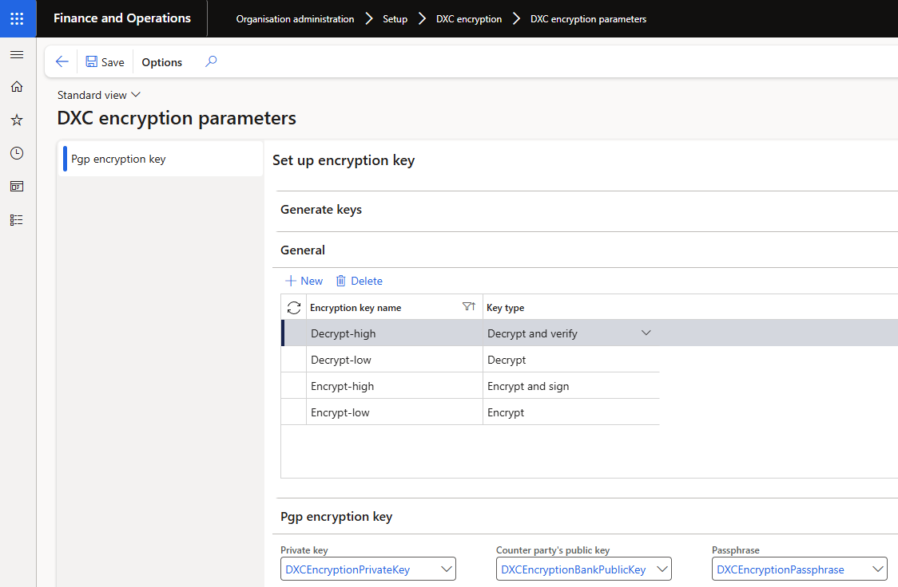
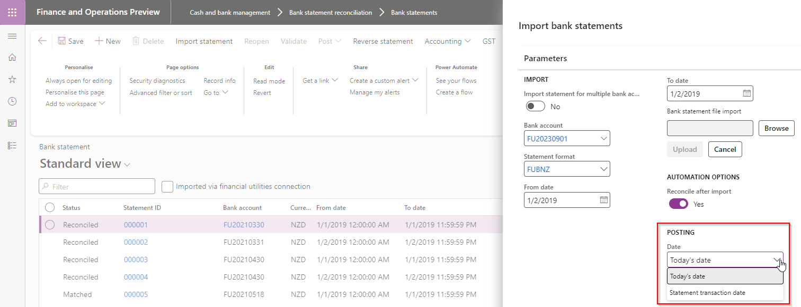

# Version compatibility

The matrix shows the minimum DXC build versions compatible per Microsoft versions and builds.  
If blank: investigations are ongoing.  

| D365 Version                                          | Any issues found in testing?                                                                 | Product version tested                                                                                                    |
| :---------------------------------------------------- | :------------------------------------------------------------------------------------------- | :------------------------------------------------------------------------------------------------------------------------ |
| Product version: 10.0.40   App build: 10.0.1935.5  | • No functional issues   • Build error fixed in 17981                                     | • Functional: 10.0.37.2024032522   • Build error fixed in: 10.0.37.202405302                                           |
| Product version: 10.0.41   App build: 10.0.2015.16 | Yes - 18802                                                                                  | Fix available in 10.0.40.202409162                                                                                        |
| Product version: 10.0.42   App build: 10.0.2095.13 | No                                                                                           | DXC Finance Utilities 10.0.40.2024091931   DXC ABN Validation 10.0.40.2024091931   DXC Encryption 10.0.40.202409162 |
| Product version: 10.0.43   App build: 10.0.2177.18 | Yes - 21291 (still under investigation)   Export file name on vendor payment journal line | DXC Finance Utilities 10.0.40.202501221   DXC ABN Validation 10.0.40.202501221   DXC Encryption 10.0.40.202412121   |

Release notes for other models included in product:

- [DXC Connections](../CONNECTIONS/Release-notes.md)
- [DXC License Manager](../LMG/Release-notes.md#dxc-license-manager)
- [DXC License](../LMG/Release-notes.md#dxc-license)

#### Features not yet supported

| Feature                        | 10.0.43 Feature state |
| :----------------------------- | :-------------------- |
| **Modern bank reconciliation** | On by default         |

### Microsoft deprecation notice

[Microsoft notice](https://learn.microsoft.com/en-us/dynamics365/fin-ops-core/fin-ops/get-started/removed-deprecated-features-platform-updates#feature-deprecation-effective-october-2024)

- **Likely to affect**: Companies that uses **Database** credential type for their **Azure blob** connections. These connections can be used to import bank statements and/or export electronic reporting format files.  
- **Status**: Rollout for the change by Microsoft begins in **October 2024** in a phased manner. Changes will be backported to **10.0.41 (PU65)** and all later releases.  
- **What do you need to do if affected**:
  - If decide to use **Blob Service SAS URL** in Key vault:
    - Step 1 - Ensure Finance Utilities version 10.0.40.202409192 is deployed . If using **Connection string** Key vaults, older Finance Utilities versions should be fine.
    - Step 2 - Create Blob service SAS URL in Azure portal - [User guide](https://learn.microsoft.com/en-us/azure/storage/common/storage-sas-overview)
    - Step 3 - In **Key vault parameters** create a Secret using the value created in step 2.
    - Step 4 - Change all applicable **Azure blob** connections:  
      • Credential type: Key Vault  
      • Connection string: Secret setup in step 3
    - If decide to use **Connection string** in Key vault:
    - Step 1 - If using **Connection string** Key vaults, older Finance Utilities versions should be fine. Not required to upgrade to 10.0.40.202409192
    - Step 2 - Create Connection string in Azure portal
    - Step 3 - In **Key vault parameters** create a Secret using the value created in step 2.
    - Step 4 - Change all applicable **Azure blob** connections:  
      • Credential type: Key Vault  
      • Connection string: Secret setup in step 3

# Current version

### Release 10.0.40.20250122

DXC Finance Utilities 10.0.40 runs on the following Microsoft releases

| Base                               | Version              | Release                                                                                                                                                         |
| :--------------------------------- | :------------------- | :-------------------------------------------------------------------------------------------------------------------------------------------------------------- |
| Microsoft Dynamics 365 application | 10.0.40 10.0.1935.92 | [What’s new or changed in Dynamics 365 application version 10.0.40](https://docs.microsoft.com/en-us/dynamics365/finance/get-started/whats-new-changed-10-0-40) |
| Microsoft Dynamics 365 application | 10.0.41              | [What’s new or changed in Dynamics 365 application version 10.0.41](https://docs.microsoft.com/en-us/dynamics365/finance/get-started/whats-new-changed-10-0-41) |
| Microsoft Dynamics 365 application | 10.0.42              | [What’s new or changed in Dynamics 365 application version 10.0.42](https://docs.microsoft.com/en-us/dynamics365/finance/get-started/whats-new-changed-10-0-42) |
| Microsoft Dynamics 365 application | 10.0.43              | [What’s new or changed in Dynamics 365 application version 10.0.43](https://docs.microsoft.com/en-us/dynamics365/finance/get-started/whats-new-changed-10-0-43) |

#### Build 10.0.40.202501221

Release date: 22 January 2025

<ins>New features</ins>

| Number | Module                   | Functionality         | Description                                                                                                                                                                                                                                                                                                                                    |
| :----- | :----------------------- | :-------------------- | :--------------------------------------------------------------------------------------------------------------------------------------------------------------------------------------------------------------------------------------------------------------------------------------------------------------------------------------------- |
| 20611  | Cash and bank management | Bank statement format | Increased Custom line code's **Line code** from 5 to 10 characters                                                                                                                                                                                                                                                                             |
| 20434  | Various                  | Encryption            | DXC Encryption 10.0.40.202412121. Ability to setup lower level of encryption. [User guide](Setup/ENCRYPTION/Encryption-decryption.md)   Key type options:   • Encrypt   • Encrypt and sign   • Decrypt   • Decrypt and verify    |

<ins>Bug fixes</ins>

| Number | Module                   | Functionality                                         | Description                                                                                                                                                                                                                                                                                      |
| :----- | :----------------------- | :---------------------------------------------------- | :----------------------------------------------------------------------------------------------------------------------------------------------------------------------------------------------------------------------------------------------------------------------------------------------- |
| 20860  | Cash and bank management | Mark as new - offset to intercompany account          | When using **Post** button in bank reconcilidation's New transactions and unselected new transaction record's Line details were offset to **intercompany** account, these records were also incorrectly posted in the intercompany and also still showed as unposted on the bank reconciliation. |
| 20960  | Cash and bank management | Import bank statements                                | Removed **Recurrence** on Batch processing for Import bank statements. Also fixed issue where duplicate bank statements where imported when:   Batch processing enabled and   Was an issue with automatic reconcile after import and running default matching rule set.                    |
| 20959  | Cash and bank management | Reconcile after import with default matching rule set | Similar to 18174, also fixed issue where subsequent rules not run when the matching rule set contains a rule that errors and was automatically run with reconcile after import (set as default matching rule set on bank account).                                                               |

# Deprecated features

This section describes the features that have been removed, or planned to be removed from a Finance utilities version.

### Vendor bank account change workflow

- Reason for deprecation/removal - Replaced by D365 feature from 10.0.32 called 'Vendor bank account change proposal workflow' / 'Supplier bank account change proposal workflow'. [Learn more](https://learn.microsoft.com/en-gb/dynamics365/finance/accounts-payable/vendor-bank-account-workflow)
- Impact - Removal of the following fields in Accounts payable parameters FastTab 'Vendor approval':
  - Bank account number
  - Bank account BSB
  - Bank account biller code (Finance utilities field)
  - Bank account lodgement reference (Finance utilities field)
  - Bank account bank group
  - Bank account SWIFT code
  - Bank account IBAN
  - Bank account active date
  - Bank account expiration date
- Notice date - 24 July 2023
- Status - Completed in 10.0.36.202311161
  > Note: The Finance utilities fields (Biller code and Lodgement reference) have been added to standard 'Vendor bank account approval' FastTab in Accounts payable parameters in Finance Utilities version 10.0.35.202307311.

### New bank statement transaction - Posting date

- Finance Utilities functionality - Option to post **new** bank statement transaction at either **Today's date** or **Statement transaction date** (Statement's To date)
- Recommended process: Feature 'New voucher and date for new transactions in the advanced bank reconciliation bank statement' is automatically enabled from 10.0.36. The feature automatically sets new 'Cash and bank management parameters' field 'Set the booking date as default accounting date for new transactions' to _Yes_. Select applicable option in this new field to set the default accounting date for new transactions:
  - Yes: Bank statement line booking date
  - No: Bank statement import date
- Reason for deprecation/removal - Feature 'New voucher and date for new transactions in the advanced bank reconciliation bank statement' was introduced in 10.0.31. In 10.0.35 MS has updated the feature which has resulted in a breaking change for Finance Utilities Posting date functionality. From 10.0.36 this feature is enabled by default.
- Impact - Removal of the following fields & functionality:
  - Posting date default on bank account  
  - Posting date option on importing bank statement  
  - Posting date on bank reconciliation  
- Notice date - 4 September 2023
- Status - Completed in 10.0.36.202311161

  

### Archive

Older releases notes can be accessed [here](Release-notes-archive.md)

# Installation process

To align with MS best practice and to protect our IP the following applies to the release process.

- The license models DXCLicense and Sable37License will only be released as binaries as part of a deployable package.
- We will not provide test models for the products, neither as binary or source code.
- We will only publish the release as a deployable package.
- Model source code can be provided at our discretion. It can be requested for debugging upgrade errors, or if required for extensions.
  - If you have been given the source code to our model for extension or debugging purpose, never make modifications directly to our models!
  - If you need an extension point, please send an email to ECLANZProductSupport@dxc.com and request it to be implemented.

Depending on the installation history follow one of these guides to install the new release.

## Installation without existing installed product

1. Apply the deployable package to your environment.
2. If you have requested any model for extension or debugging purposes. Install the model source code.
   a. Note, once the model source code is compiled it will overwrite the binaries installed when the deployable package was applied.

## Installation with existing installed product

If you’re installing the new release in an installation that already has a previous version of the product installed and you’re not using it for debugging or extension. We recommend that you;

1. Remove the release product model source code from your source control, if source control is used.
2. Apply the deployable package, installing the latest version of the product models as binaries.
3. Check in the binaries for the models to source control, if source control is used.

If you’re using our model source code for extension or debugging and would like to continue using it, please do the following to apply the new release with the source code.

1. Remove product license model from your source control that is applicable to the release. You’ll find the license model in the deployable package. It will either be called DXCLicense and Sable37License.
2. Apply the deployable package to your environment to install the latest binaries. Check in the binaries for the license model that was removed in step 1 to source control. Note, this step will also install the binaries for all the models in the new release.
3. Install the product release model source code and check into source control.

If you don’t follow these instructions and continue building your installation deployable package using the license model source code, the installation will continue using the same license model as before applying the release.

## Feature management

Enable the following features in D365 Feature management:

- Finance utilities
- Finance utilities - AR utilities (additional license option)

If above feature is not visible, press **Check for updates** to refresh the feature management list.
