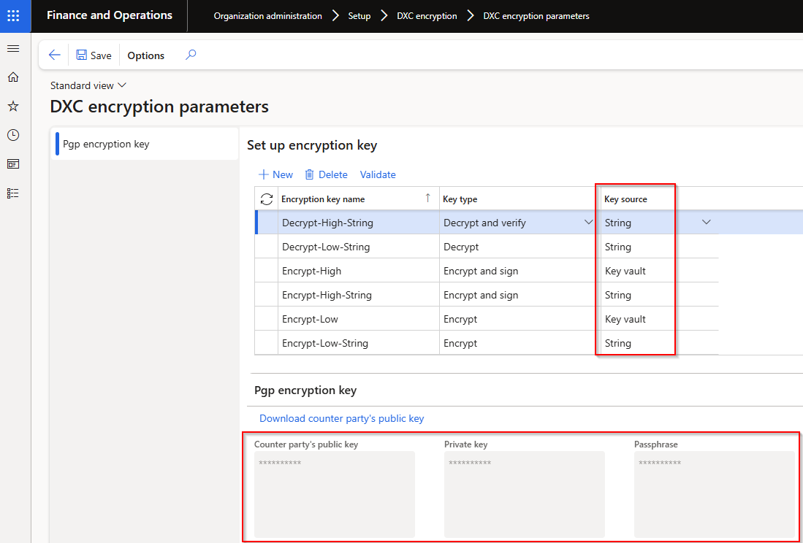

### Release 10.0.42.20250408

#### Build 10.0.42.2025040822
Release date: 21 May 2025

<ins>Bug fixes</ins>

Number	  	| Module	| Functionality	  	| Description
:--       	|:--   		|:--	           	|:--
22874		| Accounts payable	| Sundry vendor payment proposal	| When overriding fields on payment proposal, the sundry vendor lines were incorrectly grouped on payment journal line.

#### Build 10.0.42.202504081
Release date: 8 April 2025

<ins>Manual actions required</ins>
- Delete any existing batch job for periodic task 'Update ABN validation' and create new batch job.

<ins>Bug fixes</ins>

Number	  	| Module	| Functionality	  	| Description
:--       	|:--   		|:--	           	|:--
21612		| Various	| 10.0.43 build issue	| Fix 10.0.43 build issue on **Validate connection** for **API Endpoint** connection type.   Microsoft.IdentityModel.Clients.ActiveDirectory has been deprecated and no longer supported by FinOps and needs to be upgraded to now use Microsoft.Identity.Client   [Microsoft notice](https://learn.microsoft.com/en-us/dynamics365/fin-ops-core/fin-ops/get-started/removed-deprecated-features-platform-updates#azure-active-directory-authentication-library-adal)
21732		| Various	| ABN validation	| Incorrect GST registered status where ABN hasn't registered for GST and the ABN has been cancelled - showed GST registered as Cancelled.  

<ins>New features</ins>

Number	  	| Module	| Functionality	  	| Description
:--       	|:--     	|:--	         	|:--
21215		| Various	| ABN validation	| Where the ABN isn't registered for GST, use the earliest ABN entity status from date for **GST from** date. 
21210		| Various	| Encryption and Decryption	| Filtered drop-down options:   • Import connections to decrypt key types   • Export connections to encrypt key types        
20946		| Cash and bank management	| Bank statement periodic import | Where the bank statement has no transactions - now moving the file to archive instead of error folder. Also updated error message to infolog 'No bank statement was created as file contained no transactions'
17536		| Cash and bank management	| Import bank statement	| New Financial utilities parameters field **Enable date range for custom bank statement formats** controls the **From date** and **To date** inputs on **Import bank statement** for custom bank statement formats.   • **No** (default) - From and To date won't be mandatory anymore and automatically calculate the from date as earliest date in file and To date as latest date in the file. Similar to our periodic import job.   • **Yes** - From and To date is still mandatory for custom bank statement formats. This is useful where a company only needs to import a certain date range for the particular bank statement.
17536		| Cash and bank management	| Modern bank reconciliation	| Where the feature 'Modern bank reconciliation' is enabled, the bank statement form has been replaced with a new std form. Similar to Bank statement form with feature disabled, we replaced 'Import bank statement' dialog with Finance Utilities dialog which supports importing Finance Utilities custom formats.  
21689   21102 | Various	| DXC Connections	| New DXC Connections release 10.0.42.202504042 - [Release notes](../CONNECTIONS/Release-notes.md)   • SFTP connection migrated to DXC Connections model.   • Azure blob connection: added ability to use container level shared access signature URI   • Upgraded SFTP to latest 2024.2.0
21719		| Various	| DXC Encryption	| New DXC Encryption release 10.0.42.202504041. See below for details.

#### DXC Encryption Release 10.0.42.202504041

<ins>New features</ins>

Number	  	| Module	| Functionality	  	| Description
:--       	|:--     	|:--	         	|:--
20654		| DXC Encryption	| Generate keys	| Ability to **Generate** encryption keys within FinOps on **DXC encryption parameters**   
21545		| DXC Encryption	| Key values	| Previously the module only included the option for SAS URL to Azure blob file to store the Encryption keys. This change provides support for Secrets in Azure containing base 64 encoded data of the actual keys into D365 key vault. These secrets will then be pulled into FinOps as base64, and decoded before being used for encryption/decryption purposes.
21698		| DXC Encryption	| Key values	| New field **Key source** provides the ability to store key values as string within FinOps. Options:   • **Key vault** (default) - Azure Storage SAS URL & Azure Secrets   • **String** - Store keys within FinOps without Azure + key vaults. Also includes option to download the public key   
21548		| DXC Encryption	| Setup	| Moving **Private key** and **Counter party's public key** around in **DXC encryption parameters**
21551		| DXC Encryption	| Validate	| Ability to validate encryption / decryption key name. Select applicable **Encryption key name**, click **Validate** which will open a dialog to browse to a file.   • **Encrypt / Encrypt and sign** - select a file that should be encrypted, if setup is correct the encrypted file will be created that can be sent to counter party for testing.   • **Decrypt / Decrypt and verify** - select encrypted file that should be decrypted, if setup is correct a decrypted file will be created.   
