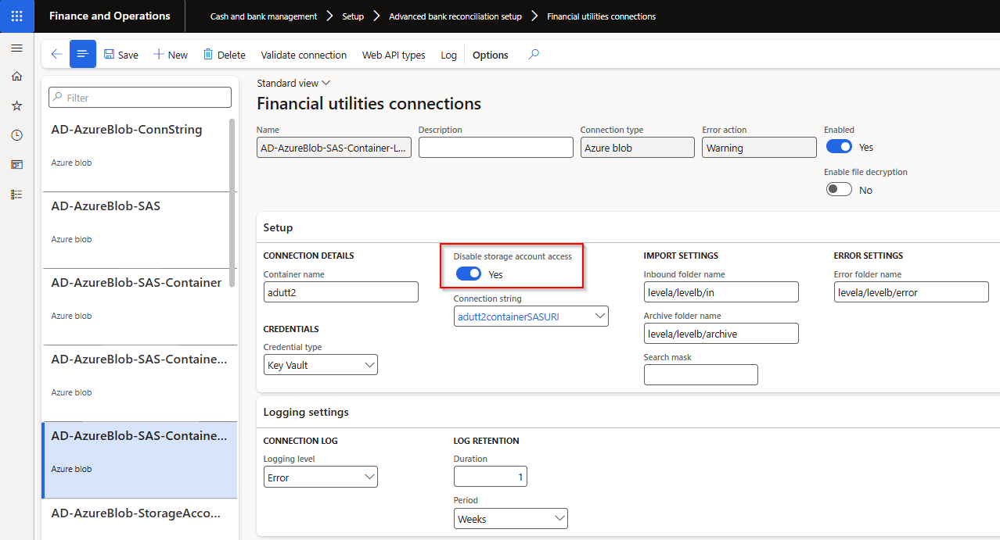
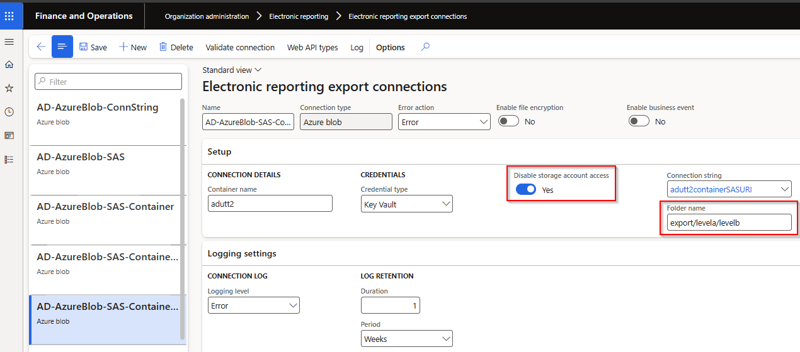

### Release 10.0.43.20250502

#### Build 10.0.43.202505021
Release date: 2 May 2025

<ins>New features</ins>

Number	  	| Module	| Functionality	  	| Description
:--       	|:--     	|:--	         	|:--
21806   22076 | Various	| Azure connections	| Added ability to use container level shared access signature URI by setting new field **Disable storage account access** to _Yes_.   Note: For SAS URI container based, it is important the URI is generated on the container level not at the folder level.   [User guide](Setup/CASH-AND-BANK-MANAGEMENT/Finance-utilities-connections.md#azure-sas-container-level)        
21544		| Accounts payable	| ABN validation (only applicable to Australia)	| **New ABN vendor** - Create a new vendor by entering their ABN. This automatically creates the new ABN and Vendor and populates vendor's name and assigns the ABN to the newly created vendor.   Requirements:   • 'ABN validation' enabled for the legal entity   • Automatic number sequence used to create Vendor account ID   
21675		| Accounts payable	| Electronic reporting (ER) | Payment advice report: ER version of the SSRS report ECL_BankPaymAdviceVendV2.Report. Published on LCS solution as 'Vendor payment adviceV2_DXC(Excel)'

<ins>Bug fixes</ins>

Number	  	| Module	| Functionality	  	| Description
:--       	|:--   		|:--	           	|:--
21957		| Various	| 10.0.43 build issue	| Fix 10.0.43 extra build issue on Reconciliation matching rules - Financial dimensions.
21291		| Accounts payable	| Vendor payments	| Fix 10.0.43 issue where the value written to Finance Utilities field 'Export file name' was CustVendPaymERExport.updatePaymentItem instead of actual file name.
21218		| Accounts payable	| Self billing / RCTI	| Fix to Consolidate by Receipt date. Issue occurred where multiple invoices were created for same purchase order.
21950		| Cash and bank management	| Bank reconciliation	| Removed the requirement where a Bank transaction needs to be selected when using Match. This allows users to match two Bank statement transactions that balance to zero (reversals).
