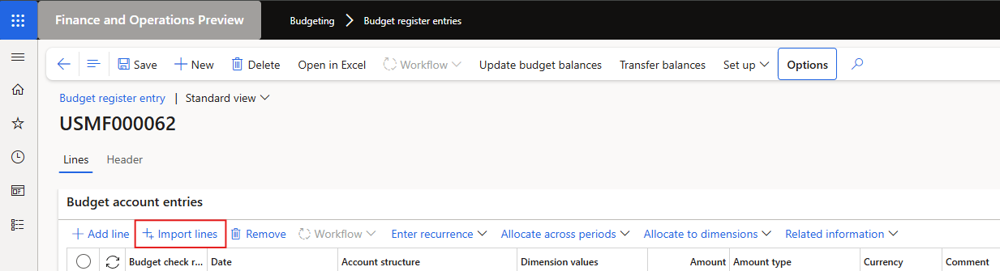

### Release 10.0.43.20250521

#### Build 10.0.43.2025052121
Release date: 1 August 2025

<ins>Bug fixes</ins>

Number	  	| Module	| Functionality	  	| Description
:--       	|:--   		|:--	           	|:--
23232		| Cash and bank management	| Bank statement import	| Replaced **DMFParameters::find().SharedFolderPath;** with **System.IO.Path::GetTempPath();**   Method depreciated by MS.   Issue with importing bank statements using a shared working directory

#### Build 10.0.43.202505211
Release date: 21 May 2025

<ins>Manual actions required</ins>
- Where **Import lines** is used to import budgets into **Budget register entries**, please add Finance utilities duty **Maintain budget import** to an existing/new role. We'll add it to a new role in the next planned August release. Related to 22784.

<ins>Bug fixes</ins>

Number	  	| Module	| Functionality	  	| Description
:--       	|:--   		|:--	           	|:--
22907		| Cash and bank management	| Posting new transactions	| Fix to error caused by 21957, only applicable to release 10.0.43.202505021. Error when posting new transaction: "Function SourceDocumentExtensionFactory::newObject has been incorrectly called."
22709		| ABN validation	| Create new vendor	| Fix to label on Vendors Action pane - 'New ABN vendor'
22783		| DXC Encryption	| 10.0.44 build error fix	| New DXC Encryption model 10.0.43.202505191 to fix build error. Removed privilege 'Maintain DXC encryption parameters' from standard role 'Information technology manager'.
22784		| Budgeting	| 10.0.44 build error fix	| Removed Finance Utilities duty 'Maintain budget import' (SAB_FinBudgetMaintain) from standard role 'Budget manager'.   
22874		| Accounts payable	| Sundry vendor payment proposal	| When overriding fields on payment proposal, the sundry vendor lines were incorrectly grouped on payment journal line.
