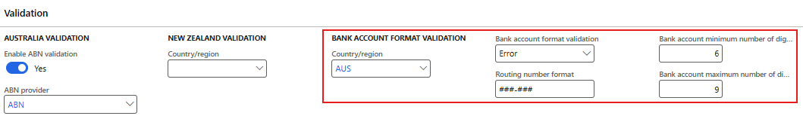

### Release {{page.release-version}}

#### Build {{page.release-version}}
Release date: 28 November 2025

<ins>New features</ins>

Number	  	| Module	| Functionality	  	| Description
:--       	|:--     	|:--	         	|:--
24106		| Various	| Connections - SFTP	| Removed **SFTP** renci.dll from product as it has been moved to DXC Connections model.
24598		| Cash and bank management	| Import bank statement via Financial utilities connection		| New 'DXC Connections' version 10.0.44.202511252   [Release notes](../CONNECTIONS/Release-notes.md)   Added support for Azure SAS URI for container level with key access.   Now supported:   • SAS URI container level account key (folders) (new)   • SAS URI container level user-delegated (folders)   • SAS URI storage level (only containers)    • Connection string (only containers)
24214		| All	| Licensing | New 'DXC License manager' version 10.0.43.202509291   New 'DXC License' version 10.0.44.202511211   [Release notes](../LMG/Release-notes.md)
23540		| Product Experience Metrics	| Product support | New 'Product Experience Metrics' version 10.0.45.202511281. Foundational model that defines the structural and semantic framework for product support. It provides interfaces and dependencies that serves as a shared reference layer for all products. Additional metrics added in this Finance Utilities release.
24290		| Various	| ABN validation	| Updated headings and labels on ABN validation setup on **Legal entities**. Split into Australia and New Zealand validation.
24082		| Accounts payable   Accounts receivable	| Bank account validation	| **Bank account validation** option when creating new vendor and customer bank accounts. Validation will also apply when importing vendor and customer bank account data entities.     Fields added to Validation section on **Legal entites**:   • **Country/region** - Validation will only apply to bank accounts for this country. Once this field is populated, address becomes mandatory on vendor and customer bank accounts.   • **Bank account format validation** - No validation (default), Warning, Error   • **Routing / bsb number format** - example ###-###   •  **Bank account minimum number of digits** - example 6 for Australia, 15 for New Zealand   • **Bank account maximum number of digits** - example 9 for Australia, 17 for New Zealand     • [Setup user guide](Setup/ABN/Bank-account-validation.md)   • [Processing user guide](Processing/ABN/Bank-account-validation.md)     Australia example:        New Zealand example:   
24317		| Cash and bank management	| Bank statement format | Increased Custom line code's **Line code** from 10 to 30 characters
23590		| Cash and bank management	| Automatic vendor account matching	| Finance Utilities **Intercompany** functionality added to 10.0.45 feature **Automatic vendor account matching**.

<ins>Bug fixes</ins>

Number	  	| Module	| Functionality	  	| Description
:--       	|:--   		|:--	           	|:--
24259		| Accounts payable	| BPAY	| Fixed label issue on vendor Method of payment for 'Biller code is mandatory' under Payment control.
24202		| Cash and bank management	| Import bank statement	| Incorrect error when importing ER bank statement format and limiting it to one specific bank account. The messages incorrectly stated the operation was cancelled and error message. Bank statement still imported. Error message has now been updated.

